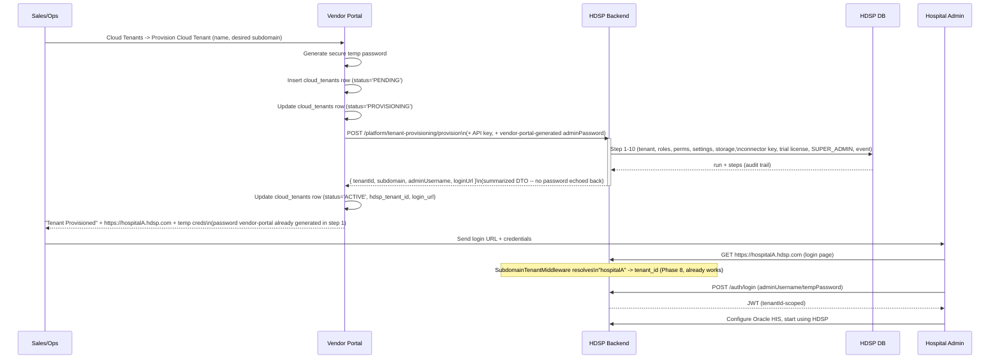

# Cloud Tenant Onboarding — Design Document

Status: **Implemented (Phase A + Phase B complete).** Reviewed and signed off with two adjustments (both incorporated below): (1) vendor-portal generates the SUPER_ADMIN temporary password and supplies it in the provisioning request — HDSP never generates or returns a password; (2) `cloud_tenants.provisioning_status` is a standardized 4-state enum (`PENDING` / `PROVISIONING` / `ACTIVE` / `FAILED`), not a boolean. All 8 steps of Section 10's implementation plan are done at the code level; see that section for exactly what's verified vs. still pending a real staging run.
Scope: the official onboarding architecture for HDSP's cloud offering (`DEPLOYMENT_MODE=cloud`), building on Phase 8 (Multi-Tenancy Activation), Phase 9 (Cloud Infrastructure), and Phase 10 (Tenant Provisioning).

**Governing decision (explicit, non-negotiable for this feature):** self-hosted's existing "Register to Vendor" flow — initiated from the HDSP login page, unpaired hospital calls vendor-portal — is completely untouched. It is not merged into a combined flow, not given a "deployment type" toggle, not reused for cloud. Cloud onboarding is built as an entirely separate, new Vendor Portal feature ("Cloud Tenants" → "Provision Cloud Tenant"), with its own controller, service, and database table in vendor-portal, that never touches `hospitals.entity.ts`/`hospitals.controller.ts`/`hospitals.service.ts` (self-hosted's existing pairing machinery). See Section 4 for exactly why this table separation is also a data-modeling necessity, not just an organizational preference.

This document was produced by re-reading the actual code, not by re-deriving the architecture from memory. Every claim below cites the file it came from.

---

## 1. Current Architecture (As-Is)

**Two systems, two databases, no integration between them today.**

### 1a. Self-hosted registration (works today, unchanged by this design)

```
Hospital installs HDSP (self-hosted)
        │
        ▼
Login page — "Vendor Connection: Not Registered"
        │
        ▼
Admin clicks "Register to Vendor"
        │
        ▼
HDSP backend → POST vendor-portal /api/hospitals/register
   (vendor-portal/backend/src/modules/hospitals/hospitals.controller.ts:24,
    comment: "called by HDSP on first boot")
        │
        ▼
vendor-portal creates a `hospitals` row, returns instanceToken + instanceSecret
        │
        ▼
HDSP stores the pairing (VendorSyncService — backend/src/modules/licensing/vendor-sync.service.ts)
        │
        ▼
Vendor Portal → HDSP webhooks (license sync, HIS config push, etc.) are
authenticated via VendorHmacGuard (backend/src/modules/vendor-administration/
guards/vendor-hmac.guard.ts) — HMAC-SHA256 over
method+path+timestamp+nonce+body, keyed by the paired instanceSecret.
```

This is a real, working, tenant-agnostic pairing protocol. It assumes HDSP
already exists and just needs to introduce itself to the vendor. It has no
concept of "create a tenant" — self-hosted has exactly one tenant, seeded
once by `1783710000000-SeedDefaultTenant.ts` (`code: 'default'`), and
`SubdomainTenantMiddleware` (backend/src/common/middleware/subdomain-tenant.middleware.ts)
always falls back to that tenant when no subdomain matches.

### 1b. HDSP's own multi-tenant provisioning (built, but never called by anything)

`TenantProvisioningService` (Phase 10, `backend/src/modules/platform/
tenant-provisioning/tenant-provisioning.service.ts`) is a complete 10-step
pipeline: tenant row → subdomain reservation → roles → permissions →
settings → storage namespace → connector pairing key → trial/subscription
license → SUPER_ADMIN user → `TenantProvisioned` event.

It's exposed via `TenantProvisioningController`
(`backend/src/modules/platform/tenant-provisioning/tenant-provisioning.controller.ts`),
whose own doc comment says exactly what this design confirms:

> "An INTERNAL platform-operator tool, not a customer self-service signup
> API — per the user's Option 3 scope decision, Vendor Portal self-service
> onboarding UI is deferred (see PHASE_10_DEFERRED_BACKLOG.md)."

`PHASE_10_DEFERRED_BACKLOG.md`, item 1 ("Vendor Portal self-service
onboarding"), names this exact gap as future work. This design document is
that follow-up.

**Concretely, today:** creating a hospital in vendor-portal inserts one row
into vendor-portal's own `hospitals` table (with `instance_secret`/
`instance_token` — the columns fixed earlier this session) and does
*nothing else*. It never calls HDSP. HDSP never hears about it. The two
systems are fully decoupled, exactly as the earlier conversation concluded.

---

## 2. Target Cloud Onboarding Workflow

```
Sales / Ops team
        │
        ▼
Vendor Portal — "Create Cloud Hospital" (new action, cloud-only)
        │
        ▼
Vendor Portal saves its own Customer/Subscription/Billing record
        │
        ▼
Vendor Portal → POST HDSP /platform/tenant-provisioning/provision
   (new service-to-service auth — see Section 7)
        │
        ▼
TenantProvisioningService.provision() runs all 10 existing steps
   (unchanged — this pipeline already does everything needed)
        │
        ▼
HDSP returns { tenantId, subdomain, adminUsername, ... }
        │
        ▼
Vendor Portal stores the returned tenant reference against its Customer row
        │
        ▼
Vendor Portal shows "Tenant Provisioned Successfully" +
   https://hospitalA.hdsp.com + temporary admin credentials
        │
        ▼
Hospital opens the URL → logs in directly (no "Register to Vendor" step —
   see Section 5)
```

Everything from "TenantProvisioningService.provision()" downward already
exists and works (Phase 10). The only genuinely new work is everything
*above* that line: a vendor-portal-initiated call into it, and the
credential that authorizes that call.

---

## 3. Required Changes — Vendor Portal

- **A new, self-contained "Cloud Tenants" module** — new controller, new
  service, new database table (Section 4). Not an option/toggle bolted onto
  the existing hospital-registration screen or `hospitals.controller.ts`.
  The existing `POST /api/hospitals/register` endpoint (self-hosted's
  "called by HDSP on first boot" path) is not modified, not extended, not
  given a second meaning.
- A new outbound HTTP client call from this new module to HDSP's
  `POST /platform/tenant-provisioning/provision`, using the new
  service-to-service credential (Section 7), not the existing
  `instanceToken`/`instanceSecret` pairing (that pairing is per-*existing*-
  hospital-instance and cannot exist yet for a tenant that doesn't exist —
  the same chicken-and-egg problem the user identified for the login page
  applies here too, one layer earlier).
- Store the returned `tenantId`/`subdomain`/`loginUrl` in the new table
  (Section 4), so future subscription/billing actions (upgrade, suspend,
  cancel) know which HDSP tenant they map to.
- Explicitly deferred per the user's own instruction ("what I would not
  implement yet"): queues, retries, email invitations, background jobs.
  First cut is synchronous request/response.

## 4. Required Changes — HDSP

- **Auth on `TenantProvisioningController`**: currently
  `@UseGuards(JwtAuthGuard, RolesGuard) @Roles('SUPER_ADMIN')` — requires an
  existing logged-in HDSP user. Vendor-portal calling this before any
  tenant/user exists cannot authenticate this way. Needs a new guard
  (Section 7).
- **Login page conditional rendering** (Section 5) — the only place inside
  HDSP itself where `DEPLOYMENT_MODE` should branch, per the user's own
  scoping instruction.
- **`DEPLOYMENT_MODE` reaching the frontend** (Section 8) — currently it
  does not, at all.
- Everything else — `TenantProvisioningService`, `SubdomainTenantMiddleware`,
  `TenantScopeGuard`, CORS's tenant-subdomain wildcard matching — already
  works and needs no changes. This is the encouraging finding of this
  pre-flight: the hard, tenant-isolation part of "cloud" was already built
  in Phases 8–10. What's missing is purely the *trigger* that starts it.

## 5. Login Page Behaviour

**File:** `frontend/src/app/(auth)/login/page.tsx` (Vendor Connection card
starts at line 772). Today this card renders unconditionally — no
`DEPLOYMENT_MODE` check exists anywhere in the file.

| Mode | Behaviour |
|---|---|
| `self_hosted` | Unchanged: "Vendor Connection" card, "Not Registered" / "Registered" status, "Register to Vendor" button when unregistered. |
| `cloud` | Vendor Connection card hidden entirely (or replaced with a read-only "Cloud Managed / Tenant / Subscription / Status" card, per the user's proposal — this needs its own data source, see below). |

The "Cloud Managed" card's data (tenant name, subscription plan, status)
would come from a new lightweight read endpoint — `SubscriptionLicense`
(`backend/src/modules/licensing/entities/subscription-license.entity.ts`,
issued by Step 8 of provisioning) already has `subscriptionStatus`,
`licensedModules` — this is a read, not new state.

## 6. API Contract — `POST /platform/tenant-provisioning/provision`

Verified directly from `provision-tenant.dto.ts` and
`tenant-provisioning.controller.ts`/`.service.ts`:

**Request** (`ProvisionTenantDto`):
```
hospitalName:   string (min 2)
subdomain:      string (DNS-label-safe: ^[a-z0-9]([a-z0-9-]{0,61}[a-z0-9])?$)
adminUsername:  string (min 3)
adminEmail:     string (email)
adminPassword:  string (min 8)
adminFullName?: string
triggeredBy?:   string   // audit trail only, not authorization
```

**Response:** `{ run: TenantProvisioningRun, steps: TenantProvisioningStep[] }`
— a run/step audit trail, not a flat "tenant created" object. The caller
needs to read `steps` to find the created `tenantId` (from the
`create_tenant_row` step's result) and the subdomain/admin details from
their respective steps. **Gap for a clean vendor-portal integration**: there
is no single summarized response shape — HDSP should add a thin
summarizing wrapper. Recommend as a small, additive change (a new response
DTO built from the existing steps, not a change to `provision()`'s
internal behavior).

**Password ownership (per review feedback):** `adminPassword` is already a
caller-supplied, required field on `ProvisionTenantDto` — the pipeline
never generates one itself. This already matches the recommendation that
vendor-portal, not HDSP, owns temporary-password generation: vendor-portal
generates a secure temp password, sends it in the request, and HDSP simply
uses it to create the SUPER_ADMIN. **The summarized response DTO above must
not echo `adminPassword` back** — the caller already has it, and this is
an explicit hard requirement: no password value crosses the wire from
HDSP to vendor-portal in either direction. Confirmed `stepCreateSuperAdminUser`'s
existing return value (`{ id, username, email, role }`) already omits the
password — the summarizing wrapper just needs to preserve that omission,
not introduce a regression.

Final summarized response shape:
```
{ tenantId: string, subdomain: string, adminUsername: string, loginUrl: string }
```

**Idempotency:** real, but resumption-only, not create-or-get. `resume()`
(`POST /platform/tenant-provisioning/:runId/resume`) continues a
previously-failed run from its last incomplete step — it requires the
`runId` from the original attempt (vendor-portal would need to store this
if it wants to retry). There is no "provision if not exists, else return
existing" idempotency keyed by e.g. hospital name or subdomain — calling
`provision()` twice with the same subdomain fails cleanly (`ConflictException`
on the duplicate subdomain check in `stepCreateTenantRow`), it does not
silently return the existing tenant. Acceptable for a synchronous,
human/ops-driven first cut; worth documenting as a known gap. **HDSP is the
sole source of truth for subdomain uniqueness** — the `cloud_tenants.subdomain`
unique constraint (Section 6a) is a client-side backstop for vendor-portal's
own UI, not the authority; a race between two concurrent provisioning
requests for the same subdomain is correctly rejected by HDSP's DB-level
check regardless of what vendor-portal's own table allows.

**Rollback:** partial. Each step is tracked (`TenantProvisioningStep`), and
`deprovision()` exists — but per its own doc comment (Task 10.8) it is
"pilot rollback only": flips the tenant to `inactive` and revokes the
connector pairing key. It does not undo roles/permissions/settings/users
created by a partially-failed run. A failed `provision()` call is meant to
be fixed via `resume()`, not rolled back and retried from scratch.

**Authentication:** today, `JwtAuthGuard` + `RolesGuard('SUPER_ADMIN')` —
see Section 7 for why this doesn't work for vendor-portal and what should
replace/supplement it.

## 6a. Database Changes

**HDSP backend: none.** `TenantProvisioningService`'s pipeline already
persists everything it creates (`Tenant`, roles, permissions, settings,
storage namespace record, connector pairing, `SubscriptionLicense`,
`User`, `TenantProvisioningRun`/`TenantProvisioningStep` audit rows). No
new tables or columns needed on the HDSP side for this feature.

**Vendor Portal: one new table, confirmed necessary (not just tidy) by
reading `hospital.entity.ts`.** The existing `hospitals` table is shaped
entirely around the self-hosted pairing protocol — every column is
required (`NOT NULL`) and self-hosted-specific:
`instance_token`/`instance_secret` (pairing credentials issued *by*
vendor-portal *to* an already-running HDSP instance), `public_ip`/
`public_port`/`webhook_url` (how vendor-portal reaches that instance for
webhooks), `machine_fingerprint` (self-hosted licensing binds to a
machine), `status: 'PENDING'|'ACTIVE'|'SUSPENDED'` (the pairing lifecycle).
None of these have a meaningful value for a cloud tenant at the moment
it's provisioned — there is no "instance" yet, no public IP, no machine.
Reusing this table would mean either relaxing several `NOT NULL`
self-hosted-specific columns to nullable-but-meaningless-for-cloud-rows
(the exact anti-pattern already flagged and avoided in this project's
Phase 10 work), or writing placeholder values into them — both wrong.

New table, e.g. `cloud_tenants` (vendor-portal owns naming/exact schema at
implementation time; shape only, here):

```
cloud_tenants
  id                  uuid, pk
  hospital_name       varchar
  subdomain           varchar, unique
  hdsp_tenant_id      uuid            -- HDSP's Tenant.id, returned by provision()
  admin_username      varchar
  login_url           varchar
  provisioning_status varchar         -- 'PENDING' | 'PROVISIONING' | 'ACTIVE' | 'FAILED'
                                       -- (per review: standardized 4-state enum, not a
                                       -- boolean/2-state flag, for operational support)
  provisioning_run_id uuid, nullable  -- HDSP's TenantProvisioningRun.id, for resume() on failure
  subscription_plan   varchar, nullable
  created_at          timestamptz
  updated_at          timestamptz
```

This is intentionally a peer table to `hospitals`, not a subtype or shared
base — matching Section 3's "new, self-contained module" decision. The two
tables are never joined or unioned by application logic; a hospital is
either a self-hosted pairing (row in `hospitals`) or a cloud tenant (row in
`cloud_tenants`), never both, and nothing in this design requires them to
share a schema.

## 7. Authentication Strategy

Three real options, in order of how much new surface they add:

1. **New service-to-service API key guard** (recommended first cut) — a
   single shared secret (env var on both sides, e.g. `VENDOR_PORTAL_API_KEY`
   on HDSP, `HDSP_PROVISIONING_API_KEY` on vendor-portal), checked via a
   new `VendorPortalApiKeyGuard` on `TenantProvisioningController` *in
   addition to* (or as an alternative path alongside) the existing
   SUPER_ADMIN JWT guard — so the existing internal-operator use case (a
   human SUPER_ADMIN calling it directly) keeps working unchanged, and
   vendor-portal gets its own path in. Simplest to build, weakest rotation
   story (matches item 5 in `PHASE_10_DEFERRED_BACKLOG.md`, "Secret and
   credential rotation tooling" — already a known deferred item).
2. **Reuse `VendorHmacGuard`'s HMAC pattern, new keypair** — same
   HMAC-SHA256-over-headers shape already proven in
   `vendor-hmac.guard.ts`, but keyed by a new platform-level secret instead
   of a per-instance `instanceSecret` (since no instance/tenant exists yet
   to own one). More consistent with existing conventions, more code to
   write than option 1.
3. **mTLS / VPC-internal-only network restriction** — if vendor-portal and
   HDSP's control plane end up in the same VPC (plausible per Phase 9's
   Terraform topology), network-level restriction could supplement either
   of the above rather than replace it.

Recommendation: **option 1**, additive to the existing guard, as the
minimum viable auth for a first working end-to-end flow — consistent with
the user's own "what I would not implement yet" list (no queues/retries/
email yet; this is the same philosophy applied to auth).

## 8. Deployment Mode Branching

Verified: `deploymentConfig` (`backend/src/config/deployment.config.ts`)
reads `process.env.DEPLOYMENT_MODE`, backend-only, via NestJS's
`ConfigService`. It does **not** currently reach the frontend in any form —
checked `frontend/next.config.mjs`'s `env` block, which exposes exactly
three vars (`NEXT_PUBLIC_APP_NAME`, `NEXT_PUBLIC_APP_VERSION`,
`NEXT_PUBLIC_ENABLE_FORMS_MODULE`); `DEPLOYMENT_MODE` is not among them, and
no `frontend/src/middleware.ts` or runtime config endpoint exists either.

Recommended mechanism: **build-time `NEXT_PUBLIC_DEPLOYMENT_MODE`**, added
to `next.config.mjs`'s existing `env` block, sourced the same way
`NEXT_PUBLIC_ENABLE_FORMS_MODULE` already is. This is sufficient (not just
convenient) because deployment mode is an infrastructure-wide property, not
a per-tenant one — Phase 9's cloud topology runs one shared frontend image
behind the wildcard ALB for *all* cloud tenants (confirmed in
`infrastructure/terraform/alb.tf`), so "is this a cloud deployment" is the
same answer for every request that image ever serves. A runtime config
endpoint would only be needed if a single frontend image had to serve both
modes simultaneously, which it never does (self-hosted and cloud are built
and deployed as separate images per Phase 9/12's Dockerfiles).

## 9. Sequence Diagram



## 10. Step-by-Step Implementation Plan

Ordered so each step is independently testable before the next depends on
it. First-cut scope only (per Section 3/7's explicit deferrals — no queues,
retries, email, or background jobs).

1. **HDSP: add `VendorPortalApiKeyGuard`**, alongside the existing
   SUPER_ADMIN JWT path on `TenantProvisioningController` (Section 7,
   option 1). New env var on both repos. **Done** —
   `VENDOR_PORTAL_API_KEY` documented in `env.validation.ts`,
   `deployment.config.ts`, `infrastructure/terraform/secrets.tf`
   (`hdsp/jwt` secret) + `ecs.tf` (`common_secrets`), and
   `CLOUD_DEPLOY.md` Section 3 (population) / Section 8 (cross-reference).
   Self-hosted's `infrastructure/installer/env.selfhosted.template` notes
   why it's intentionally absent there.
2. **HDSP: add a summarized provisioning response DTO** (`{ tenantId,
   subdomain, adminUsername, loginUrl }`), built from the existing
   `run`/`steps` — additive, `provision()` itself untouched. **Done** —
   `TenantProvisioningService.buildProvisioningSummary()`; no password
   ever included.
3. **HDSP: expose `DEPLOYMENT_MODE`** to the frontend via
   `NEXT_PUBLIC_DEPLOYMENT_MODE` in `next.config.mjs` (Section 8). **Done**
   — also required threading `DEPLOYMENT_MODE` through as a Docker build
   ARG in `frontend.Dockerfile` (a real gap found while documenting this:
   without it, `docker build --build-arg DEPLOYMENT_MODE=cloud` would have
   silently had no effect, since build args aren't automatically visible
   as `process.env` vars inside a build stage). `CLOUD_DEPLOY.md` Section
   4 updated with the required `--build-arg`.
4. **HDSP: branch the login page's Vendor Connection card** on
   `NEXT_PUBLIC_DEPLOYMENT_MODE` (Section 5) — hide in cloud mode, or swap
   in the read-only "Cloud Managed" card if a data source is scoped at the
   same time. **Done** (hide-entirely variant; the richer "Cloud Managed"
   card remains a follow-up needing its own read endpoint).
5. **Vendor Portal: create the new `cloud_tenants` table + entity**
   (Section 6a) — a new migration, fully independent of `hospitals`. **Done**
   — `vendor-portal/backend/src/modules/cloud-tenants/entities/cloud-tenant.entity.ts`
   + migration `1784203761689-CreateCloudTenants.ts` (same `hasTable()`-guarded
   pattern as the three migrations before it). Does not alter `hospitals` in
   any way — no shared columns, no FK, no migration touching that table.
6. **Vendor Portal: new "Cloud Tenants" module** — controller, service
   (including the outbound client calling HDSP's endpoint from steps 1/2
   with the new API key), and UI ("Cloud Tenants" → "Provision Cloud
   Tenant"), writing to the table from step 5. Does not touch
   `hospitals.controller.ts`/`.service.ts`/`.entity.ts` at all. **Done** —
   `vendor-portal/backend/src/modules/cloud-tenants/` (module, controller,
   service, DTO), wired into `app.module.ts` additively (imports array only
   gained `CloudTenantsModule`/`CloudTenant`, no existing lines touched);
   frontend `(vendor)/cloud-tenants/page.tsx` + `lib/api/cloud-tenants.api.ts`
   + a new "Cloud Tenants" nav entry in `(vendor)/layout.tsx`.
   `CloudTenantsService.provision()` generates the SUPER_ADMIN temp password
   (Vendor Portal owns this per Section 6's password-ownership decision),
   calls HDSP, and persists `tenantId`/`subdomain`/`loginUrl`/`provisionedAt`/
   `status` from the response — the temp password itself is returned once to
   the caller and never persisted. `HDSP_BACKEND_URL`/`HDSP_PROVISIONING_API_KEY`
   documented in `vendor-portal/.env.example` and `vendor-portal/backend/.env`.
7. **End-to-end test**: create a cloud hospital via vendor-portal, confirm
   `hospitalA.<cloud-base-domain>` resolves (DNS/ACM wildcard cert — verify
   these exist in the target AWS account, since Terraform's ALB rule
   assumes them but doesn't provision Route53/ACM itself per
   `alb.tf`/`README.md`), log in with the returned admin credentials,
   confirm tenant isolation (a second tenant's data is not visible). **Code
   reviewed, not live-run** — no real AWS/DNS/ACM environment exists in this
   sandbox (same posture as `CLOUD_DEPLOY.md`'s own disclaimer). Verified at
   the code level instead: both repos compile cleanly (`tsc --noEmit`); the
   outbound client's URL (`{HDSP_BACKEND_URL}/api/v1/platform/tenant-provisioning`)
   matches `TenantProvisioningController`'s actual route
   (`@Controller('platform/tenant-provisioning')` + HDSP's `api`/`v1`
   prefix/versioning in `main.ts`); the request payload's field names match
   `ProvisionTenantDto` exactly (`hospitalName`, `subdomain`, `adminUsername`,
   `adminEmail`, `adminPassword`, `adminFullName?`, `triggeredBy?`); the
   response shape consumed (`{ run, steps, summary }`) matches
   `buildProvisioningSummary()`'s actual return; `X-Vendor-Portal-Api-Key`
   matches what `VendorPortalApiKeyGuard` reads. A real staging run against
   an actual AWS account is still required before this is production-verified.
8. **Docs**: update `PHASE_10_DEFERRED_BACKLOG.md` item 1 to point at this
   document and record it as in-progress/complete once shipped;
   `HYBRID_ARCHITECTURE_LOG.md` entry. **Done** — see that document's item 1
   and this repo's `HYBRID_ARCHITECTURE_LOG.md` entry.

Explicitly deferred beyond this plan (per Section 3): async/queued
provisioning, email invitations, create-or-get idempotency keyed by
subdomain, full rollback (vs. resume) of partially-failed runs, and the
broader lifecycle-management items already tracked in
`PHASE_10_DEFERRED_BACKLOG.md` (items 2–7).
