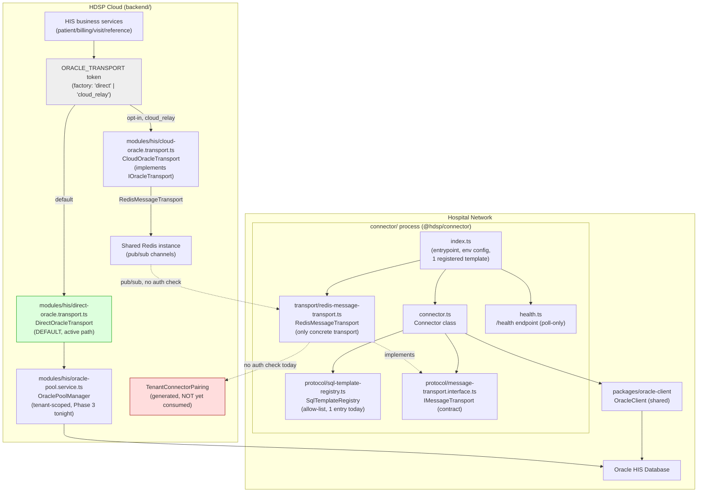

# HDSP Connector — Current State Audit

Date: 2026-07-21
Scope: `D:\HDSP_HYBRID\connector\` package and its integration into `backend/`.
Companion to `HDSP_CLOUD_CONNECTOR_ARCHITECTURE.md`. Pure audit — no code
changed.

## 1. File inventory

```
connector/
├── package.json              — @hdsp/connector, v0.1.0, private
├── tsconfig.json
├── jest.config.js
├── VERSIONING.md              — protocol semver scheme + compatibility matrix
├── COMPATIBILITY.json         — machine-readable counterpart to VERSIONING.md
├── dist/                      — BUILT, populated (confirms it compiles)
└── src/
    ├── connector.ts                          75 lines
    ├── health.ts                             43 lines
    ├── index.ts                              76 lines
    ├── __tests__/
    │   └── connector.spec.ts                115 lines (5 tests)
    ├── protocol/
    │   ├── message-transport.interface.ts    68 lines (types only)
    │   ├── sql-template-registry.ts          61 lines
    │   └── __tests__/
    │       └── sql-template-registry.spec.ts 36 lines (4 tests)
    └── transport/
        └── redis-message-transport.ts       125 lines
```

No `README.md` inside `connector/` itself — its scope is documented only in
`VERSIONING.md`, `COMPATIBILITY.json`, and comments referencing repo-root
`PHASE_6_IMPLEMENTATION_PLAN.md`/`PHASE_7_IMPLEMENTATION_PLAN.md`.

## 2. What each file does, and its real completion state

**`connector.ts` — Fully implemented.** The `Connector` class: wires an
injected `OracleClient` to an `IMessageTransport` and a
`SqlTemplateRegistry`. `start()` connects Oracle and starts the transport;
`handleRequest()` resolves an incoming `sqlTemplateId` against the
registry (never accepts raw SQL), runs the matching Oracle query/execute,
and returns a correlated success or structured error response
(`HisUnavailableError` marked `retryable: true`). `isHealthy()` reports
Oracle + process liveness. No gaps, no stubs — this is solid, working
relay logic. Its own doc comment ("nothing in `backend/` imports or
depends on this class... `DirectOracleTransport` remains the backend's
exclusive Oracle path") is now slightly stale in spirit — the backend does
import from this package (see §4) — but accurate in substance: this class
is not on the backend's live query path by default today.

**`health.ts` — Fully implemented, deliberately minimal.** A plain
`http.Server` (no framework) serving `/health` with
`{oracle, connector, connectorVersion, protocolVersion}`. This is a
poll-based health surface, not a push/heartbeat mechanism — nothing calls
out to the cloud on its own; something else would have to poll this port.

**`index.ts` — Partially implemented; the gap is explicit and load-bearing.**
The real entrypoint: builds a `SqlTemplateRegistry` containing exactly
**one** template — `health-check-select-1` = `SELECT 1 FROM dual` — then
wires `OracleClient` + `RedisMessageTransport` from env vars and starts
both the connector and the health server. Its own doc comment states
outright: *"This is NOT the production HIS template set (patient lookup,
billing, etc.) — that expansion is explicitly deferred."* This is the
single biggest concrete gap in the package: everything downstream of "have
a registered template to execute" is real HIS query coverage, and there
is currently zero of it.

**`protocol/message-transport.interface.ts` — Complete as an interface;
documents its own missing implementation.** Pure types
(`MessageTransportRequest`/`Response`, `IMessageTransport`). Its doc
comment already predicted the exact gap the architecture doc's §5
addresses: *"A WebSocket transport for the interactive-lookup case is left
as a documented, not-yet-implemented follow-up."*

**`protocol/sql-template-registry.ts` — Mostly complete, one enforcement
gap.** `register()`/`resolve()`/`has()`/`list()`, throwing
`UnknownSqlTemplateError` for unregistered IDs — this is the actual
security boundary preventing arbitrary SQL from crossing the wire, and it
works. Gap: `expectedBinds` is recorded per template but **not enforced at
runtime** — a caller can send extra or malformed binds today and they'd
reach Oracle unvalidated by this layer (the doc comment says this
explicitly: "not enforced... no caller exists yet to validate against").

**`transport/redis-message-transport.ts` — Fully implemented and working
as the one and only transport.** `ioredis` pub/sub, shared request channel
+ per-`correlationId` response channel, `lazyConnect: true` (deliberate —
its own inline comment documents a real bug this avoided). No stubs. The
gap here isn't in this file's own logic; it's architectural — see §3.

**Cross-cutting, not localized to one file:** the `TenantConnectorPairing`
credential the backend already generates (Task 10.4) is **not consumed
anywhere in this package** — no auth field exists in the protocol at all.
`VERSIONING.md` tracks this explicitly as a known gap. There is also no
connect-time protocol-version handshake; a version mismatch would only
surface as a failed first request, not be rejected up front.

## 3. Test coverage — real, but narrow

Both test files contain genuine assertions, no `.skip`, no placeholder
TODOs:

- `connector.spec.ts` (5 cases): query/execute round-trips, unknown
  template returns a structured error (doesn't throw), `HisUnavailableError`
  marked retryable, `isHealthy()` reflects Oracle state. Uses an in-process
  mock transport and `jest.spyOn` on `OracleClient` — no real Oracle.
- `sql-template-registry.spec.ts` (4 cases): resolve, unknown-ID rejection,
  duplicate-registration rejection, and an explicit assertion that no
  method ever echoes back arbitrary SQL. No real Redis.

**What's entirely absent: any integration test against a real Oracle
instance or a real Redis instance.** Every test is a pure unit test with
mocks/doubles. `ci-connector.yml`'s "standalone boot smoke check" runs the
compiled entrypoint for 5 seconds with no live Redis/Oracle and expects it
to time out — its own comment is explicit this only proves "the compiled
entrypoint starts and the health server binds," not real connectivity.

When I tried to actually run `npm test` against this package in tonight's
sandbox, one suite failed on a symlink-resolution I/O error trying to
reach `@hdsp/oracle-client` via the workspace `file:` dependency — this
looks like a sandbox/mount artifact specific to this session (the compiled
`packages/oracle-client/dist/` is present and populated), not a real
break, but I want to flag rather than silently smooth over that I could
not get a fully clean local test run tonight. The Redis-independent suite
(`sql-template-registry.spec.ts`) ran clean, 4/4.

## 4. Integration with the backend today

Exactly two real (non-comment) references to `@hdsp/connector` anywhere in
`backend/src`, confirmed by an exhaustive grep — no hidden third path:

- **`backend/src/modules/his/cloud-oracle.transport.ts`** — `CloudOracleTransport`,
  an `IOracleTransport` implementation that imports `RedisMessageTransport`
  from the connector package and routes `query()`/`execute()` calls
  through it, translating a caller's raw SQL string to an allow-listed
  `sqlTemplateId` via a small local `knownTemplates` map (which, matching
  `index.ts`'s gap above, only has the one conformance query registered).
  Selected via `ORACLE_TRANSPORT=cloud_relay`; **`'direct'` is the default**
  (`DirectOracleTransport` → `OraclePoolManager`, tonight's Phase 3 work),
  so this path is inactive unless explicitly switched on.
- **`oracle-transport.conformance.spec.ts`** — a test asserting both
  `DirectOracleTransport` and `CloudOracleTransport` behave identically for
  the one shared conformance query, against a mocked `ioredis` — fully
  offline, no live Redis.

**Net assessment:** the seam exists and the two implementations of
`IOracleTransport` are provably interchangeable for the one query both
sides know about, but this is not live, running integration — it's a
correctly-designed abstraction with the connector side genuinely
reachable, just never exercised against real infrastructure.

## 5. Completion estimate — HDSP Edge Connector (production-ready bar)

I'm breaking this into weighted areas rather than one unexplained number,
since "percent complete" hides very different kinds of gaps otherwise:

| Area | State | Weight | Contribution |
|---|---|---|---|
| Core relay engine (Oracle wiring, request/response correlation, error shaping) | Done | 15% | 15% |
| SQL allow-list / query registry mechanics | Done, minus bind validation | 10% | 8% |
| Transport abstraction (interface design) | Done | 5% | 5% |
| Concrete transport(s) | Redis only; WebSocket (the production-facing one per the architecture doc) not started | 15% | 4% |
| Production HIS query coverage | 1 conformance query only, real set (~20-40 queries) not built | 20% | 1% |
| Auth / pairing-key consumption | Not started | 10% | 0% |
| Fleet visibility / status / heartbeat | Not started | 10% | 0% |
| Packaging (Windows Service, installer, secret storage) | Not started | 10% | 0% |
| Auto-update | Not started | 5% | 0% |
| Real-world validation (live Oracle, real network topology) | Not started | — | 0% |

**Overall: roughly 30-35% of the way to what "HDSP Edge Connector" means
in the architecture doc's full scope** — but that number is doing a lot of
hiding. The 30-35% that exists is genuinely solid, tested, and
well-documented (better foundation than many "started from nothing"
efforts). The 65-70% that doesn't exist is almost entirely the parts that
make this a *product* rather than a proof-of-concept: nothing
authenticates a specific connector to a specific tenant, only one trivial
query works, there's no way to install it on a hospital machine, no way to
update it, no way for anyone to see whether a given hospital's connector
is even online, and it has never been run against a real Oracle database.
I'd characterize today's state as "a correctly-designed, working skeleton"
rather than "an MVP" — the skeleton is worth keeping and building on
(consistent with the architecture doc's phased plan), but there's no
shortcut past the remaining ~65%.

## 6. Dependency diagram



Text-form summary of the same graph, for anywhere the diagram above
doesn't render: `HisServices` call `IOracleTransport` via the
`ORACLE_TRANSPORT` DI token, which today defaults to `DirectTransport` →
`OraclePoolManager` → Oracle directly (tonight's Phase 3 work, live and
default). The alternate path, `CloudTransport` → shared `Redis` →
`RedisMessageTransport` (inside the Connector process) → `Connector` →
`SqlTemplateRegistry` → `OracleClient` → Oracle, exists and is
provably correct for the one shared conformance query, but is opt-in only
and has no authentication step connecting a specific Connector instance to
a specific tenant — `TenantConnectorPairing` exists on the cloud side but
nothing on the connector side ever presents or checks it (shown in red
above as the clearest concrete gap).

## 7. Update, 2026-07-21 (Phase A + Phase B shipped)

Everything in sections 1-6 above is the pre-Phase-A snapshot; kept
unedited as the historical baseline. This section records what changed.

**Phase A (Auth / pairing-key consumption)** — the single biggest gap
identified above is now closed at the mechanism level: `ConnectorInstance`
entity + migration, `POST /api/v1/connector/register` (redeems a
`TenantConnectorPairing` one-time key, flips it `pending -> active`,
issues a connector-scoped access+refresh JWT pair signed with dedicated
`jwt.connectorSecret`/`connectorRefreshSecret`), `POST
/api/v1/connector/token/refresh` (rotate-with-blacklist, same pattern as
`AuthService`), and the connector-side `registration.ts` +
`token-store.ts` (AES-256-GCM local credential persistence). Test coverage
in `connector-registration.service.spec.ts` (6 cases: happy path, wrong
key, unknown tenant, pending-only lookup, blacklisted refresh reuse,
deleted-instance refresh).

**Phase B (WebSocket transport)** — the "Concrete transport(s)" and
"Fleet visibility / status / heartbeat" rows above move from 0 to
partial:
- `ConnectorGateway` (`backend/src/modules/platform/connector/connector.gateway.ts`):
  a NestJS WS gateway on the `/connector` namespace, authenticates
  incoming sockets against a connector access JWT, joins
  `connector:{id}`/`tenant:{tenantId}` rooms, tracks `online`/`offline`
  status on `ConnectorInstance` for the socket's lifetime, and exposes
  `dispatchToConnector()` — request/response correlation over the socket
  with a timeout, no proactive heartbeat yet.
- `WebSocketMessageTransport` (connector-side,
  `connector/src/transport/websocket-message-transport.ts`): the
  `IMessageTransport` receiver counterpart, `socket.io-client` with
  `transports: ['websocket']` only (no HTTP long-polling fallback), auto
  first-boot registration + credential reuse wired into `index.ts`'s
  `main()` behind `CONNECTOR_TRANSPORT=websocket` (defaults to `redis`,
  zero behavior change for any existing deployment).
- `ConnectorJobDispatchService` + `ConnectorJobDispatchProcessor`: a thin
  BullMQ durability layer (`QUEUE_NAMES.CONNECTOR_JOBS`) in front of
  `dispatchToConnector()`, so a dispatch surviving a backend restart or a
  briefly-offline connector is a Bull retry, not caller-written retry
  logic.
- End-to-end coverage: `connector-websocket-e2e.spec.ts` spins a real
  Fastify+socket.io `ConnectorGateway` and a real `WebSocketMessageTransport`
  client, authenticates with a real signed JWT, and round-trips a
  `health-check-select-1` request through a mocked `OracleClient` —
  proving the actual new mechanism without live Redis, Bull, or Oracle.
  A second case proves an invalid token is rejected at the WS handshake.

**Still NOT done** (unchanged from the "not started" rows above, or only
partially addressed): `ConnectorGateway`/`WebSocketMessageTransport` are
not wired into `ORACLE_TRANSPORT`/`CloudOracleTransport`'s selection —
nothing in HIS business services can reach a Connector yet even once one
is connected. No periodic heartbeat (status is connection-lifetime-based
only, doesn't detect a wedged-but-connected process). Production HIS
query coverage, fleet UI, packaging/installer, and auto-update are all
still not started.

**Verification note**: `connector/` typechecks clean (`tsc --noEmit`, run
in-session). `backend/`'s full-project `tsc --noEmit` and `jest` both
exceeded this sandbox's command timeout without producing output — the
same environment limitation observed during Phase A, not something new in
this pass. Every backend file touched or added in Phase B was reviewed by
hand (import correctness, DI wiring, Bull/Gateway conventions matched
against existing modules) but was not machine-verified in this session.
**Run `npm run build` and `npm test` in `backend/` locally before treating
Phase B as deploy-ready.**

## 8. Update, 2026-07-21 (Phase C — Oracle execution path)

The "Still NOT done" gap called out at the end of §7 (`CloudOracleTransport`
never dispatching through `ConnectorGateway`) is now closed. Full
rationale and design in `ADR_CONNECTOR_PROTOCOL.md` §7-8; summary here for
the completion-tracking narrative this file has kept phase over phase:

- `CloudOracleTransport` gained a `CLOUD_ORACLE_TRANSPORT_MODE` config
  (`'redis'` default / `'websocket'` opt-in), resolving the ambient tenant
  (`TenantContextStorage`) to a registered `ConnectorInstance` (new
  `ConnectorDirectoryService`) and dispatching through
  `ConnectorJobDispatchService` instead of the untenanted
  `RedisMessageTransport`.
- New `ConnectorNotRegisteredError` for "no ambient tenant" / "tenant has
  no registered Connector" — kept out of the existing circuit-breaker path
  deliberately (config problem, not a transient failure).
- Second conformance query, `patient-search` (parameterized, row-
  returning), registered identically on both `CloudOracleTransport`'s
  `knownTemplates` and the Connector's own `SqlTemplateRegistry` — proves
  bind-parameter passthrough and row mapping, not just a static no-op
  query. **Explicitly not** `PatientService.search()`'s real SQL (that's
  built per-tenant from `HisSchemaConfig`, incompatible with today's
  exact-string-match allow-list — see the ADR for the tracked follow-up).
- `cloud-oracle-transport-websocket-e2e.spec.ts`: the full milestone path
  (`CloudOracleTransport.query()` -> real `ConnectorGateway` -> real WS
  transport -> real `Connector` -> mocked `OracleClient` -> back up the
  stack) for both conformance queries, plus a "no registered connector"
  rejection case and a "default mode needs no connector dependency at
  all" construction case.

**"Concrete transport(s)" row from §5's original table is now**: Redis
(untenanted, legacy default) and WebSocket (tenant-scoped, the production
path) are both wired all the way from `CloudOracleTransport` down to the
Connector process. The row that's still open is "Production HIS query
coverage" — proving the mechanism is not the same as covering the real
query set, and that gap is unchanged in size, just better understood.

**Verification note (unchanged from Phase B)**: `connector/` typechecks
clean. `backend/`'s full-project `tsc --noEmit` and `jest` again exceeded
this sandbox's command timeout with no output, for both the new Phase C
files and the Phase B files reused unchanged. `ConnectorJobDispatchService`
itself (the real BullMQ path) was not exercised — no live Redis in this
sandbox — a method-shape-compatible stand-in calling
`ConnectorGateway.dispatchToConnector()` directly was used in the e2e test
instead. **Run `npm run build` and `npm test` in `backend/` locally, and
exercise the real `ConnectorJobDispatchService`/Bull path against live
Redis, before treating Phase C as deploy-ready.**
