# HDSP Cloud Migration Architecture Review

**Prepared for:** HDSP (Hospital Digital Services Platform) leadership and engineering
**Scope:** Full codebase inspection of the on-premise HDSP monorepo (`backend` — NestJS/TypeORM/PostgreSQL/Redis/Oracle, `frontend` — Next.js, `vendor-portal`, `packages/*`, `infrastructure/*`) to assess migration to a cloud-hosted, multi-tenant SaaS platform.
**Method:** Direct inspection of source — `app.module.ts`, all 110 entity files, 65 controllers, 146 services, config files, infra manifests, CI workflows, and supporting architecture docs already in the repo. Findings below cite real file paths, class names, and code excerpts; no section is speculative.

---

## 1. Current Architecture Assessment

**Stack & process model.** NestJS on Fastify. A single `AppModule` (`backend/src/app.module.ts`) statically imports ~25 feature modules (Auth, Users, RBAC, Settings, Audit, Licensing, HIS, Branch, Loyalty, EIC, Notifications, Reports, Token, HisSync, Attendance, DocumentPlatform, VendorAdministration, CMS, Feedback, Platform). All modules run in one process, sharing one TypeORM connection pool, one Redis client, one Bull/Redis instance, and one Oracle connection pool. There are no enforced module/service boundaries (no per-module schema separation, no internal API contracts) that would allow splitting the monolith without a substantial rewrite.

**Deployment model.** `DEPLOY.md` states the target outright: "On-premise Linux server (Ubuntu 22.04 LTS)."
- `infrastructure/pm2/ecosystem.config.js` runs `hdsp-backend` (PM2 cluster, 2 instances, hardcoded `cwd: '/opt/hdsp/backend'`, `PORT: 3001`) and `hdsp-frontend` (Next.js, `PORT: 3000`) as OS processes on one box. PM2 cluster mode scales vertically within a single host only — there is no cross-machine orchestration.
- `infrastructure/nginx/nginx.conf` + the (per-install, hand-authored) `hdsp.conf` hardcode a single `server_name` and proxy to single backend/frontend upstreams — one Nginx vhost per install, no subdomain-per-tenant routing anywhere.
- `infrastructure/docker-compose.yml` provisions exactly one Postgres 15 and one Redis 7 container for local/dev use — single-instance, no clustering/sharding, and is explicitly commented "Oracle HIS is NOT containerised — it is the existing hospital HIS server."
- The application itself (backend/frontend) has **no Dockerfile at all** — it is built with `npm run build` and run directly under Node/PM2, confirmed absent from the repo.
- File uploads live on local disk (`uploads/{display-media,cms-media,feedback-media}`, `static/token-audio`), created via `fs.mkdirSync` at boot and served directly by the same Node process (`main.ts`). A second replica or different tenant's uploads would collide or be invisible under this model.
- Backups (`DEPLOY.md` §13) are `pg_dump` cron jobs to local `/backups` and Redis RDB snapshots to a local Docker volume — single-machine backup strategy with no offsite/geo-redundancy.

**Coupling.** Coupling is tightest at the infrastructure layer: one Postgres DB, one Oracle HIS connection (`OraclePoolService`, a Nest singleton with one pool, one circuit breaker, one `connectedTo` string), one Redis instance with a flat `hdsp:` key prefix, one JWT signing secret, and one machine-fingerprinted license file, all scoped to a single running instance. Within the codebase, cross-module coupling is comparatively loose — most entity relationships/FKs are module-local (see Section 3) — which is favorable for the retrofit work described below.

**Scalability limitations.** PM2 cluster mode caps scale-out to the cores of one VM; Bull/Redis-backed queues and `ScheduleModule`/`setInterval` pollers run once per process with no distributed-lock coordination (a second replica would double-process the same cron ticks and Oracle polls); the in-memory `ThrottlerModule` rate limiter is per-process, so PM2's 2 instances already silently double the effective rate limit today; there is no CDN, no HTTP caching layer, and static uploads are served from local disk by the API process itself.

**Assumptions baked into the system.** `DEFAULT_BRANCH_ID = '2'` is hardcoded in `branch.service.ts` as a literal reference to one named hospital's Oracle `orgstructure` row ("ALMAS") — proof the codebase was built and tuned for one specific hospital's deployment. `env.validation.ts`'s Joi schema requires single scalar values for `DB_HOST/NAME/USER/PASSWORD`, `REDIS_HOST`, `ORACLE_*`, `JWT_SECRET` — there is no way to represent "N sets of tenant credentials" in the env-var model at all. `SettingsService`'s `system_settings` table and the `CmsSettings`/`FeedbackSettings` entities are explicitly documented "singleton row" patterns (a single global config row per install).

**Why this is unambiguously on-premise, single-tenant software:** one DB, one Oracle HIS connection, one Redis instance, one JWT secret, and one license file bound to one machine fingerprint, all per running instance; zero tenant/hospital/org discriminator on any of the 110 entities except two narrow exceptions (Section 2); PM2 + Nginx + local-disk uploads assume a single VM; and multiple components carry literal, hardcoded references to one hospital's specific HIS schema/IDs.

---

## 2. Multi-Tenant Readiness

**Entity census.** 110 `*.entity.ts` files exist under `backend/src/modules/**`. A repo-wide grep for `tenant|hospitalId|orgId|organizationId` returns only 12 files, and only **two real persisted entities** carry a hospital/tenant-shaped column:
- `platform/services/ai-platform/entities/ai-usage.entity.ts` — `organizationId`/`hospitalId` columns (AI cost/usage tracking — built with future multi-org billing in mind, but isolated to this one table).
- `document-platform/compliance-engine/entities/compliance-profile.entity.ts` — nullable `hospital_id`, used only for hierarchical policy resolution (hospital → department → doc-type), not row-ownership/isolation.

**The other 107 entities have zero tenant/hospital discriminator**, including `users`, `audit_logs`, `system_settings`, all `rbac`, `token`, `cms`, `feedback`, `eic`, `loyalty`, `notifications` entities, and — notably — `licensing/entities/license-master.entity.ts` (its `hospitalName`/`hospitalCode` are descriptive metadata of the one install, not a scoping FK).

**"Branch" is not a tenant boundary — it is intra-hospital department/location data sourced live from the single Oracle HIS.** `branch.service.ts` queries `SELECT id, name FROM orgstructure WHERE isactive = 1` against the one configured Oracle instance; there is no `branches` table in Postgres at all (branches are cached HIS reference data, `BRANCH_CACHE_KEY = 'hdsp:branches:all'`, TTL 1800s). `DEFAULT_BRANCH_ID = '2'` is hardcoded to one real branch of one hospital. Tables like `token_branch_config` (unique on `branch_id`) and `feedback_settings.branchId` (documented as "branch-override-ready... global row has branch_id IS NULL") confirm branch = department within one hospital, never across hospitals. **A new, higher-level `tenant`/`hospital` concept above "branch" is required** — branch cannot be repurposed as tenant without breaking HIS-branch semantics used throughout the codebase.

**Global singleton-row config anti-pattern**, explicitly documented in code comments:
- `system_settings` — `setting_key` globally unique, "synchronized from the Vendor Portal."
- `cms_settings` / `feedback_settings` — doc comment: "same singleton-row pattern... always operates on one row, seeded by the migration."
- `his_schema_configs` — doc comment says it stores "per-hospital" HIS column mappings, yet the schema has a single globally-unique `config_key` with zero hospital scoping — the comment and the on-prem assumption directly collide here.

**Exhaustive list of locations requiring tenant awareness:**

| Category | Locations |
|---|---|
| **Entities needing `tenant_id`** | All 107 non-scoped entities; highest priority: `users`, `roles`, `permissions`, `system_settings`, `cms_settings`, `feedback_settings`, `license_master`, `his_schema_configs`, `audit_logs`, `token_branch_config` |
| **Services needing tenant-scoping logic** | `UsersService`/`AuthService` (username/email currently globally unique — login must resolve tenant first), `RbacService` (roles/permissions currently global), `LicenseService` (machine-fingerprint model → tenant-keyed), `SettingsService`/`FeedbackSettingsService`/`CmsSettingsService` (singleton-row pattern), `BranchService`/`OraclePoolService` (one global Oracle pool → tenant-keyed pool registry) |
| **Redis keys** | All of `CACHE_KEYS` in `redis.config.ts` (`PATIENT`, `LICENSE`, `DOCTORS`, `JWT_BLACKLIST`, etc.), plus `hdsp:branches:all`, `SESSION_ACTIVITY`, `USER_SESSION`, and per-module ad hoc keys in `token.service.ts`, `his-token-bridge.service.ts`, `auth.service.ts`, `jwt.strategy.ts`, `reference.service.ts`, `license.service.ts`, `token-kiosk.service.ts`, HIS billing/config/patient/visit/sync services — 22 files total. The global `hdsp:` prefix namespaces the *app*, not a tenant. |
| **Background jobs / queues** | `notifications`, `audit-logs`, `loyalty-events`, `attendance-realtime`, `his-bridge` — none carry `tenantId` in job payloads today |
| **Cron / scheduled tasks** | `PasswordResetService.expireStaleRequests`, `RegistrationService.sweepExpiredReservations`, `NightReconciliationJob`, `HisReconciliationJob`, `CampaignScheduler` (birthday + expiry), `TokenDailyResetService`, `TokenAnalyticsService`, `CmsAssetCleanupService` — plus `setInterval`-based pollers `HisSyncScheduler`, `AttendanceListener`, `DependencyPollingOrchestrator` — all run once globally per process today |
| **Uploads** | `uploads/display-media`, `uploads/cms-media`, `uploads/feedback-media`, `static/token-audio` — flat directories, no tenant prefix, filenames differentiated only by timestamp+random suffix |
| **Rate limiting** | In-memory `ThrottlerModule` (global + `vendor-administration` module) — not tenant-keyed, not distributed |

---

## 3. Database Analysis

**Key relationships.** `users` (UUID PK, globally unique `username`/`email`) ↔ `roles`/`permissions` via `user_roles`/`user_permissions` join tables; `users` ↔ `branch` via a raw-SQL-managed `user_branches` join table (not a TypeORM entity — managed via `dataSource.query` in `branch.service.ts`). `audit_logs` has composite indexes on `(userId, createdAt)`, `(entityType, entityId)`, `(action, createdAt)`. `license_master` is a standalone table with a unique `license_key`, no inbound FKs. `system_settings` and `his_schema_configs` each have a single-column global unique constraint (`setting_key`, `config_key`). Domain modules (Token, CMS, Feedback, EIC, Loyalty, DocumentPlatform, Attendance) each own a self-contained cluster of entities with FKs internal to that module — cross-module FKs are rare, which favors a tenant-id retrofit since most joins are already module-local.

**Migration tooling.** TypeORM CLI (`npm run typeorm` → `migration:generate/run/revert/show`), `synchronize: false` enforced everywhere (all schema changes flow through reviewable migrations — a real asset for a controlled tenant-id rollout). `data-source.ts` manually imports/lists every migration class (CLI path) while `database.config.ts`'s runtime `typeOrmAsyncConfig` uses a glob — this dual mechanism is already slightly brittle (duplicate-timestamp migration files exist) and should be cleaned up regardless of the tenancy decision.

**Recommendation: shared database with a `tenant_id` column + row-level scoping — not database-per-tenant.**

Reasoning specific to this codebase:
- The DB connection is a single hardcoded `DataSourceOptions` built once at boot. Database-per-tenant would require dynamically creating/pooling N `DataSource` instances, resolving the right one per request, and running the full 80+-migration history against every new tenant DB on provisioning — a major rewrite of `app.module.ts`'s DB wiring. Adding `tenant_id` is additive and rides on the existing single-connection, single-migration-history model.
- Oracle HIS connectivity is fundamentally per-hospital regardless of the Postgres strategy (`OraclePoolService` is already one pool per instance) — database-per-tenant Postgres would not simplify the harder problem (a tenant→Oracle-config resolver is needed either way, and the existing `his_schema_configs` per-key model already anticipates this).
- The 107 un-scoped entities and singleton-row config tables are cheaper to retrofit with an additive `tenant_id` column than to split into N physical databases; the "add nullable column → backfill → tighten to NOT NULL" pattern is already established in this repo's own migration history.

Trade-off to flag: shared-DB point-in-time restore for a single tenant becomes harder (selective `pg_dump --table` or logical replication rather than "restore this tenant's DB") — a real operational cost versus per-tenant DBs, addressed further in Section 16.

**Concrete migration work required:**
1. New first-class `tenants`/`hospitals` table (id, subdomain, name, status, plan/license reference) — currently nonexistent.
2. Add nullable `tenant_id uuid` to all ~107 tenant-scoped entities, backfill existing rows to one default tenant, then tighten to `NOT NULL` + FK — following the repo's own established "nullable → backfill → tighten" pattern.
3. Convert global unique constraints to composite `(tenant_id, ...)`: `users.username`, `users.email`, `system_settings.setting_key`, `his_schema_configs.config_key`, `token_branch_config.branch_id`, `license_master.license_key`.
4. Add composite indexes leading with `tenant_id` on high-traffic tables (`audit_logs`, token records, feedback submissions, CMS player logs, attendance event/reconciliation tables).
5. Build a `TenantContextMiddleware`/interceptor (resolving tenant from subdomain in the Fastify pipeline, alongside the existing `RequestIdMiddleware`) plus either a custom TypeORM repository wrapper or **Postgres Row-Level Security (RLS)** keyed on a session-local GUC — RLS is specifically attractive here because several services build raw SQL via `dataSource.query(...)` (e.g. `BranchService.getUserBranches`), which would otherwise bypass an ORM-level tenant filter.
6. Refactor `OraclePoolService` into a tenant-keyed pool registry; add `tenant_id` to `his_schema_configs` so "per-hospital" becomes literally true.
7. Namespace all Redis keys and Bull job payloads with `tenantId` (Section 2).
8. Rework the 8+ cron/interval jobs to iterate over active tenants.
9. Restructure or migrate upload directories to tenant-prefixed object storage (Section 7).
10. Replace the machine-fingerprint license model with a tenant-linked subscription/entitlement model (Section 8).
11. Rework CORS logic (currently a hardcoded private-IP-range regex for LAN/HIS integration) to support a wildcard-subdomain model (`*.hdsp.com`) while preserving a carve-out for hybrid on-prem HIS connectivity.

---

## 4. Authentication & Authorization

**JWT structure (actual signed payload)**, from `auth/strategies/jwt.strategy.ts` and `AuthService.generateTokens()`:
```
sub, jti, username, hisEmployeeCode?, roles[],
activeBranchId?, activeDepartmentId?, activeServiceCenterId?,
activeDepartmentName?, activeServiceCenterName?,
isHisIntegration?, iat, exp
```
No `hospitalId`/`tenantId` claim exists. Permissions are **not** embedded as claims — only role names are; actual permission strings are recomputed from the DB on every request via eager-loaded `roles.permissions` + `directPermissions`. Two additional token types (`ReservationCapabilityPayload`, `WorkstationSessionPayload`) are validated by the same strategy and skip the DB user lookup entirely — signature alone is trusted.

**Guard chain:** `JwtAuthGuard` (global, `@Public()`-skippable) → `JwtStrategy.validate()` (checks Redis JWT blacklist, loads user + roles + permissions, rejects inactive/locked) → `RolesGuard` (`@Roles()`, `SUPER_ADMIN` bypasses) → `PermissionsGuard` (`@RequirePermissions()`, `SUPER_ADMIN`/capability/workstation tokens bypass) → `LicenseGuard` (`@RequireModule()`, checks `LicenseService.getStatus()`).

**RBAC model:** `Role` (unique `name`, `isSystem`, `moduleCode`) ↔ `Permission` (composite unique `(moduleCode, resource, action)`, computed `key` = `"MODULE:RESOURCE:ACTION"`) via `role_permissions`; `User` also has direct `directPermissions` (per-user override on top of role grants). No row-level or tenant scoping anywhere in the permission model today — a permission is global to the single-hospital install.

**Session/refresh handling (Redis):** access token TTL 15m, refresh 7d; logout/rotation blacklists the old `jti` in Redis, checked on every request and again explicitly on refresh; refresh **rotates** (old `jti` blacklisted, new pair issued); idle-session timeout enforced via `SESSION_ACTIVITY(jti)` keys refreshed by a `/auth/activity` heartbeat. A separate httpOnly-cookie flow (`hdsp_widget_session`, path-scoped to `/api/v1/auth`) exists for the HIS-embedded registration widget — a distinct credential pattern that needs its own tenant-scoping design. All Redis keys use the flat `hdsp:` prefix — not tenant-namespaced.

**"Hospital" concept in User/JWT today: none.** Confirmed by reading the full `User` entity — no `hospitalId`/`tenantId` column. `activeBranchId` is confirmed to be a within-hospital HIS `orgstructure.id`, not a tenant boundary.

**Recommendations for tenant-aware authentication:**
1. Add a `tenants` table and `tenant_id` FK on `users`, `roles` (or copy-on-provision per tenant), `user_roles`, `user_permissions`, `system_settings`, `license_master`, and hospital-scoped config tables.
2. Add `tenantId`/`tenantSlug` to `JwtPayload`, signed at login; every downstream guard, cache key, and Oracle-pool/branch lookup keys off this claim.
3. Add subdomain-based tenant resolution middleware (`req.hostname` → tenant record) running *before* auth; `AuthService.login()` should validate `user.tenantId === resolvedTenantId`, rejecting cross-tenant login even with correct credentials — this closes the most likely SaaS bug class (hospital-A user logging into hospital-B's subdomain).
4. Add a `TenantScopeGuard` verifying every entity touched by a request belongs to the caller's tenant — today zero code paths do row-level tenant filtering.
5. Prefix every Redis key (`CACHE_KEYS`, `JWT_BLACKLIST`, `SESSION_ACTIVITY`, `USER_SESSION`, `hdsp:branches:all`) with `tenantId` to prevent cross-tenant cache poisoning once one Redis instance serves all tenants.
6. `isSetupRequired`/`setupSuperAdmin` currently assume exactly one `SUPER_ADMIN` across the whole DB — must become per-tenant.
7. Tenant-scope the `hdsp_widget_session` cookie (domain-per-subdomain or embed tenant in the token).
8. Keep JWT signing secrets global (per-tenant secrets add little security value and complicate rotation) — tenant isolation belongs at the claim/middleware level, not the signing-key level.

---

## 5. Configuration Analysis

Two configuration mechanisms exist today: **environment variables** (`.env`, validated by a Joi schema in `env.validation.ts`, read once at boot) and a **DB-backed `system_settings` key/value table**, explicitly documented as "synchronized from the Vendor Portal" — this second mechanism is the existing precedent for "vendor pushes config into an install" and is the natural template to extend for tenant-level settings.

| Category | Source | Classification | Justification |
|---|---|---|---|
| App (`NODE_ENV`, `PORT`, `API_PREFIX`, `FRONTEND_URL`, etc.) | env | **Global** | Process-level runtime config, identical across tenants sharing a deployment |
| PostgreSQL connection | env | **Global infra**, tenant isolation via `tenant_id`/RLS, not separate DBs | One DB = one hospital today; in SaaS, isolation moves from "separate DB" to row-level scoping |
| **Oracle HIS connection** (`ORACLE_HOST/PORT/SERVICE/USER/PASSWORD`, pool, mode) | env | **Tenant-level** | Each hospital has its own on-prem Oracle instance with distinct credentials — the single most tenant-variable category in the config surface; requires a per-tenant `hospital_his_connections` table with encrypted credentials, not a global env var |
| Redis connection | env | **Global infra** | Tenant isolation via key-prefixing, not separate Redis config |
| JWT secrets | env | **Global** | One signing key platform-wide is standard practice; isolation enforced by the `tenantId` claim |
| Licensing (public key, trial days) | env | **Global key**, **tenant-level license data** | RSA verification key is global; the actual license record (modules, expiry, maxUsers, hospitalCode) is already per-hospital data — generalizes directly (Section 8) |
| Rate limiting (`THROTTLE_*`, `LOGIN_THROTTLE_*`) | env | **Both** | Sane global defaults, but abuse-prone tenants would benefit from per-tenant override — no such path exists today |
| **WhatsApp** (`WHATSAPP_ACCESS_TOKEN`, `PHONE_NUMBER_ID`) | env | **Tenant-level** | Each hospital needs its own WhatsApp Business number/token for patient notifications — a single global token cannot serve multiple hospitals |
| Reporting (`POINT_VALUE_INR`) | env | **Tenant-level** | Loyalty-point monetary value is a hospital-specific business rule, not a platform constant |
| Logging (`LOG_LEVEL`, `LOG_DIR`) | env | **Global** | Operational/infra concern |
| Attendance polling tuning | env | **Tenant-level** | Tunes polling against each hospital's own Oracle HIS — timing/volume characteristics differ per hospital |
| HIS sync interval/lookback | env (unvalidated) | **Tenant-level** | Same reasoning as Oracle config |
| Idle session timeout | DB `system_settings` | **Both** — global default, tenant override possible | Already the working pattern to extend |
| CMS settings, Feedback settings, Token kiosk branding, Token config | DB entities (singleton row today) | **Tenant-level** | Already modeled as configuration-as-data — only gap is the missing `tenant_id` FK, not an architectural rework |
| CORS origins | not currently an explicit config category | **Both — needs to be added** | Platform-wide wildcard default (`*.hdsp.com`) plus potential tenant custom-domain overrides |
| File storage paths | not present as env config (no `STORAGE_PATH`/`S3_BUCKET`) | **Tenant-level — gap** | No dedicated storage config exists; must be introduced with tenant-prefixed object keys (Section 7) |
| SMTP | **not found anywhere in the codebase** | Gap, not yet classifiable | No `SMTP_*` vars in `.env.example`/`env.validation.ts`/grep — flag for explicit SaaS design decision |
| Google Review link | referenced only in project history/memory, not found as env/config in this pass | **Tenant-level**, likely a `feedback_settings` DB field | Consistent with the settings-as-DB-row pattern |
| Branding / logo / theme / working hours / hospital details | Not centrally modeled as env; found as scattered DB entity fields | **Tenant-level** | Naturally per-hospital — should be consolidated into a single `tenant_settings`/branding table in the SaaS redesign |

**Key structural finding:** the SaaS configuration migration is narrower than the full 20-section prompt might imply. The DB-backed settings tables already model "configuration as data" correctly — they just need `tenant_id` added and query scoping enforced. The genuinely new work is **Oracle/HIS connection details and notification-provider credentials**, which need a real per-tenant encrypted credential store (or secrets-manager integration), because no such mechanism exists today.

---

## 6. Oracle HIS Integration

**Connection method.** `OraclePoolService` uses the official `oracledb` driver (dynamically `require`'d so a missing native module degrades gracefully), connecting via a TNS-style descriptor (`DESCRIPTION/ADDRESS/CONNECT_DATA`) — a direct TCP connection to the Oracle listener, no HTTP API or gateway in between. A pool (`poolMin=2, poolMax=20`) is created with a 60s keepalive ping and a home-grown **circuit breaker** (15s cooldown after any failed acquisition, fails fast with `HisUnavailableError` instead of queueing repeatedly).

**Network assumption.** The Node process is assumed to sit on the same network as Oracle (or at least route TCP:1521 directly) — no proxy, VPN, or connector abstraction exists. This is the core on-premise design point: backend, Postgres, Redis, and the hospital's Oracle HIS all live inside the same hospital LAN.

**Credential source.** Base credentials come from `.env`, but `OraclePoolService.onModuleInit()` also checks a vendor-portal-pushed `his_schema_config` for live `db.host/user/password` and can hot-swap the pool (`reconfigure()`) without redeploy — this is effectively an existing "per-tenant Oracle config" mechanism, just not yet wired to multi-tenant routing.

**Sync mechanisms — all polling-based, no Oracle triggers/CDC:**
1. **HIS bill → Loyalty sync**: a self-throttling `setInterval` (default 10s, next tick only fires after the current one completes), incremental cursor stored in Redis, up to 200 rows/tick against `BILL_MASTER`/`INS_MASTER_INVOICE`, **and writes back** to Oracle (`LOYALTY_PATIENT_SUMMARY` via MERGE) — a genuinely bidirectional bridge, with failed writes queued and retried.
2. **Attendance punch polling**: `setInterval` (default 15s, disabled by default), cursor on `CREATEDDATETIME` (insert time, chosen deliberately to never miss late-uploaded punches), detected punches queued into a Bull queue for async processing.
3. **Nightly HIS reconciliation** (`@Cron` 03:30 and 01:30): read-only comparison of HDSP's independently computed attendance state against Oracle's `DUTYACTUALVALUES` — a formal equivalence proof for this approach already exists in the repo's own documentation (`HIS_REALTIME_EQUIVALENCE_PROOF.md`).
4. **Token/kiosk bridge**: fire-and-forget `INSERT INTO PRINT_DATA_DETAIL` on every kiosk print, with Bull-queued retry (5 attempts, exponential backoff) on Oracle failure; live Oracle lookups for dropdowns cached in Redis (60s TTL).
5. **Patient/visit/billing/reference lookups**: synchronous, on-demand queries in the request/response cycle, short Redis caches (1–5 min). **Column mappings are already configurable per hospital** via `his_schema_config` — table/column names differ per hospital's Oracle schema and are pushed from the vendor portal rather than hardcoded, which is the existing precedent for per-tenant schema variance.

Data flowing over the connection: patient demographics/search, billing/invoices, visit records, department/service-center reference data, attendance punches, attendance decisions, token print records, and loyalty summaries written back — genuinely bidirectional.

### Cloud connectivity architecture comparison

| Approach | Fit with this codebase | Pros | Cons | Security | Latency |
|---|---|---|---|---|---|
| Local connector agent (outbound-only, app-level) | Hosts existing `OraclePoolService`+sync logic almost unchanged; relays via outbound HTTPS/queue | No inbound firewall rule ever needed; per-tenant isolation natural | New component to build/deploy/monitor per hospital | Small attack surface; agent holds live creds, must be hardened | One extra hop; interactive paths need proxying |
| VPN (site-to-site) | `OraclePoolService` essentially unchanged | Minimal app code change, near-native latency | Hospital IT must provision/maintain a tunnel per tenant — heavy ops lift at scale; outages block everything | Bridges two networks — larger blast radius | Best latency of "reach out" options |
| Reverse SSH/TLS tunnel | Reuses TNS/oracledb code almost unmodified | No inbound hospital port | Persistent stateful component; raw wire protocol opaque to security tooling | Compromised tunnel = full DB access | Comparable to VPN |
| **Secure agent (outbound-only, job/queue relay)** | Cloud enqueues jobs, agent executes locally, posts results back | No inbound port ever; per-tenant isolation natural; query surface can be allow-listed at the agent | Synchronous call sites need redesign into request/poll patterns | Strongest posture — agent never listens, queue-mediated audit | Extra round-trip unless paired with a streaming channel |
| Event bridge (Oracle triggers/CDC) | Would require DDL/trigger rights on a vendor-owned production HIS schema | True real-time, no polling latency | Highly intrusive to a system HDSP doesn't own; likely a non-starter with hospital IT/HIS vendors | Much larger attack/blast surface | Best possible, but unrealistic given how conservative the existing integration already is |
| Polling service (current pattern) | This is what the code already does — only the transport under `OraclePoolService.query()` changes | Zero behavioral change to sync semantics; lowest app-code risk | Doesn't solve reachability alone — must be paired with a transport | Depends on paired transport | Current 10–15s intervals already tolerant of extra hops |
| WebSocket relay | Agent maintains persistent outbound WS; cloud pushes query jobs | Low latency for interactive lookups; simpler than a queue product | Custom reconnect/backoff protocol to build and secure | mTLS required on handshake | Good — near real-time |
| **Message queue relay** (agent pushes normalized events outward) | Agent runs existing polling/cursor/idempotency logic unchanged, publishes sanitized events to a cloud queue | Cleanest separation — raw Oracle creds/SQL never leave the hospital network; scales to many tenants naturally; reuses existing cursor/retry design | Requires packaging the agent as a standalone service; needs a queue reachable from hospital LANs | Best security profile of all options | Matches current 10–15s cadence well; interactive reads need a paired low-latency channel |

**Recommendation: deploy a lightweight, outbound-only local connector at each hospital hosting the existing `OraclePoolService`+sync logic unchanged, relaying via a message queue (push model) to the cloud backend, paired with a WebSocket or short-poll job channel for synchronous lookups** (patient search, dropdowns). Rationale grounded in the code itself:
- The architecture is already polling-based, cursor-driven, and idempotent (Redis-persisted cursors, capped batch sizes, EARN/ADJUST/REVERSE idempotent handling) — this maps almost 1:1 onto a queue-relay model without redesigning sync semantics.
- The codebase already assumes Oracle is unreliable and is built around that (circuit breaker, retry queues, Bull-backed exponential backoff) — extending the same tolerance to "the hospital-to-cloud link is sometimes down" is a natural extension, not a new paradigm.
- Hospital Oracle networks genuinely cannot be exposed inbound; an outbound-only agent needs zero inbound firewall changes, which is what hospital IT will actually approve.
- Keeping raw Oracle credentials and SQL text inside the hospital boundary is strictly safer than any tunnel/VPN approach that lets the cloud service hold or route live Oracle connections directly.

---

## 7. File Storage

**Current state.** No `multer`/`diskStorage` — the app uses `@fastify/multipart` directly. Four static mounts are registered in `main.ts` (`static/token-audio`, `uploads/display-media`, `uploads/cms-media`, `uploads/feedback-media`), each a local directory created via `fs.mkdirSync` at boot. Three controllers (`CmsMediaController`, `TokenController.uploadMedia`, `FeedbackFormController`) hand-roll near-identical upload logic: read `req.file()`, generate `${Date.now()}-${random}${ext}`, stream to disk, compute a SHA-256 checksum after the fact. `CmsAssetCleanupService` (cron, 02:30) deletes orphaned media directly via `fs.unlink`.

Notable good patterns already in place: **QR codes are rendered on-the-fly** (`qrcode` package, SVG/dataURL) with nothing persisted to disk; **CSV reports** are built in-memory and streamed directly; **PDF generation** (document-platform, forms-designer) returns a `Buffer` with no tmp files. All three are already cloud-safe.

The worst pattern found: `document-platform`'s **asset library stores files as base64 in a Postgres `text` column**, with an explicit code comment acknowledging the shortcut ("In a real env, we'd store this in S3... For this milestone, we use base64 in DB or local disk") — this bloats Postgres rows, has no CDN, and doesn't scale.

A **partial, unwired storage abstraction already exists**: `platform/services/object-repository/` defines `IObjectStorageProvider` (`local|s3|azure-blob|gcs`) and `ObjectRepositoryService`, but no concrete provider is implemented and it's never imported by `PlatformServicesModule` or injected into any of the three upload controllers — dead scaffolding pointed at the right target architecture.

**Recommendation: S3-compatible object storage** (AWS S3 in production; MinIO for on-prem/dev parity or hospitals unwilling to move fully to SaaS), fronted by a CDN for CMS/display media specifically (signage players poll frequently for large image/video assets — the highest-value CDN target in this system).

**Concrete code changes:**
1. Implement `LocalDiskStorageProvider` (dev/back-compat) and `S3StorageProvider` (`@aws-sdk/client-s3` + `@aws-sdk/lib-storage` for streaming multipart uploads) against the existing `IObjectStorageProvider` interface; actually wire `ObjectRepositoryModule` into `PlatformServicesModule`.
2. Replace the three hand-rolled upload controllers to call `ObjectRepositoryService.storeFile(..., { tenantId, branchId, module })` instead of `fs.createWriteStream`.
3. Tenant-prefix every object key (`{tenantId}/cms-media/{uuid}.ext}`) — none of the current filename schemes include any hospital identifier, a hard requirement in a shared bucket.
4. Change entity URL fields to store object keys, computing presigned/CDN URLs at read time (not persisted, since presigned URLs expire); write a backfill migration to move existing `uploads/*` files into the bucket.
5. Remove the four `@fastify/static` mounts once reads redirect to presigned URLs/CDN.
6. Fix `CmsAssetCleanupService` to call the storage provider's `.delete()` instead of `fs.unlink`.
7. Fix the document-platform asset library — stop persisting `base64Data`, route through the same object storage service, migrate existing rows out of the DB.
8. Add env-driven config (`STORAGE_DRIVER`, `S3_BUCKET`, `S3_REGION`, `S3_ENDPOINT` for MinIO/R2 compatibility) mirroring the existing `registerAs` pattern in `backend/src/config/`.

---

## 8. Licensing

**Current architecture — already a hub-and-spoke system.** The **Vendor Portal** (a separate NestJS app at `vendor-portal/`, with its own `hospitals`, `issued-license`, `license-request`, `revocation-event` entities) is the source of truth for which hospitals exist and what they're licensed for. Flow:
1. **One-time registration**: the on-prem instance POSTs `{hospitalName, hospitalCode, publicIp, machineFingerprint, webhookUrl}` to the vendor portal, receiving back an `instanceToken`/`instanceSecret`.
2. **Machine fingerprinting**: `sha256(hostname + sorted non-internal MAC addresses)`, truncated — binds a license to one physical/VM host.
3. **Signing**: RSA private key held only by the vendor; HDSP holds just the public key, verifying signatures with `crypto.createVerify('RSA-SHA256')` over a canonical ordered-key JSON payload.
4. **Activation**: verifies signature → checks expiry → verifies machine fingerprint matches → persists an append-only `LicenseMaster` row → busts the Redis `license:current` cache key.
5. **Runtime enforcement**: `LicenseGuard` + `@RequireModule('LOYALTY'|'FORMS'|'QUEUE'|...)`, backed by a 5-minute Redis-cached `LicenseService.getStatus()` (union of modules across active rows, 1-day grace period after expiry).
6. **Trial mode**: auto-activates a 30-day trial if no license exists at boot; widens to full-platform access for the trial duration by design (matches prior project memory).
7. **Vendor webhooks (inbound)**: handles `LICENSE_APPROVED`, `TRIAL_EXTENDED`, `MODULE_REVOKED`, `LICENSE_REVOKED` (the last force-logs-out all sessions and can trigger `resetToTrial()`, which deletes all non-`SUPER_ADMIN` users and license/registration data — see risk note below), HMAC-verified.
8. **Outbound requests**: hospitals can request additional modules, tracked through PENDING/APPROVED/REJECTED states.

**Net assessment: licensing is the most SaaS-ready subsystem in the codebase** — it already models hospitals as external, addressable entities with a signed-artifact issuance flow and webhook-driven lifecycle. It is a topology collapse, not a from-scratch design problem.

**What can be reused largely as-is:** the `LicenseMaster` shape (modules array, `maxUsers`, expiry, grace period) becomes a `tenant_licenses` table with a `tenant_id` FK; `LicenseGuard`/`@RequireModule()` is unchanged in shape (just becomes tenant-parameterized); the Vendor Portal's `Hospital`/`IssuedLicense`/`LicenseRequest` entities already form a workable subscription-management schema, needing only billing-provider fields added (`stripeCustomerId`, `planId`, etc.).

**What must change:**
1. **Machine fingerprinting must be removed as a hard gate** — incompatible with ephemeral containers/pods and autoscaling; replace "one license = one machine" with "one license = one `tenant_id`," enforced by the tenant-resolution middleware (Section 4). Retain fingerprinting only as an optional flag for hybrid on-prem tenants.
2. **`resetToTrial()`'s blast radius must be tenant-scoped before any shared-DB cutover** — today it deletes all non-admin users and license data with no tenant filter; in a shared multi-tenant DB this is a **high-risk migration blocker** requiring an explicit audit and fix before go-live.
3. **Module activation needs finer granularity** — today's coarse module-level boolean should be supplemented with a `plan_features` table (feature key, enabled, limit value) for real billing tiers; `maxUsers` also does not appear to be enforced anywhere in `users.service.ts`/`auth.service.ts` today — a gap to close for billing-tier enforcement.
4. **Billing readiness** — no usage metering, invoicing, or payment-provider references exist; add `stripeCustomerId`/`subscriptionStatus`/`currentPeriodEnd` to the Hospital/License entities and a Stripe webhook handler analogous to the existing vendor-webhook pattern.
5. **Tenant-scope the Redis blacklist wipe** on `LICENSE_REVOKED` (`hdsp:refresh:*` glob-delete) — otherwise revoking one tenant's license force-logs-out every tenant sharing Redis.
6. **`SetupController`'s one-time-registration model** assumes one hospital per process — becomes a proper internal tenant-provisioning API in SaaS, not a public-ish bootstrap endpoint.

---

## 9. Module-by-Module Assessment

| Module | Current Architecture | Cloud Challenges | Changes Required | Risk | Effort |
|---|---|---|---|---|---|
| **Platform** | Aggregates infra (secrets provider interface) + a large AI-platform subtree; contains the unused object-repository abstraction | Secrets read from env only; AI-usage entities not confirmed tenant-scoped | Wire up `ObjectRepositoryModule`; add a secrets-manager provider; audit AI-usage entities for tenant scoping | Medium | M |
| **Auth** | See Section 4 | Tenant claim/subdomain resolution missing | See Section 4 | High | L |
| **Token** | Kiosk/display/registration/workstation queue system, own Redis provider, disk uploads for canvas media | Local disk media (Section 7); `TokenGateway` (Socket.IO) needs Redis adapter for horizontal scaling | Migrate uploads to object storage; add Socket.IO Redis adapter | Medium | M |
| **CMS** | Digital signage: media library, playlists, display groups, emergency broadcast, ticker, disk-based media + cleanup cron | Largest storage footprint of any module; cleanup service manipulates raw disk paths; players poll frequently — best CDN candidate | Full S3+CDN migration; rewrite cleanup to call storage provider | High | L |
| **Attendance** | Real-time HIS-integrated engine: Bull queue, multiple cron jobs, dependency pollers, governance locks | Heavy in-process cron reliance; queue not tenant-namespaced; Oracle biometric polling hard to reach from cloud without a connector | Namespace queue/cron per tenant; solve HIS connectivity via Section 6's agent pattern; add tenant context to job payloads | High | XL |
| **Feedback** | Forms, QR campaigns (rendered on-the-fly, not stored), portal, complaints, analytics, disk-based header image upload | Only the header-image upload touches disk; otherwise stateless/DB-driven and already cloud-friendly | Migrate header-image upload to object storage | Low | S |
| **Document Platform (Forms)** | Document engine + forms designer (both in-memory `Buffer` PDF generation — good), forms-import (OCR/classifier), compliance-engine, **asset-library storing base64 in Postgres**, workflow-engine | Asset-library DB-blob anti-pattern won't scale; OCR/classifier calls need per-tenant API key/quota handling | Replace base64 storage with object storage; audit OCR providers for tenant-scoped rate limiting/billing | High | L |
| **Loyalty** | Points/rewards, own Bull queue, cron campaign scheduler, HIS bridge | Shared/non-namespaced queue; campaign cron needs tenant-aware scheduling for differing cadences | Namespace queue by tenant; verify HIS bridge connectivity model per tenant | Medium | M |
| **EIC** | Early Intervention Center clinical module — pure TypeORM + services, no queues/storage coupling | Cleanest module for migration; tenant column presence unverified across its 16 entities | Verify/add tenant scoping; otherwise minimal change | Low | S |
| **Vendor Administration** | Command/query split, account-lock management, **in-module `ThrottlerModule.forRoot()` using in-memory storage** | In-memory rate limiting breaks correctness across horizontally-scaled instances | Switch to the already-stubbed Redis throttler storage (`redis.config.ts` has a placeholder marked for exactly this) | Medium | S |
| **Notifications** | Bull-queued sends, `WhatsAppService` external API integration | Shared non-namespaced queue; WhatsApp credentials likely global env vars today, need to be per-tenant | Add `tenantId` to queue jobs; move provider credentials to per-tenant config store | Medium | M |
| **Reports** | CSV exports built in-memory, streamed directly, no PDF/tmp files | None significant — already stateless/cloud-safe | Consider streaming very large exports row-by-row | Low | S |
| **RBAC** | Role/Permission entities, pure DB-backed | Roles/permissions currently global — risk of cross-tenant leakage if not filtered | Add tenant scoping to Role/Permission and their service queries | Medium | M |
| **Settings** | Single `SystemSetting` entity, explicitly system-wide, unique `setting_key`, no tenant column | Hard blocker as-is — only one value per key can exist across the whole deployment | Add `tenantId`, change uniqueness to `(tenantId, settingKey)`, audit all callers | High | M |
| **Audit** | Own Bull queue, widely imported by other modules | Shared non-namespaced queue; compliance-critical — cross-tenant mixing must never happen | Add `tenantId` to `AuditLog` and queue jobs; verify processor never writes cross-tenant | Medium | S |
| **Branch** | Existing multi-location concept within one hospital, own Redis provider | Closest existing primitive to "tenant" but conflates in-hospital branch with hospital-as-tenant — a real architectural decision point | Introduce `tenantId`/`hospitalId` explicitly above `branchId` across the schema | High | L |
| **HIS** | See Section 6 | — | — | — | — |
| **Licensing** | See Section 8 | — | — | — | — |

**Cross-cutting finding:** Redis/Bull are globally shared with a single `hdsp:` prefix and unprefixed queue names — every queue-backed module needs tenant-aware job payloads before this can safely run multi-tenant; today one hospital's job timing/volume is theoretically observable by a co-located tenant. The in-memory `ThrottlerModule` (used ad hoc in vendor-administration) and the explicit `redisThrottlerStorage` stub marked "*Replaced with Redis storage when cluster mode needed*" both confirm the backend was built assuming a single-process, single-tenant deployment.

---

## 10. Background Jobs

**Queue infrastructure.** Bull, Redis-backed, shared `prefix: 'hdsp:bull'`, default `attempts: 3` with exponential backoff. Named queues: `notifications`, `audit-logs`, `loyalty-events`, `campaign-triggers` (declared but no producer/processor found — appears unused/reserved), `attendance-realtime`, plus an ad hoc `his-bridge` queue registered outside the `QUEUE_NAMES` constant.

| Queue | Processor | Purpose |
|---|---|---|
| `notifications` | `NotificationProcessor.handleSend` | Async WhatsApp/other-channel notification dispatch |
| `audit-logs` | `AuditProcessor.handleWriteAuditLog` | Persists audit rows off the request path |
| `loyalty-events` | `LoyaltyProcessor.handleEarnFromBill` | Background loyalty point-earning |
| `attendance-realtime` | `AttendanceQueueProcessor.handlePunch` | Processes detected Oracle punches into attendance decisions (license-gated) |
| `his-bridge` | `HisBridgeProcessor.handleInsert` | Durable retry for `PRINT_DATA_DETAIL` inserts when Oracle is unavailable |
| `campaign-triggers` | none found | Reserved/unused |

**Cron jobs (`@Cron`):** password-reset expiry (every 15 min), token reservation sweep (every 15s), night attendance reconciliation (01:30), HIS attendance reconciliation (03:30, read-only against Oracle), loyalty birthday campaign (~08:00 IST) and campaign expiry (~00:05 IST), token daily reset (every minute, per-branch timezone-aware), token analytics nightly aggregation (00:15), CMS asset cleanup (02:30, license-gated).

**`setInterval`-based background loops (not `@Cron`, functionally equivalent):** `HisSyncScheduler` (10s, self-throttling), `AttendanceListener` (15s poll + 30-min backfill sweep, disabled by default), `DependencyPollingOrchestrator` (60s).

**None of these job payloads carry a tenant identifier today** — a required, non-trivial refactor point for every queue producer/processor and every cron/interval loop listed above.

**Recommended cloud worker architecture:**
1. **Split API and worker into separate deployable services** — extract a dedicated worker entrypoint registering only queues/processors/schedulers, no HTTP controllers, so API pods scale on request volume and worker pods scale on queue depth independently (today they share one event loop).
2. **Tag every job/cron tick with `tenantId`** — required at every `queue.add()` call site and every cron/interval handler.
3. **Horizontal scaling per queue via Bull's `concurrency` option** — mostly a deployment change, but re-audit for idempotency under concurrent workers (the codebase has already hit and fixed one Bull job-dedup bug, per `RealtimeQueueService`'s unique-jobId comment — a useful precedent to reapply).
4. **Add a real dead-letter queue with alerting** — today `removeOnFail` policies act as an implicit DLQ inside Bull with no dedicated alerting; move permanently-failed jobs to a `*-dlq` queue and alert per tenant.
5. **Move Oracle-touching pollers into the per-hospital connector agent** (Section 6) — `HisSyncScheduler`, `AttendanceListener`, `HisReconciliationJob`, `NightReconciliationJob`, `DependencyPollingOrchestrator` need direct/local Oracle access and should move to the edge; Postgres-only jobs (campaign scheduler, token daily reset/analytics, CMS cleanup, password-reset expiry, reservation sweep) can run centrally in the cloud worker service, iterated per active tenant.
6. **Generalize the existing `AttendanceMonitoringService` health-card pattern** into a tenant-aware ops dashboard covering all queues/cron jobs plus per-tenant Oracle-agent connectivity status.

---

## 11. API Review

**Current state.** Global URI versioning (`VersioningType.URI`, `defaultVersion: '1'`) applies `/api/v1/...` to every route automatically; no controller hardcodes a version segment, and there's no evidence yet of a `v2` migration path. Strict global `ValidationPipe` (`whitelist`, `forbidNonWhitelisted`, `transform`). CORS is built for on-prem/LAN HIS integration — hardcoded localhost + `frontendUrl` + `CORS_ORIGIN` env + a regex auto-allowing any private LAN address. `@fastify/helmet` is configured with a real CSP. Swagger is correctly gated to non-production only.

**Rate limiting.** Global `ThrottlerModule.forRoot` (100 req/min), **in-memory** (no distributed `ThrottlerStorage` configured) — combined with PM2's 2-instance cluster mode, the effective limit is already silently doubled today. Per-route `@Throttle()` overrides exist on auth/setup/public-feedback endpoints (sensible IP-based brute-force protection), but there is no per-tenant or API-key quota anywhere.

**Webhooks.** One real inbound webhook: `POST /license/vendor-webhook`, HMAC-SHA256 verified over the raw request body — a correct pattern. Two sibling `@Public()` endpoints (`GET /license/his-config-export`, `POST /license/oracle-test`) use a weaker static bearer-token scheme despite carrying equally sensitive payloads (live Oracle credentials) — flagged as a security gap in Section 12. No outbound webhook design exists yet for hospital-side agent callbacks.

**Recommendations:**
1. Formalize a versioning/deprecation policy (`@Version(['1','2'])`) ahead of any breaking v2 need, rather than a flag-day cutover.
2. Introduce a real API gateway (Kong, AWS API Gateway, or Nginx/Envoy with tenant-aware routing logic) to centralize tenant resolution, auth short-circuiting, per-tenant rate limiting, and request tracing — today all of this is baked into the monolith and IP-keyed.
3. Replace the in-memory throttler with Redis-backed storage (`ThrottlerStorageRedisService`), keyed by `tenantId + userId`/API key rather than raw IP (meaningless behind a shared gateway/NAT).
4. Enforce tenant filtering at the gateway/middleware layer (Section 4) — this is the single largest cross-cutting rework in the whole migration, not a bolt-on.
5. Add HTTP/Redis caching for static reference data (license status, RBAC permissions, form templates) with tenant-scoped keys; move CMS/media reads behind object storage + CDN.
6. Physically separate internal admin/vendor-facing APIs (`oracle-test`, `his-config-export`, `vendor-webhook`) from tenant-facing product APIs — today they share the same controller/prefix as ordinary tenant endpoints.
7. For future outbound hospital-agent webhooks, reuse the proven HMAC-over-raw-body pattern, add Bull-backed retry with backoff, a delivery log (reusing the audit module's pattern), and per-tenant signing secrets.

---

## 12. Security Review

**AuthN/AuthZ.** JWT + `PermissionsGuard`/`@RequirePermissions()` consistently applied. `JWT_SECRET` has no hardcoded fallback and is enforced `min(32)` + required at boot via the Joi schema — the app won't start without a real secret. Access/refresh secrets are separated.

**Secrets management.** All secrets live in a plain `.env` file on the server — standard for on-prem, a hard gap for cloud SaaS (no rotation, no audit trail, no secrets manager). Concerning: the vendor webhook can push **live Oracle DB credentials and pre-hashed user password hashes** into the running instance via a generic `HIS_CONFIG_UPDATE` event type — whether the resulting config table encrypts these at rest was not confirmed in this pass and should be verified before cloud cutover.

**Upload validation.** MIME type is allow-listed but trusted from the client-supplied header with no magic-byte/content-sniffing check — a relabeled malicious file can pass the filter. Filenames are server-generated (good — prevents path traversal). Body size limits exist at two layers (10MB JSON, 100MB multipart). No malware/AV scanning step exists.

**SQL injection.** Clean result — every raw query found in application code (`branch.service.ts`, EIC services, `rbac/roles.service.ts`, loyalty services) uses parameterized placeholders with values passed separately; no string-concatenated SQL was found outside of developer-run migration DDL.

**XSS/CSRF.** CSP mitigates some XSS impact; primary auth is bearer-token (inherently CSRF-resistant). However the cookie-authenticated HIS-widget flow (`hdsp_widget_session`, three routes) has **no visible CSRF token protection**, relying entirely on same-origin embedding via the current Nginx topology — a real gap if that widget is ever embedded cross-origin or the proxy topology changes during cloud migration.

**CORS.** The private-IP auto-allowlist regex is a deliberate, documented on-prem/LAN accommodation for HIS popup integration but is a **liability if carried into cloud** — cloud VPCs/containers also present RFC1918 addresses, so an attacker inside the tenant's own VPC could originate CORS-trusted requests. Must be removed or tightly scoped before cloud deployment.

**Tenant isolation.** Confirmed weak/absent as expected — `branchId` is the only isolation primitive, and it models sub-locations within one hospital, not tenants. This is architecturally the single largest security gap for the SaaS migration.

**Object storage security.** All uploads currently on local disk with predictable-but-random filenames, no signed-URL/expiry mechanism, no per-tenant ACL — resolved directly by the Section 7 migration.

**Encryption.** TLS terminated at Nginx (modern config); no column-level or application-level encryption at rest was found for PII/PHI fields (patient names, MRNs, EIC session notes, complaint text) — reliance is entirely on disk/volume encryption, which is not evidenced in the repo's `docker-compose.yml`.

**HIPAA-style/PHI considerations.** EIC (clinical), Feedback (complaints/responses), Attendance (HIS-synced staff data), and the HIS integration itself all touch PHI-adjacent data. The `Audit` module is a solid foundation (actor, action, entity, old/new value, IP, user-agent, queued reliably via Bull) but: no field-level redaction/minimization is applied to `oldValue`/`newValue` (could capture full PHI into the audit log itself), and no formal retention/classification policy exists at the code level.

**Concrete recommendations:**
1. Move to a secrets manager (AWS Secrets Manager/Azure Key Vault/Vault); rotate JWT and DB secrets on a schedule; route the vendor webhook's DB-credential push into the secrets manager, not a Postgres table.
2. Introduce application-level encryption (pgcrypto/envelope encryption via KMS) for PHI fields, with per-tenant data-encryption keys — enables a clean "delete tenant key = crypto-shred tenant data" offboarding story.
3. Extend the existing audit pipeline to redact/hash PHI before persisting, make it tenant-scoped and exportable for compliance requests, and ship to an immutable/WORM sink.
4. Put a WAF in front of the gateway — particularly important given the currently-public `oracle-test`/`his-config-export` endpoints and public feedback-submission endpoints.
5. Isolate the Oracle connector path into its own narrowly-scoped service (Section 6), rather than a monolith component holding every tenant's on-prem HIS credentials.
6. Make tenant isolation retrofit the first workstream, not an afterthought.
7. Fix the CORS private-IP allowlist before any cloud deployment.
8. Harden `oracle-test`/`his-config-export` to the same HMAC scheme already used by `vendor-webhook`.
9. Add explicit CSRF protection to the three cookie-authenticated widget routes.

---

## 13. Infrastructure Review

**Docker.** `docker-compose.yml` provisions only Postgres+Redis for local/dev; the application itself has **no Dockerfile at all** today. Dev credentials in compose are plaintext placeholders with no prod override file present in the repo.

**PM2.** Two apps — backend (2-instance cluster, 512MB restart cap) and frontend (1-instance fork). Includes a git-pull-based deploy block, graceful shutdown, and auto-restart with backoff — a workable single-VM process manager, but no health-check-gated rolling deploy, no blue/green.

**Nginx.** Global settings (gzip, modern TLS 1.2/1.3, rate-limit zones) are defined, but the actual per-host `server {}` block is **not in the repo** — it's hand-authored per install, consistent with one config per on-prem deployment rather than a template-driven multi-tenant router.

**Logging.** Winston + daily rotation to local disk (30-day combined, 90-day errors, gzip), console disabled in production. Solid file-based logging, but **no centralized/shippable log sink** — logs stay on local disk, which won't scale past a single instance without a shipping agent or a switch to stdout-based collection.

**Monitoring/health checks.** Genuinely strong and already cloud/Kubernetes-ready: `@nestjs/terminus`-based `/health` (Postgres, Redis, Oracle, Bull, memory, disk), `/health/live`, `/health/ready`, with custom indicators for Redis/Oracle/Bull — this is a real asset carried into any container-orchestrated migration.

**CI/CD.** GitHub Actions exist for backend (build shared packages → lint → unit tests) and frontend (build → type-check → lint), explicitly self-labeled a "Milestone 1 baseline": no E2E, no contract testing, no migration-coverage checks, no test framework configured for the frontend at all, and `npm install` is still used instead of `npm ci` (a tracked, known gap). **There is no CD/deployment automation whatsoever** — no image build/push, no artifact publishing; `DEPLOY.md`'s "zero-downtime update" process is a fully manual `git pull` + `npm ci` + `pm2 reload` runbook.

**Cloud deployment architecture comparison** (constraints: BullMQ workers, Postgres, SSR-capable Next.js, stateful local-disk uploads needing re-platforming regardless of target, required per-tenant subdomain routing not yet built, and an on-prem Oracle connector requiring outbound-only egress per hospital):

- **Docker Compose lifted to a cloud VM** — fastest path, but inherits every current weakness (SPOF, no autoscale, disk-tied uploads/logs, no tenant isolation). Reasonable only as an interim step, not the SaaS target.
- **Kubernetes** — best long-term isolation/scaling story (per-tenant namespaces, independent scaling of API/workers, natural home for a per-hospital connector sidecar), but the team has zero container/orchestration maturity today (no Dockerfiles exist yet) — a large operational leap from the current PM2/bare-metal posture.
- **AWS ECS (Fargate) / Azure Container Apps** — a middle path: container isolation and managed autoscaling without operating a K8s control plane; maps cleanly onto the existing three-process model (API, worker, Next.js ≈ current PM2 `apps` array); integrates natively with Secrets Manager, ALB host-based routing (enabling per-tenant subdomain routing), and CloudWatch Logs (solving the centralized-logging gap directly).
- **Google Cloud Run** — good fit for the stateless frontend/API, poor fit for long-lived BullMQ workers (scale-to-zero doesn't suit persistent queue consumers without extra plumbing) and for hosting a persistent per-tenant Oracle-tunnel connector.

**Recommendation: AWS ECS Fargate (or Azure Container Apps if Azure-committed), not Kubernetes, given the team's current maturity.** The task-definition model is a much smaller conceptual jump from PM2's `ecosystem.config.js`; the workload decomposes naturally into 3 ECS services (API, worker, frontend); RDS Postgres (Multi-AZ) + ElastiCache Redis replace the compose services with minimal code change (both already config-driven via env); ALB host-based routing directly satisfies the subdomain-per-tenant requirement and can carry AWS WAF in the same move. The Oracle connector should remain a lightweight per-hospital edge agent with an outbound tunnel to the cloud backend (Section 6), never an inbound path. Defer Kubernetes until/unless dedicated per-tenant compute isolation is needed for large enterprise customers — ECS Fargate can migrate to EKS later without changing the container images.

---

## 14. Scalability Review

Bottlenecks identified directly from the codebase inspection above:

- **Single Postgres connection pool, single instance** — no read replicas, no connection-pool tenant fairness (one noisy tenant can starve the pool for others once multi-tenant).
- **Single Redis instance** — cache, session/blacklist, Bull queues, and rate-limit storage all share one instance with a flat prefix; a hot tenant's cache churn or job volume affects every other tenant sharing it.
- **In-process, non-distributed rate limiting** — already silently doubled by PM2's 2-instance cluster mode; will misbehave further under any horizontal scale-out until replaced with Redis-backed storage (Section 11/12).
- **Polling-based Oracle sync** — 10–15s intervals across multiple pollers scale linearly with tenant count once centralized; must move to the per-hospital edge-agent model (Section 6) to avoid the cloud backend becoming a polling bottleneck against N hospitals' Oracle instances.
- **Local-disk uploads** — a hard scale-out blocker today: a second API replica cannot see a first replica's uploaded files; resolved by the Section 7 object-storage migration.
- **In-process cron/`setInterval` schedulers** — a second replica would double-process every tick with no distributed lock; must move to a single designated worker service or add distributed locking (e.g., Redis `SET NX` lock per tick) before horizontal scaling of the worker tier.
- **Bull queue concurrency** — currently unconfigured/default per processor; needs explicit `concurrency` tuning per queue once traffic is multi-tenant, especially `attendance-realtime` and `notifications`.
- **Document-platform asset-library base64-in-Postgres** — directly degrades Postgres performance (TOAST bloat, larger backups, slower vacuum) as usage grows; highest-priority storage fix from a pure performance standpoint, not just an architecture one.
- **Single points of failure** — one Oracle pool, one Redis instance, one Postgres primary, one Nginx box, one PM2-managed VM: every one of these is a SPOF in the current topology, each addressed by the target architecture in Sections 6, 7, and 13 (managed Postgres with Multi-AZ, managed Redis with replication, ALB with multiple targets, containerized multi-replica services).
- **Memory/CPU** — no code-level bottlenecks were found (PDF/CSV generation are in-memory but bounded by request size; the document-platform's `forms-import` OCR/classifier path is the one place flagged as potentially CPU/GPU-heavy and worth load-testing before multi-tenant rollout).

**Recommendations:** move to managed Postgres with read replicas for reporting/analytics-heavy queries (Reports, Attendance reconciliation), managed Redis with cluster mode, Redis-backed distributed locks for all cron/interval jobs, per-queue Bull concurrency tuning informed by load testing, and the Section 6/7 architectural moves (Oracle edge-agent, object storage) which resolve the two hardest scale-out blockers directly.

---

## 15. Performance Review

- **Caching.** Redis caching is already used tactically (patient lookups, department dropdowns, branch list, license status) with sensible short TTLs — extend this pattern with tenant-scoped keys rather than redesigning it. Add an HTTP-layer cache (ETags/Cache-Control) for static reference data and RBAC permission lookups, which are currently recomputed from the DB on every request inside `JwtStrategy.validate()`.
- **Database optimization.** Add composite indexes leading with `tenant_id` on high-traffic tables once the tenant-id retrofit lands (Section 3); review the existing duplicate-timestamp migration files for cleanup; consider read replicas for the Reports and Attendance-reconciliation query paths, which are naturally read-heavy and latency-tolerant.
- **Indexes.** Existing composite indexes on `audit_logs` are a good pattern to replicate on other high-write tables (token records, feedback submissions, CMS player logs) once tenant-scoped.
- **Redis improvements.** Move rate-limiting storage to Redis (closes a correctness bug, not just a performance one); tenant-namespace all cache keys; consider Redis Cluster for very large tenant counts.
- **Connection pooling.** Oracle pool sizing (`poolMin=2, poolMax=20`) is currently tuned for one hospital; a tenant-keyed pool registry (Section 3/6) needs its own sizing strategy per tenant, likely smaller per-tenant pools sitting behind the edge agent rather than one large shared pool.
- **Horizontal scaling.** Directly gated on resolving the in-process cron/interval singleton problem and the local-disk upload problem — both called out above as scale-out blockers, not just performance tuning items.
- **CDN.** Highest-value target is CMS/display media (Section 7) — signage players poll frequently for large assets, the textbook CDN use case in this system.
- **Lazy loading / streaming.** Reports CSV export and document PDF generation are already good in-memory/streaming patterns; the one exception (document-platform asset library storing base64) should adopt streaming uploads directly to S3 via `@aws-sdk/lib-storage`.

---

## 16. Disaster Recovery

**Current state.** `pg_dump` cron to local `/backups` and Redis RDB snapshots to a local Docker volume — both single-machine, no offsite/geo-redundancy, no automated point-in-time recovery validation evidenced in the repo.

**Recommendations for the SaaS target:**
- **Backups.** Managed Postgres (RDS/Cloud SQL/Azure Database for PostgreSQL) with automated daily snapshots + continuous WAL archiving for point-in-time recovery; retain backups offsite (cross-region) per a defined retention policy tied to healthcare compliance requirements.
- **Point-in-time recovery.** With a shared multi-tenant database, PITR restores the whole database, not a single tenant — document this trade-off explicitly (flagged in Section 3) and consider a secondary path for single-tenant recovery (logical replication slot or scheduled per-tenant `pg_dump --where` exports for the highest-value/compliance-sensitive tenants).
- **Database replication.** Multi-AZ synchronous replication for the primary (failover), plus asynchronous read replicas for reporting workloads (Section 14/15) that double as a secondary DR target.
- **Object storage backup.** S3 versioning + cross-region replication for the CMS/document/feedback buckets once migrated (Section 7); lifecycle policies to move cold media (old CMS assets, expired campaign creatives) to cheaper storage tiers.
- **Failover.** Managed Redis with automatic failover (cluster mode with replicas); ALB/ECS service auto-recovery for compute; health checks already exist (`/health/ready`, `/health/live` via Terminus) and should directly back the orchestrator's failover/replacement logic.
- **Multi-region strategy.** Not an immediate requirement given the likely initial single-region hospital customer base, but the tenant-id-based data model (Section 3) makes a future region-per-tenant-group strategy feasible without a schema change — worth designing the tenant table with a `region` column from day one even if only one region is live initially.
- **Oracle-side DR.** Explicitly out of scope for HDSP's DR plan — each hospital's own Oracle HIS DR posture remains the hospital's responsibility; the edge-agent architecture (Section 6) means an HDSP-side outage does not affect the hospital's own HIS operation, and vice versa, which is a resilience benefit of that design.

---

## 17. Cost Optimization

Cost estimates below are directional (US pricing, AWS-equivalent), intended to frame trade-offs rather than serve as a quote — validate against actual usage/traffic once tenant load is known.

| Tier | Profile | Indicative monthly infra cost | Notes |
|---|---|---|---|
| **Small** (pilot / 1–5 hospitals) | Single ECS Fargate service set (API 2 tasks, worker 1 task, frontend 2 tasks), small RDS instance (db.t4g.medium, single-AZ), small ElastiCache node, S3 + CloudFront at low volume | ~$400–800/mo | Acceptable to run single-AZ during pilot; defer Multi-AZ/WAF spend until paying tenants |
| **Medium** (10–50 hospitals) | Multi-AZ RDS (db.r6g.large), ElastiCache cluster mode (2+ nodes), ECS services autoscaled 2–6 tasks per service, ALB + WAF, S3+CloudFront at moderate media volume, per-hospital edge agents (near-zero cloud cost, runs on hospital hardware) | ~$2,000–5,000/mo | This is where per-tenant rate limiting, Redis-backed throttling, and DLQ/alerting need to be fully in place — traffic is unpredictable across a heterogeneous hospital set |
| **Large** (50–200 hospitals) | Multi-AZ RDS with read replicas, Redis Cluster, ECS services autoscaled more aggressively, multi-region S3 replication, dedicated WAF rules and possibly per-large-tenant resource isolation | ~$8,000–20,000/mo | Consider EKS migration here if per-tenant compute isolation becomes a sales requirement for large hospital groups |
| **Enterprise** (200+ hospitals or large hospital networks demanding dedicated infrastructure) | Dedicated VPC/cluster per large customer or per region, dedicated RDS instances for compliance-sensitive customers, possible hybrid (customer-hosted edge agent + dedicated cloud tenancy) | Highly variable, quote per customer | Enterprise customers may specifically require database-per-tenant despite the general recommendation in Section 3 — treat this as a premium tier option, not the default architecture |

**Cost trade-offs to flag explicitly:**
- Shared-DB-with-tenant-id (the general recommendation) is materially cheaper to operate than database-per-tenant at Small/Medium scale, but large enterprise/compliance-sensitive customers may specifically demand physical isolation — plan for this as an opt-in premium deployment mode rather than redesigning the whole platform around it.
- The per-hospital edge-agent model (Section 6) shifts Oracle-connectivity compute cost onto the hospital's own hardware — a real cost advantage of that architecture versus VPN/tunnel approaches, which typically require dedicated cloud-side networking resources (NAT gateways, VPN endpoints) per tenant.
- CDN cost scales with CMS media volume — worth metering per-tenant media usage from day one so heavy-signage hospitals can eventually be billed proportionally.
- CI/CD automation (currently absent — Section 13) is a one-time engineering cost that pays for itself quickly once manual `git pull`/`pm2 reload` deployments no longer scale to N tenants sharing infrastructure.

---

## 18. Migration Roadmap

```mermaid
gantt
    dateFormat  X
    axisFormat %s
    section Foundation
    Phase 1 Tenant Foundation        :p1, 0, 3
    Phase 2 Authentication           :p2, after p1, 2
    Phase 3 Configuration            :p3, after p1, 2
    section Connectivity
    Phase 4 Oracle Connector         :p4, after p2, 3
    Phase 5 Storage                  :p5, after p1, 2
    section Application
    Phase 6 Module Retrofit          :p6, after p2 p3, 4
    section Platform
    Phase 7 Infrastructure           :p7, after p1, 3
    Phase 8 Production Rollout       :p8, after p4 p5 p6 p7, 2
```



**Phase 1 — Tenant Foundation** (blocks everything else)
Introduce the `tenants` table; add nullable `tenant_id` to all 107 un-scoped entities; build the `TenantContextMiddleware`/RLS layer; retrofit `resetToTrial()` and other unscoped destructive operations to be tenant-safe before any shared-DB cutover. *Dependency: none — this must go first, as Phases 2, 3, 5, 6 all assume a `tenant_id` concept exists.*

**Phase 2 — Authentication** (depends on Phase 1)
Add `tenantId` to `JwtPayload`; build subdomain-resolution middleware; add `TenantScopeGuard`; tenant-namespace all auth-related Redis keys; fix `isSetupRequired`/`setupSuperAdmin` to be per-tenant; tenant-scope the widget cookie flow.

**Phase 3 — Configuration** (depends on Phase 1, parallel with Phase 2)
Add `tenant_id` to `system_settings`/`cms_settings`/`feedback_settings` and change uniqueness constraints; design the per-tenant encrypted credential store for Oracle/WhatsApp/notification providers; introduce `STORAGE_DRIVER`/`S3_*` env config.

**Phase 4 — Oracle Connector** (depends on Phase 2 for tenant-aware auth between agent and cloud)
Extract `OraclePoolService` + `HisSyncService`/pollers into a standalone edge-agent service; design and implement the message-queue relay + WebSocket/job-poll channel for interactive lookups; pilot with one hospital before wider rollout given this is the highest-novelty component in the whole migration.

**Phase 5 — Storage** (depends on Phase 1 for tenant-prefixed keys; can run parallel with Phase 4)
Implement `S3StorageProvider` against the existing `IObjectStorageProvider` interface; migrate the three upload controllers; fix the document-platform base64 anti-pattern; backfill existing local-disk files into the bucket; add CDN in front of CMS media.

**Phase 6 — Module Retrofit** (depends on Phases 2 and 3)
Work through the Section 9 module table in risk order: Settings and RBAC first (High risk, blocking other modules' correctness), then Attendance and Branch (High risk, XL/L effort — the architectural decision of `tenantId` vs `branchId` must be finalized here), then Loyalty/Notifications/Audit/Token/CMS (Medium), then Feedback/EIC/Reports (Low — can be done opportunistically). Add `tenantId` to every Bull job payload and cron/interval loop identified in Section 10 as part of this phase.

**Phase 7 — Infrastructure** (depends on Phase 1 only; can start early and run in parallel with Phases 2–6)
Write Dockerfiles (currently nonexistent) for backend/frontend/worker; stand up ECS Fargate services (or chosen equivalent); migrate to RDS Multi-AZ + ElastiCache; add CI `npm ci` hardening and build real CD (image build/push/deploy automation, currently entirely absent); wire ALB host-based routing for subdomain-per-tenant; add centralized logging (CloudWatch) and a WAF.

**Phase 8 — Production Rollout** (depends on all prior phases)
Pilot with 1–3 friendly hospitals on the new architecture in parallel with existing on-prem installs; validate DR/backup procedures (Section 16) end-to-end including a real tenant-scoped restore drill; validate cost model against real traffic (Section 17); phased cutover of remaining hospitals with a documented on-prem-to-cloud data migration runbook per tenant.

---

## 19. Risk Assessment

**High risk**
- `resetToTrial()` and any other unscoped destructive DB operation running against a shared multi-tenant database before Phase 1's tenant-id retrofit is complete — a genuine blast-radius incident waiting to happen if sequencing is not respected.
- The Oracle connectivity redesign (Phase 4) — this is the most architecturally novel piece of the entire migration; nothing in the current codebase has been built or tested against an outbound-agent/queue-relay model, unlike the tenant-id retrofit which extends established patterns.
- The `SystemSetting` singleton-row pattern and the `branch` vs `tenant` conflation — both are genuine breaking-change points touching most other modules; getting the tenant-vs-branch data model wrong early would require re-migrating a large surface area later.
- Cross-tenant data leakage via un-namespaced Redis keys/Bull queues if Phase 1/6 sequencing is not followed strictly (e.g., shipping module retrofits before the Redis-key-namespacing work lands).
- CORS private-IP allowlist and the weak bearer-token auth on `oracle-test`/`his-config-export` — both are exploitable today and become materially worse in a shared cloud VPC if not fixed before cloud cutover.

**Medium risk**
- In-memory rate limiting and in-process cron singletons — correctness bugs under horizontal scaling rather than security incidents, but will cause real production issues (double-processed cron ticks, ineffective rate limits) if infrastructure scaling outpaces the corresponding code fixes.
- Document-platform base64-in-Postgres anti-pattern — a performance/cost risk that compounds over time rather than an acute failure risk.
- Licensing machine-fingerprint removal — moderate risk of breaking existing on-prem installs' activation flow if not carefully feature-flagged during the transition period (some hospitals may remain on-prem during the migration).
- CI/CD immaturity (no CD automation, `npm install` instead of `npm ci`, no E2E/contract tests, no frontend test framework) — raises the risk of regressions during the high-change-volume migration period specifically, even though it's not itself a migration blocker.

**Low risk**
- EIC, Feedback, Reports modules — already largely stateless/cloud-friendly, low architectural risk, mainly bounded by the effort to add `tenant_id` and verify.
- QR code generation, CSV export, PDF generation — already cloud-safe patterns, essentially zero-risk carry-forward.

**Unknown / needs follow-up investigation before planning**
- Whether `his_schema_configs` (which can receive live Oracle credentials via webhook) encrypts sensitive fields at rest — flagged but not confirmed in this pass; should be resolved before any Phase 3/4 credential-store design decision.
- Frontend architecture depth (this review focused primarily on the backend/infrastructure; a dedicated frontend-specific pass — Next.js rendering mode, any client-side assumptions about single-tenant subdomain/branding — should precede Phase 6 UI work).
- `packages/canvas-engine`, `canvas-engine-react`, `form-schema`, `form-renderer-react` (shared workspace packages) were not inspected in this pass and should be reviewed for any single-tenant assumptions before Phase 6.
- Actual current traffic/usage volume per prospective tenant — needed to validate the Section 17 cost tiers and Section 14 scaling assumptions with real numbers rather than directional estimates.

---

## 20. Final Executive Summary

**Current readiness score: 15/100.** The codebase is a well-engineered, single-tenant, on-premise hospital application. It has essentially zero built-in multi-tenancy (2 of 110 entities carry any hospital-shaped column, and neither is used for isolation), a single Oracle HIS connection model, local-disk file storage, and a deployment topology (PM2 + Nginx + bare-metal) that assumes one VM per hospital.

**Cloud readiness score: 55/100.** This is meaningfully higher than the raw multi-tenancy score because several subsystems are already, structurally, in the right shape: the licensing/vendor-portal system is already a hub-and-spoke model that generalizes directly to tenant management; configuration is already split between env vars and DB-backed "settings as data," which is the correct SaaS pattern, just missing a tenant column; health-check/monitoring design (`@nestjs/terminus`) is already container/Kubernetes-ready; the Oracle sync architecture is already polling/cursor/idempotency-based, which maps cleanly onto a queue-relay connector model; and most entity relationships are module-local, which makes the tenant-id retrofit additive rather than a rearchitecture.

**Estimated development effort:** roughly 8 phases of work spanning the tenant-id retrofit (Phase 1, the largest single-effort item given 107 entities), the Oracle connector redesign (Phase 4, the highest-novelty item), and infrastructure containerization from a zero-Docker starting point (Phase 7). Total effort is substantial — this is not a "flip a flag" migration — but is bounded and de-risked by how much of the existing architecture (licensing, settings-as-data, health checks, HIS sync idempotency) already points the right direction.

**Estimated timeline:** a phased rollout on the order of two to three quarters to reach a production-ready multi-tenant pilot (Phases 1–7), followed by an incremental hospital-by-hospital cutover (Phase 8) that can run in parallel with continued on-prem support for hospitals not yet migrated — the codebase's existing config-driven design (env vars + DB settings) makes a long-tail hybrid on-prem/cloud coexistence period realistic rather than requiring a hard cutover date.

**Top priorities, in order:**
1. Tenant-id foundation (Section 3/Phase 1) — everything else depends on it.
2. Audit and fix unscoped destructive operations (`resetToTrial()` and equivalents) before any shared-DB cutover.
3. Oracle connector redesign (Section 6/Phase 4) — the highest-novelty, highest-risk technical component.
4. Object storage migration (Section 7/Phase 5) — resolves the hardest horizontal-scaling blocker.
5. Containerization and CI/CD maturity (Section 13/Phase 7) — currently a genuine zero-Docker, no-CD starting point.

**Recommended architecture:** shared PostgreSQL database with `tenant_id` + Row-Level Security (not database-per-tenant, except as an opt-in enterprise tier); per-hospital outbound-only edge agent relaying Oracle data via a message queue, paired with a low-latency channel for interactive lookups; S3-compatible object storage with tenant-prefixed keys behind a CDN for CMS media; AWS ECS Fargate (or Azure Container Apps) for compute, not Kubernetes, given the team's current container maturity; ALB host-based routing for subdomain-per-tenant; Redis-backed distributed rate limiting and locking to replace today's in-memory/in-process assumptions.

**Major risks:** cross-tenant data leakage if Redis/Bull namespacing and RLS are not fully in place before go-live; the unscoped `resetToTrial()`-class destructive operations; the genuinely novel Oracle-connectivity redesign; and the current complete absence of CD automation raising regression risk during a high-change migration period.

**Critical changes required before any multi-tenant cloud deployment (non-negotiable, not optional-improvement items):** tenant_id on all persisted entities with enforced row-level scoping; tenant-aware JWT and subdomain resolution; tenant-namespaced Redis/Bull; a working Oracle connectivity story that doesn't require inbound hospital firewall changes; removal of the CORS private-IP allowlist; object storage replacing local disk uploads; and Dockerization of the application (currently absent entirely).

**Expected benefits once complete:** one deployment serving all hospitals instead of N separate installs (eliminating per-hospital server provisioning, patching, and manual `git pull` deployments); centralized monitoring/logging/alerting across the whole customer base instead of per-site log files; a real subscription/billing-capable licensing model built on infrastructure that already exists (the vendor portal); horizontal scalability that the current PM2-cluster-on-one-VM model cannot provide; and a genuinely stronger security posture (secrets manager, WAF, per-tenant encryption) than what a fleet of independently-managed on-prem installs can realistically sustain today.
