# 🧭 ZoeConnect — Visual Architecture Learning Handbook

> **Purpose:** take you from ~5% understanding of ZoeConnect to a strong, defensible system-level mental model — visually, and grounded in the actual repository, not a generic NestJS tutorial.
>
> **Status of claims in this document:** everything is either a plain statement (verified directly against the code), tagged `[INFERRED]` (reasonably derived but not line-by-line confirmed), or tagged `[NEEDS CONFIRMATION]` / `[UNKNOWN]`. Nothing is silently guessed.
>
> **Scope note before you read anything else:** this handbook is written against the repository as it exists today. Its context mentions four new healthcare modules (Mortuary, Drug Indenting, CliniGrowth, and one more) as "now integrated." **That is `[NEEDS CONFIRMATION]`** — a direct search of `backend/src/modules/` and `frontend/src` for those names, and a full listing of the current module directory, found no trace of them. The 24 modules that *do* exist (listed in full below) are what this handbook teaches from, because they're what's actually in front of you. If those four modules live in a different branch, a different repository, or haven't been merged yet, say so and this handbook can be extended — but it will not pretend they're here when they aren't.

---

## 📍 How to use this handbook

This is not a reference you read once. It's built in four layers, and each layer assumes the one before it:

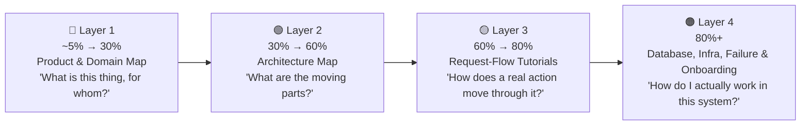

**Read it in order the first time.** After that, use the table of contents below as a reference you jump into.

| # | Section | What it teaches |
|---|---|---|
| 1 | [🏥 Product Map](#1--product-map-what-is-zoeconnect) | What ZoeConnect *is*, who uses it, why it exists |
| 2 | [🗂️ Domain Map](#2-️-domain-map-the-24-modules-grouped-by-what-they-do) | The 24 backend modules grouped into human-meaningful domains |
| 3 | [🏗️ Architecture Map](#3-️-architecture-map-the-moving-parts) | Every deployable app, how they relate, the layers inside the backend |
| 4 | [🔁 Request-Flow Tutorials](#4--request-flow-tutorials-watch-a-request-actually-move) | Three real, traced walkthroughs — login, an attendance punch, an incident report |
| 5 | [🗄️ Database Mental Model](#5-️-database-mental-model) | Postgres vs. Oracle, tenant scoping, how tables relate |
| 6 | [🌐 Infrastructure Map](#6--infrastructure-map) | Where this actually runs, ports, deployment shapes |
| 7 | [⚠️ Failure & Reliability Map](#7-️-failure--reliability-map) | What breaks when X goes down, and what happens next |
| 8 | [🎓 Developer Onboarding Guide](#8--developer-onboarding-guide) | Glossary, "if you need to do X, start here" table, local setup pointers |
| 9 | [🧠 Cheat Sheet](#9--cheat-sheet-the-one-page-version) | The whole handbook compressed to one page |

---

## 1 · 🏥 Product Map — What Is ZoeConnect?

> **🧠 Mental model box**
> ZoeConnect is **not** a hospital records system (that's the Oracle **HIS** it plugs into). ZoeConnect is a layer of *operational, patient-experience, and workforce* software that sits **around** a hospital's existing Oracle HIS, reading identity/roster/billing data from it and writing back results (attendance, points, print records) — without owning the clinical system of record itself.

Internally the product is called **HDSP** — *Hospital Digital Services Platform* — and externally branded **ZoeConnect**. Both names refer to the same system; you'll see `HDSP` all over file names, table names, and internal docs.

### Who actually uses it

| Persona | What they touch | Which modules |
|---|---|---|
| 🧑‍⚕️ Hospital staff (nurses, doctors, therapists) | Clock in/out, patient safety reports, therapy session notes | `attendance`, `incident`, `eic` |
| 🧑‍💼 Hospital administrators | Roles, settings, licensing, backups, reports | `rbac`, `settings`, `licensing`, `backup`, `reports` |
| 🧑‍🎓 Teachers / school staff | Residential children's-village school operations | `childrens-village` |
| 🧍 Patients / visitors | Token/queue for outpatient services, feedback surveys, digital signage in waiting areas | `token`, `feedback`, `cms` |
| 💳 Loyalty program members | Points, rewards, campaigns tied to hospital billing | `loyalty` |
| 🏢 Company sales/licensing team | Sell and provision the platform to new hospitals | `vendor-portal/` (a separate app), `licensing`, `platform/tenant-provisioning` |
| 🖥️ On-prem IT at a hospital | Install and run the **Connector** so a cloud-hosted ZoeConnect can reach their local Oracle HIS | `connector/`, `connector-manager/`, `connector-tray/` |

### Why it exists (the one sentence that explains 80% of the architecture)

> **Hospitals already run an Oracle HIS they didn't build and don't want touched. ZoeConnect adds modern features (attendance automation, incident tracking, patient experience, a school system, loyalty) on top of that HIS, reading its data and selectively writing back into it — while being deployable either on the hospital's own server or, increasingly, in the cloud.**

That single tension — *"modern multi-tenant cloud platform" wanting to talk to "one hospital's private on-prem Oracle database"* — is the reason the **Connector** exists (§3), the reason there are two Oracle-access modes (`direct` vs `cloud_relay`, §7), and the reason `attendance` (the module that polls Oracle most aggressively) is the one module explicitly excluded from multi-tenant cloud deployment today.

---

## 2 · 🗂️ Domain Map — The 24 Modules, Grouped by What They Do

Reading `backend/src/modules/` as a flat alphabetical list of 24 folders tells you nothing about the product. Grouped by **business domain**, it tells you almost everything:

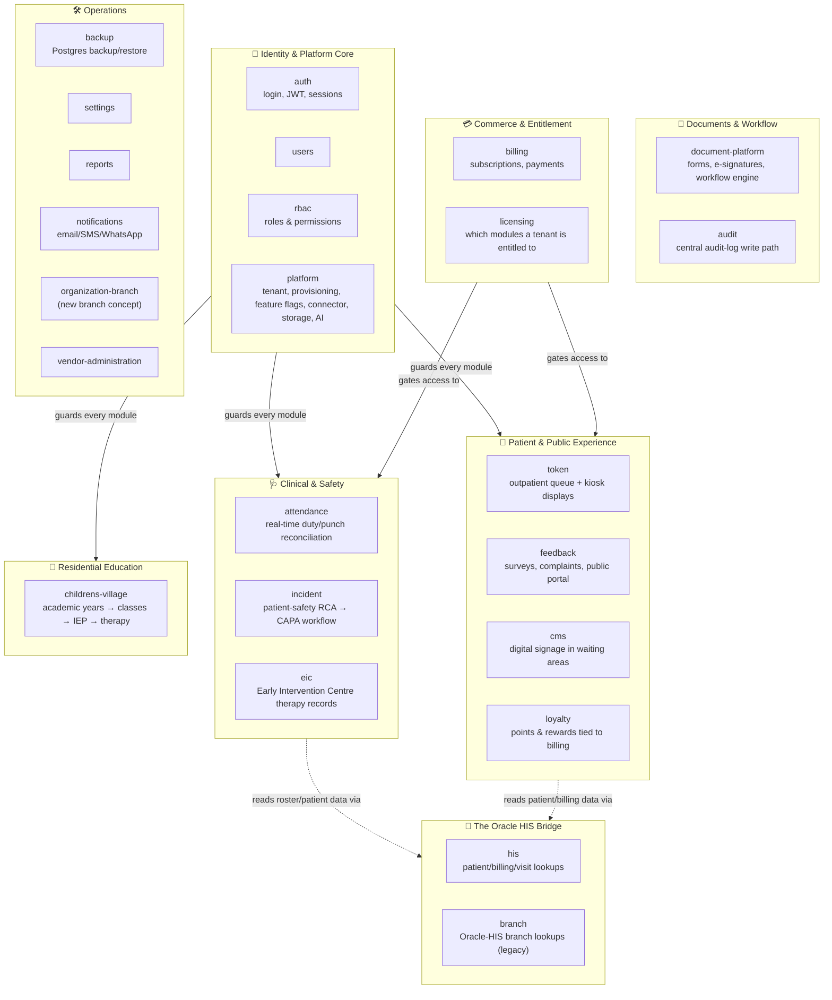

> **🧠 Mental model box — the two axes**
> Every module sits on two independent axes:
> 1. **Does it touch the Oracle HIS?** (`attendance`, `his`, `branch`, `loyalty`, `token`, `eic` — yes, directly or via `his`. Most others — no, Postgres-only.)
> 2. **Is it tenant-scoped?** (Almost everything — yes, via a `tenantId` column. `document-platform` is a notable, deliberate exception — it's platform-wide by design, not per-hospital.)
>
> If you remember nothing else from this section: **`his` is the single hub every Oracle-touching module imports from** — it's the most-depended-on module in the entire graph, not a coincidence, a design.

### The 24 modules, one line each

| Domain | Module | One sentence |
|---|---|---|
| 🩺 Clinical | `attendance` | Polls Oracle punch/roster data, decides LATE/ABSENT/HALF_DAY etc., writes the decision back into Oracle — the single largest module in the codebase (~13k LOC). |
| 🩺 Clinical | `incident` | Patient-safety incident lifecycle: triage → investigation → root-cause-analysis → corrective action → closure. |
| 🩺 Clinical | `eic` | Early Intervention Centre — therapy patients, sessions, goals, progress reports, discharge. |
| 🙂 Experience | `token` | Outpatient token/queue system with a WebSocket-driven live display — the second-largest module (~10k LOC). |
| 🙂 Experience | `feedback` | Patient experience surveys, complaint handling, a no-login public submission portal. |
| 🙂 Experience | `cms` | Digital signage — playlists, media, emergency broadcasts on waiting-room screens. |
| 🙂 Experience | `loyalty` | Points/rewards/campaigns earned from hospital billing activity. |
| 🏫 Education | `childrens-village` | An entire school-management system (academic years, classes, timetables, IEPs, therapy links) — the second-largest module by file count (120 files). |
| 📄 Docs | `document-platform` | A generic forms/e-signature/workflow engine; a pure re-export aggregate with no controllers of its own. |
| 📄 Docs | `audit` | Every other module's "what happened and who did it" trail, written via a background queue. |
| 🔐 Identity | `auth` | Login, JWT issuance/refresh, password reset, session setup. |
| 🔐 Identity | `users` | User CRUD — the module where a real cross-tenant data leak was found and fixed (see §7). |
| 🔐 Identity | `rbac` | Roles and permissions catalog. |
| 🔐 Identity | `platform` | The biggest module (164 files) — tenant identity, tenant provisioning, feature flags, the Connector's backend half, storage abstraction, an AI-platform scaffold. |
| 💳 Commerce | `billing` | Subscription/quote/checkout lifecycle, Razorpay integration. |
| 💳 Commerce | `licensing` | Which modules a given tenant/hospital is actually entitled to use. |
| 🏥 HIS bridge | `his` | The main Oracle-HIS integration point — patient, billing, visit, and reference lookups, exported to 7+ other modules. |
| 🏥 HIS bridge | `branch` | A small, older module for Oracle-HIS branch lookups — deliberately kept separate from the newer `organization-branch`. |
| 🛠️ Ops | `backup` | Postgres backup/restore with pluggable storage providers (local/S3/Azure/GCS/SFTP) — one of the most mature modules in the codebase. |
| 🛠️ Ops | `settings` | Generic system key/value settings. |
| 🛠️ Ops | `reports` | Cross-module analytics (currently reads `loyalty` + `notifications` data directly). |
| 🛠️ Ops | `notifications` | Email/SMS/WhatsApp delivery, with a pluggable local-vs-cloud provider. |
| 🛠️ Ops | `organization-branch` | A newer, independent branch concept — not connected to the legacy `branch` module on purpose. |
| 🛠️ Ops | `vendor-administration` | Backend-side support for the separate Vendor Portal app (account lockouts, remote commands). |

---

## 3 · 🏗️ Architecture Map — The Moving Parts

### 3.1 The seven applications

ZoeConnect is not one app — it's a **family of seven deployable applications** that share conventions (and sometimes a database), not a single deploy unit.

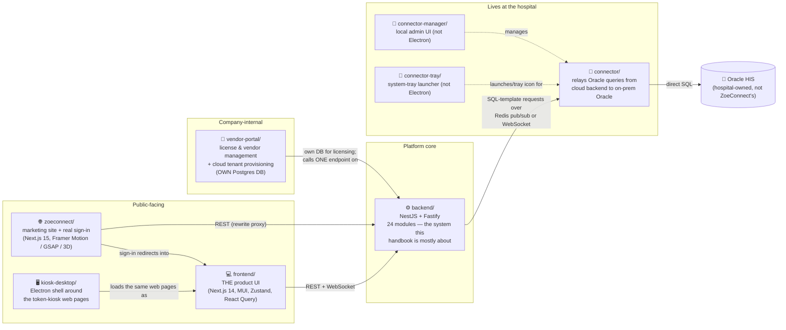

> **🧠 Mental model box**
> If someone says "ZoeConnect is down," your first question should be **"which of the seven?"** `frontend/` being down and `backend/` being down are different incidents. `vendor-portal/` being down doesn't affect a single hospital's day-to-day operations at all — it's a sales/licensing tool, not part of the clinical path.

### 3.2 What's inside `backend/` — the request pipeline

This is the part you'll spend 90% of your time in. Every HTTP request, no matter which of the 24 modules it lands in, passes through the same pipeline:

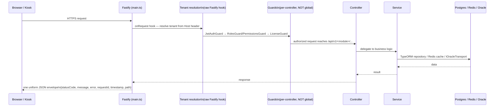

> **⚠️ Important quirk to remember:** guards are **not global**. Every one of the ~116 controller files has to remember to add `@UseGuards(JwtAuthGuard, ...)` itself — there's no framework-level safety net forcing it. This is a real, structural thing to be careful about if you ever write a new controller: forgetting the guard doesn't error, it just silently makes the route public.

### 3.3 How a module talks to Oracle (the two-mode pattern)

This is the single most distinctive architectural idea in ZoeConnect, and it's worth genuinely understanding rather than skimming.

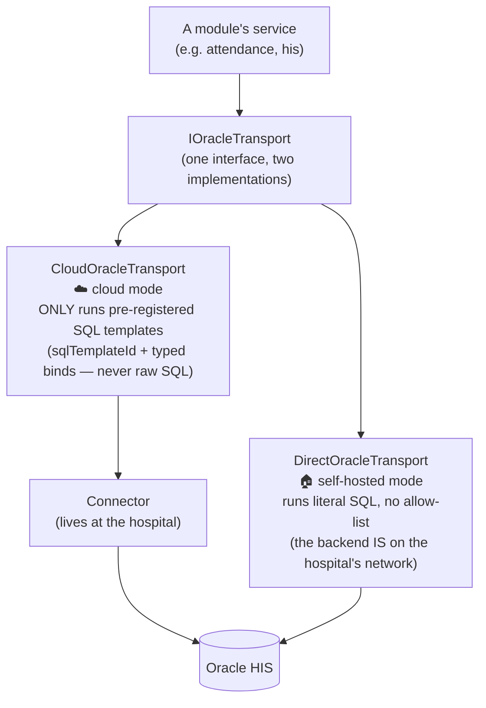

**Why two modes exist:** a self-hosted deployment sits on the hospital's own network, so it can talk to Oracle directly — no relay needed. A cloud-hosted deployment is, by definition, outside that network, so it can't reach Oracle at all unless something on-prem relays the request. That something is the **Connector**, and because a cloud backend is now sending SQL *requests* across the public internet to a machine sitting next to a hospital's real patient database, that channel is deliberately locked down: the cloud side can only ask for pre-registered `sqlTemplateId`s, never send arbitrary SQL. `[VERIFIED]` — this allow-list is enforced in code (`CloudOracleTransport`'s `knownTemplates` map throws on any unregistered template).

---

## 4 · 🔁 Request-Flow Tutorials — Watch a Request Actually Move

Three real flows, traced step by step. Read these slowly — this is where the architecture actually clicks.

### 4.1 Tutorial: Logging in

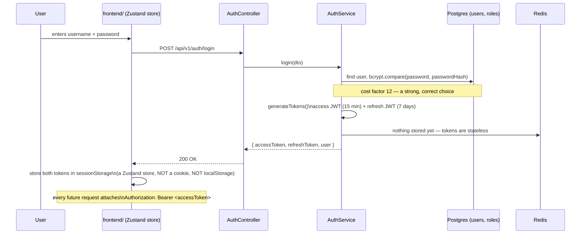

**What happens 15 minutes later, when the access token expires:**

1. A request comes back `401 Unauthorized`.
2. The frontend's axios interceptor automatically calls `POST /auth/refresh` with the refresh token.
3. The backend verifies the refresh token isn't blacklisted in Redis, mints a **brand-new pair** (both tokens rotate — the old refresh token is blacklisted so it can't be reused), and the original request is silently retried.
4. Any other requests that were in-flight during this dance are queued and retried too, not dropped.

> **🧠 Mental model box — "who am I" on the backend**
> After `JwtAuthGuard` runs, `req.user` is a **full `User` entity** loaded fresh from Postgres on every single request (via `JwtStrategy.validate()`), not just decoded from the JWT payload. That means: revoking a user's roles takes effect on their very next request. But it also means permissions **baked into the JWT at login time** (a flattened list of permission keys) stay valid on the *access token itself* until it expires — a permission revoked mid-session can still work for up to 15 minutes unless the session is explicitly blacklisted.

### 4.2 Tutorial: An attendance punch (the most "ZoeConnect-specific" flow in the whole system)

This is worth understanding deeply — it's the flow that explains *why* `attendance` is architecturally special.

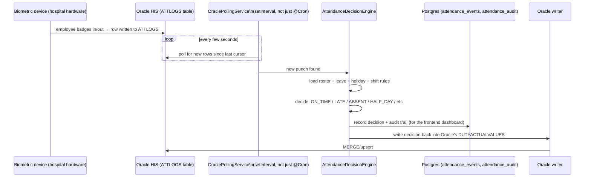

**Then, overnight, a reconciliation job double-checks everything:**

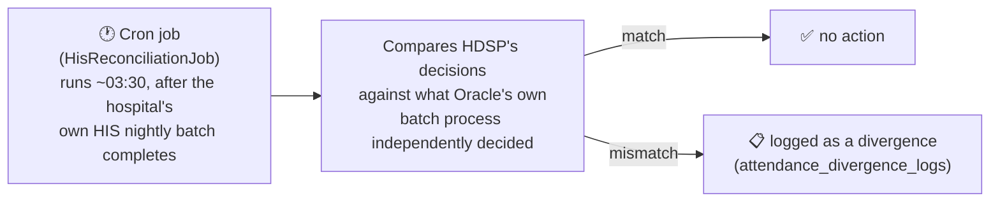

> **⚠️ Why this module can't run in multi-tenant cloud mode today**
> `OraclePollingService` uses **one process-wide connection pool**. That's fine when one deployment = one hospital (self-hosted). It breaks the moment one ZoeConnect deployment serves *multiple* hospitals simultaneously (multi-tenant cloud), because there's no way to know which tenant's Oracle a given poll cycle should even be talking to. `[VERIFIED]` — `attendance` is explicitly excluded from the module-import list when `DEPLOYMENT_MODE=cloud`.

### 4.3 Tutorial: Submitting a patient-safety incident

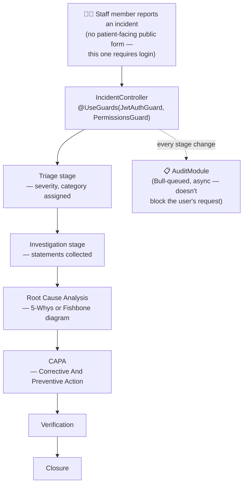

This is a genuine multi-stage **state machine**, not a simple CRUD form — 21 entities exist just for the `incident` module, one per stage/sub-concept (timeline events, notification rules, severity levels, risk-matrix config, etc.). If you're asked to work on patient-safety features, this module is the one to study as a template for "how does ZoeConnect model a real clinical workflow."

---

## 5 · 🗄️ Database Mental Model

> **🧠 The single most important idea in this whole section:**
> **There are two databases, and they are philosophically opposite.** Postgres is ZoeConnect's own database — it owns the schema, runs migrations, can add tables freely. Oracle is the **hospital's** database — ZoeConnect does not own its schema, cannot freely add columns, and must treat every read/write as touching someone else's system of record.

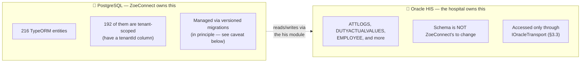

### 5.1 The tenant-scoping mental model

Every hospital using ZoeConnect is a **tenant**. Almost every table has a `tenantId` column so hospital A's data is never visible to hospital B. This is enforced through a wrapper class:

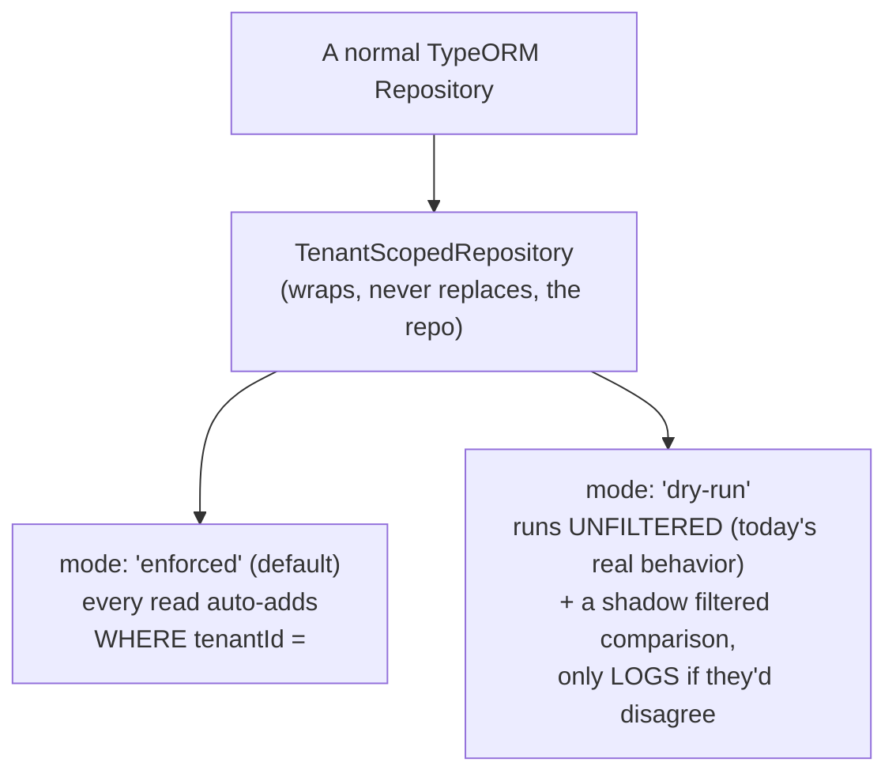

> **⚠️ This isn't theoretical — it already caused two real incidents.** `[VERIFIED]` Both the `users` module and the `eic` module had a real, confirmed cross-tenant data leak — `GET /users` was returning *every* hospital's users, not just the caller's — found and fixed by promoting those entities from `dry-run` to `enforced`. As of the last full code read, `rbac`'s `Role`/`Permission` entities are still `dry-run`, and at least one `users` entity is still pending promotion. **If you're ever touching multi-tenant data and see `dry-run`, treat it as "not actually protected yet," not as "protected, just logging."**

### 5.2 Domain groups of tables (simplified)

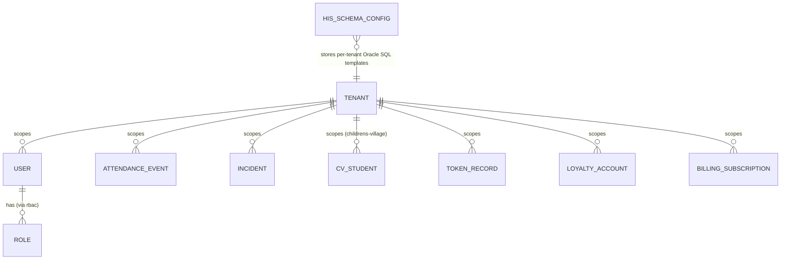

`[INFERRED — simplified for teaching, not a literal schema dump]`. The real picture has 216 entities; the point of this diagram is the *shape*, not the completeness: `TENANT` is the root nearly everything hangs off of.

### 5.3 One thing to watch out for

`[VERIFIED]` Production Oracle-sync configuration (the `his_schema_configs` table, which stores the SQL templates the cloud transport's allow-list depends on) has, at least four times, been **hand-patched via raw `psql` commands run against the live database**, outside the normal migration system. If you're ever debugging "why did an HIS sync query change behavior and there's no migration for it," this is why — check `his_schema_configs` rows directly, not just the migration history.

---

## 6 · 🌐 Infrastructure Map

### 6.1 Where this actually runs today

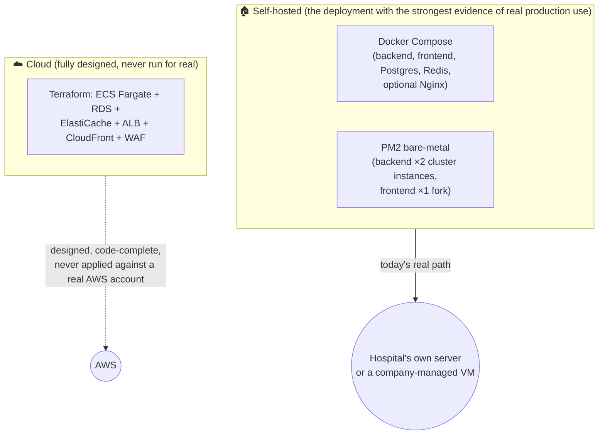

> `[VERIFIED]` No Terraform state file, no `.terraform/` directory, no lock file exists anywhere in the repo, and the Terraform module's own README says outright it has never been run against a real account. Treat the cloud path as **a well-written blueprint**, not a running system, until someone confirms otherwise.

### 6.2 Ports, at a glance

| App | Default port | Notes |
|---|---|---|
| `backend/` | 3001 | The API everything else calls |
| `frontend/` | 3000 | The product UI |
| `zoeconnect/` | 3010 | Marketing site (cloud-profile only in Docker Compose) |
| `vendor-portal/backend` | 4000 | Its own DB (`vendor_db`, port 5433) |
| `vendor-portal/frontend` | 4001 | |

### 6.3 Where the Connector fits physically

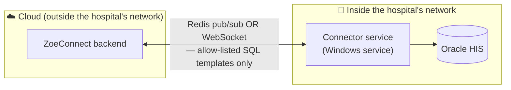

This is the one piece of infrastructure genuinely built for a "cloud service reaching into a private on-prem system" problem — worth remembering as a template if a future module (a hospital's own mortuary register, a pharmacy system) needs the same shape.

---

## 7 · ⚠️ Failure & Reliability Map

> **🧠 Mental model box**
> ZoeConnect currently has **strong logs and health checks, but no metrics/alerting layer.** That combination means: when something breaks, the *evidence* exists in the logs — but **nobody gets notified automatically.** Someone has to go looking.

### 7.1 "What happens when X goes down?"

| If this fails… | What breaks | What still works | How you'd notice today |
|---|---|---|---|
| **Postgres** | Everything — it's the primary database for almost all modules | Nothing meaningful | 5 Terminus health checks would fail; no automatic alert fires |
| **Redis** | JWT blacklist checks, session-activity tracking, all caching, all Bull queues (notifications, loyalty events, backups, attendance realtime, audit log writes) | Basic reads that don't hit cache; login itself still works (tokens are stateless) | Health check fails; queued background work silently stalls |
| **Oracle HIS** | `attendance`, `his`-dependent lookups (patient/billing/visit), `loyalty` earn-from-bill, `token`'s HIS bridge | Everything Postgres-only: `incident`, `feedback`, `cms`, `document-platform`, `backup`, `rbac`, `settings` | An Oracle health indicator exists; attendance polling would start erroring |
| **The Connector** (cloud mode only) | Any Oracle access in a cloud-hosted, multi-tenant deployment | Everything in a self-hosted deployment (Connector isn't used there at all) | `CloudOracleTransport` requests would time out |
| **One tenant's data gets exposed to another** | Already happened twice for real (`users`, `eic`) — see §5.1 | — | Found via code audit, not automated detection — **there is no automated cross-tenant leak test suite today** `[VERIFIED]` |

### 7.2 Two real production incidents worth knowing about (they're in the code comments, not just this handbook)

1. **`[VERIFIED]`** A hardcoded `localhost:3010` fallback for a marketing-site URL caused **real users' cloud logouts to redirect to `localhost`**, because the environment variable was never wired into the Docker build args. Next.js bakes `NEXT_PUBLIC_*` variables in at *build* time, not read at container start — the fix was to fetch the URL at *runtime* from an API call instead of trusting a build-time constant. **Lesson for any new module:** never default a cross-app URL to `localhost` in production code; either resolve it at runtime or make sure it's a real build argument.
2. **`[VERIFIED]`** A logging bug (now flagged for a fix, not yet confirmed fixed) writes the **plaintext password and bcrypt hash** to application logs on every failed login attempt. This is the kind of failure that doesn't crash anything — it just quietly leaks credentials into log storage until someone audits the code.

### 7.3 What's already strong here (don't rebuild these)

- ✅ 5 health indicators (Redis, Oracle, Bull, license, scheduler) already wired into Docker health checks.
- ✅ A global request-ID + structured logging interceptor — every request is traceable through the logs by ID.
- ✅ A single, uniform error response shape (`GlobalExceptionFilter`) — no module has its own inconsistent error format.
- ✅ A genuinely mature backup module — scheduled, multi-provider (S3/Azure/GCS/SFTP/local), queued, with retention pruning.

---

## 8 · 🎓 Developer Onboarding Guide

### 8.1 Glossary — the vocabulary you'll hit immediately

| Term | Means |
|---|---|
| **HDSP** | Hospital Digital Services Platform — the internal name for the same product ZoeConnect is the external brand of. You'll see this in table names, file names, class names. |
| **HIS** | Hospital Information System — the hospital's own Oracle database, the system of record ZoeConnect reads from/writes to but does not own. |
| **Tenant** | One hospital's isolated slice of data inside a (potentially) multi-hospital ZoeConnect deployment. |
| **Connector** | The on-prem relay service that lets a cloud-hosted backend reach a hospital's private Oracle HIS. |
| **`dry-run` vs `enforced`** | The two modes of `TenantScopedRepository` — `dry-run` logs would-be tenant violations without blocking them; `enforced` actually filters by tenant. See §5.1. |
| **`DEPLOYMENT_MODE`** | Env var: `self_hosted` (one hospital, direct Oracle access) vs `cloud` (many hospitals, Oracle access relayed through the Connector). |
| **`PROCESS_ROLE`** | Env var: `api` / `worker` / `all` — controls whether a given process instance runs cron jobs, to avoid duplicate scheduling when horizontally scaled. |
| **Provider abstraction** | A recurring pattern: one interface (e.g. `IObjectStorageProvider`), two implementations (local disk vs. S3), selected by a single env var. Used for storage, licensing, notifications, and Oracle transport. |
| **`@Public()`** | A decorator marking a route as not requiring authentication — used deliberately for login, kiosk displays, public feedback forms. |

### 8.2 "If you need to do X, start here"

| I need to… | Start in… |
|---|---|
| Understand how login/sessions work | `backend/src/modules/auth/`, then §4.1 above |
| Add a new API endpoint to an existing module | That module's `*.controller.ts` — check it has `@UseGuards(JwtAuthGuard, ...)` at the class level |
| Understand how a module talks to Oracle | `backend/src/modules/his/`, then §3.3 above |
| Add a brand-new module (e.g. a new healthcare app) | `backend/src/modules/notifications/` or `backend/src/modules/backup/` as clean reference examples — **import other modules' services, never their entity files directly** |
| Understand tenant isolation | `backend/src/modules/platform/tenant/repositories/tenant-scoped.repository.ts`, then §5.1 above |
| See what background jobs exist | Grep for `@Cron` and `@Process` across `backend/src/modules/**` |
| Understand the frontend's module structure | `frontend/src/app/(platform)/` — folder names mirror backend module names almost 1:1 |
| Run this locally | `[NEEDS CONFIRMATION]` — check `backend/.env.example`, `DEVELOPMENT_SETUP.md`, and `docker-compose.yml` at the repo root; this handbook doesn't re-derive exact local setup steps, since they change independently of the architecture |
| Understand deployment | `DEPLOY.md` (self-hosted/PM2) and `CLOUD_DEPLOY.md` (cloud/ECS) at the repo root |

### 8.3 The three habits worth building early

1. **Before importing anything from another module, ask: am I importing its `*Module` class (fine) or its `*.entity.ts` file directly (a shortcut seven existing modules already took, and the reason the codebase is coupled tighter than its folder structure suggests)?**
2. **Before adding a new table, ask: does it need a `tenantId` column, and will reads through it go through `TenantScopedRepository` in `enforced` mode from day one?**
3. **Before touching anything that logs request/response data, ask: could this ever contain a password, token, or patient-identifying data?** (§7.2's incident #2 is the cautionary tale.)

---

## 9 · 🧠 Cheat Sheet — the one-page version

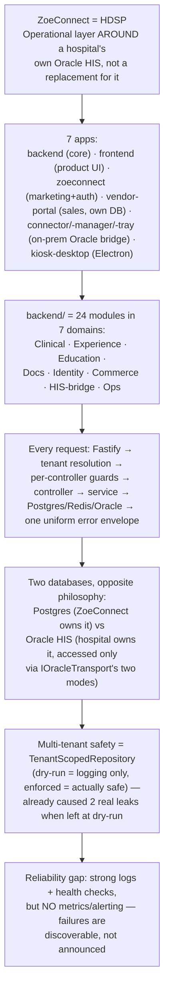

**The one idea to hold onto above all others:** *ZoeConnect's hardest architectural problem was never "how do we build a web app" — it was always "how do we safely and gradually let a modern, multi-tenant, cloud-capable platform coexist with hospitals' existing, private, schema-we-don't-own Oracle systems." Nearly every distinctive design decision in this codebase — the Connector, the two Oracle-transport modes, `attendance`'s cloud exclusion, the provider-abstraction pattern — is that one problem, solved from a slightly different angle each time.*

---

## 📌 A note on location

This file was written to `docs/ZOECONNECT-VISUAL-ARCHITECTURE-HANDBOOK.md` exactly as requested. Worth knowing: the repository already has a `docs/architecture/` folder containing related learning material (`AUTHENTICATION_FLOW.md`, `SESSION_ARCHITECTURE.md`, `MILESTONE_PLAN.md`) — if this handbook should live alongside those instead of at the `docs/` root, say so and it can be moved; nothing about its content depends on its location.

## 📌 A note on the "four new modules"

As stated at the top: a direct search of `backend/src/modules/` and `frontend/src` found no `mortuary`, `drug-indenting`, `cligrowth`/`clinigrowth`, or similarly-named module. This handbook is built from the 24 modules that verifiably exist. `[NEEDS CONFIRMATION]`: where do those four modules currently live (a different branch, an unmerged PR, a separate repo)? Once confirmed, this handbook can be extended with a dedicated section for them using the same domain-map / request-flow-tutorial format used above.
