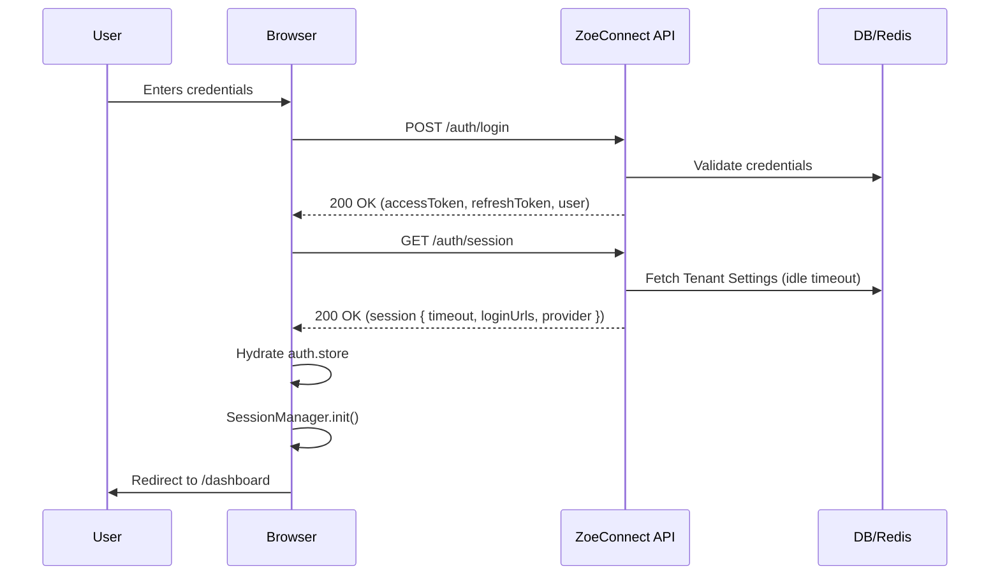
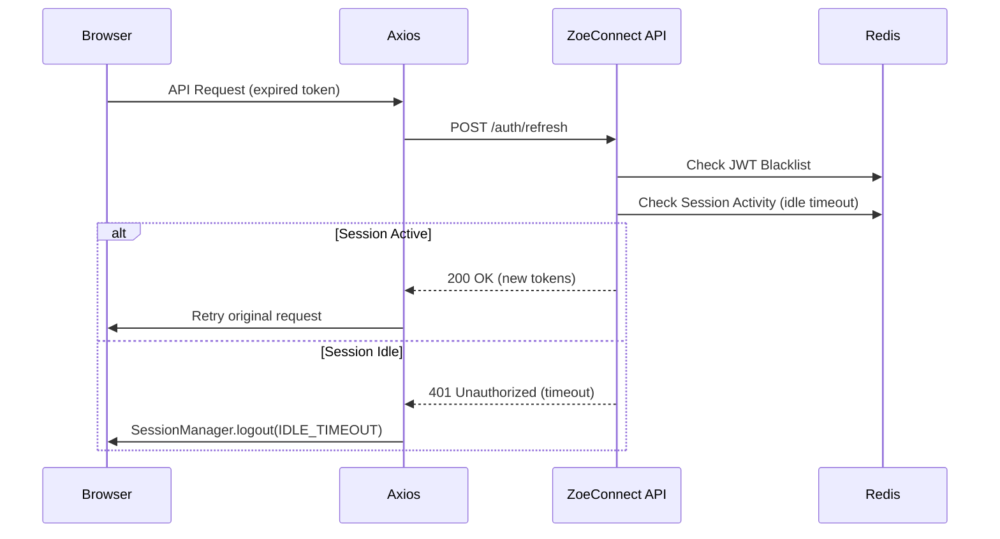
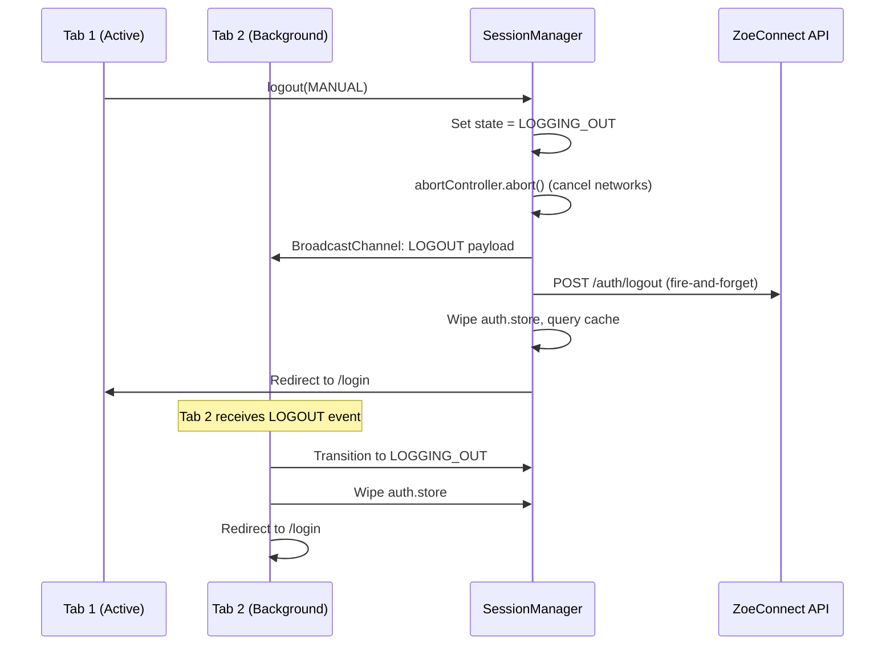
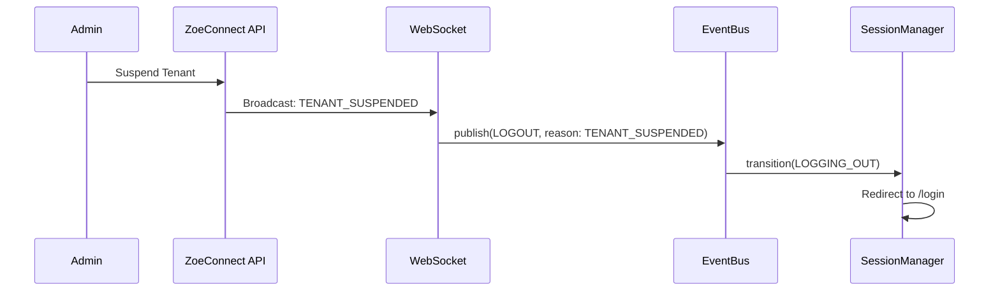

# Authentication Flow

This document details the lifecycle and sequence of authentication events in ZoeConnect.

## 1. Login Flow

The login flow handles the initial authentication, establishing the session, and storing the configuration required for idle timeout enforcement.

## 2. Refresh Flow & Idle Timeout

The refresh flow is triggered automatically by Axios interceptors when an access token expires. The backend strictly enforces idle timeouts during this refresh.

## 3. Logout & Cross-Tab Sync

When a user logs out manually or times out, the `SessionManager` orchestrates a clean teardown across all tabs instantly.

## 4. Maintenance Shutdown (Future-Proofing)

ZoeConnect's architecture supports decoupled, event-driven logouts. A future WebSocket connection can broadcast a `SYSTEM_SHUTDOWN` or `LICENSE_REVOKED` payload, immediately ending sessions without waiting for the next 401 response.

