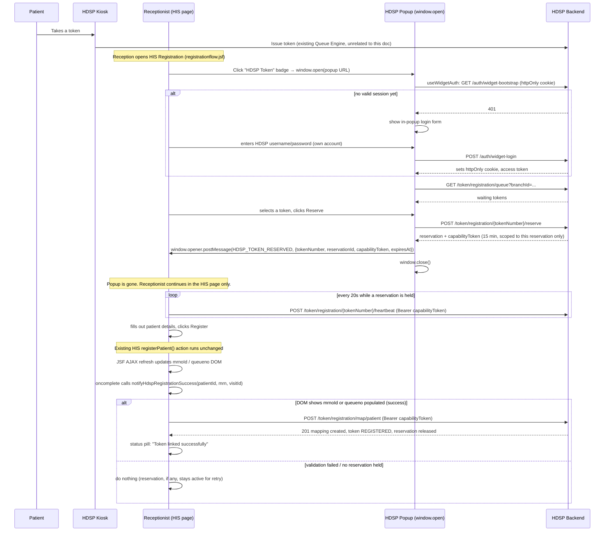
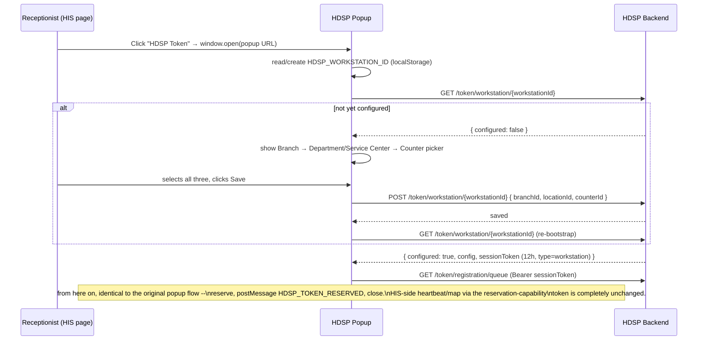
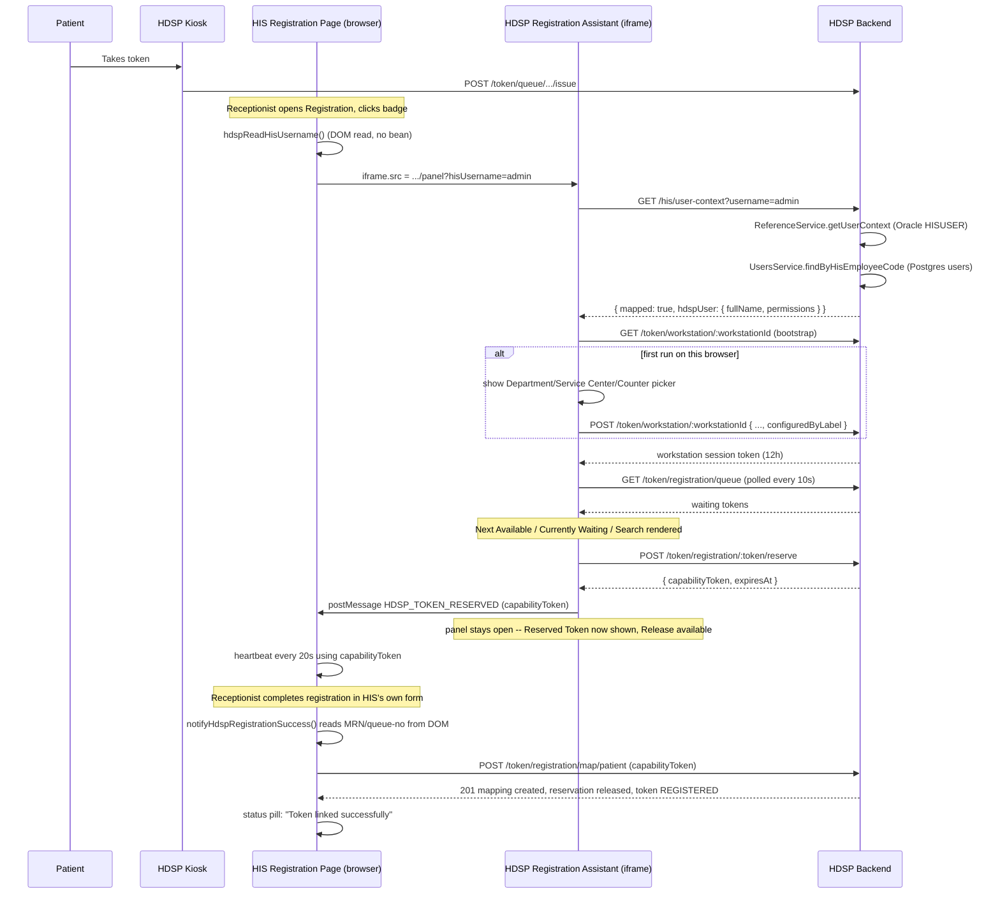

# HDSP ↔ HIS Integration: Popup-Window Architecture

> **RETIRED as of the "Direct Token Registration" redesign.** Everything in
> this document (popup, in-page panel, reservation/heartbeat lifecycle,
> reservation-capability tokens) has been removed from
> `PatientRegistration_HDSP.xhtml` and from `frontend/src/app/widget/*`
> (deleted). No HIS site should be running any version of this design
> anymore. See `docs/his-integration/DIRECT_TOKEN_MRN_MAPPING.md` for the
> current integration: a plain "HDSP Token No" text field, on-blur
> validation, and a single `POST /token/map/patient` call on successful
> registration -- no iframe, no badge, no reservation. This document is kept
> only for historical reference (why earlier designs were shaped the way
> they were, and the security reasoning that carried forward into the
> current design's use of workstation session tokens).

Supersedes the iframe-based design. This document describes the (now also
retired) popup/panel integration: two independent applications, cooperating
only through the browser, with no reverse proxy, no shared origin, and no
HIS backend code of any kind.

> **v2 update:** sections 2, 5, 9, 10, and 11 below describe the popup's
> original *user-mapping* design (receptionist authenticates once, HDSP
> resolves a mapped user). That design has been **superseded** by
> workstation-based context resolution — see the addendum at the end of
> this document. The rest of this document (communication mechanism,
> success detection, HIS-side markup, failure recovery for the
> reservation/heartbeat/map leg) is unchanged and still accurate; only
> *how the popup itself gets authorized to reserve a token* changed.

## 1. Updated architecture

```
HDSP (standalone)                          HIS (standalone, untouched)
├── Token Management                       ├── Patient Registration
├── Queue Engine                           ├── Billing
├── Counter Management                     ├── Appointments
├── Display Boards                         └── ... (everything else)
├── Reports / Analytics
└── Plugins
    ├── HIS Registration Integration  ◄──── the only thing described here
    ├── Doctor Queue
    ├── Pharmacy
    ├── Loyalty
    └── Patient Journey
```

Both applications run on their own origin (own host/port, own deployment,
own release cycle). Nothing in HDSP's core (Token Management, Queue Engine,
Counter Management, Display Boards, Reports, Analytics) knows the HIS
Registration plugin exists — it lives entirely inside `registration.module.ts`
plus a handful of guard/DTO additions, and the Token Management System
continues to work identically with the plugin absent. Nothing in the HIS
knows HDSP exists beyond a `<script>` block and a badge `<div>`.

**The only contract between them is: read values already rendered by HIS →
call the HDSP API directly from the browser.** No server-to-server call
exists in either direction.

## 2. Sequence diagram



## 3 & 4. Parent-page and popup JavaScript

Both are complete, production code, already written into the repo — not
reproduced here to avoid drift between this document and the source of
truth:

- **Parent (HIS) page JS**: `docs/his-integration/PatientRegistration_HDSP.xhtml`,
  the `<script>` block inside the `HDSP Token Selector` `<a4j:outputPanel>`.
  Functions: `hdspOpenPopup()`, `hdspStartHeartbeat()` / `hdspStopHeartbeat()`,
  the `message` listener, `window.notifyHdspRegistrationSuccess()`.
- **Popup JS**: `frontend/src/lib/hooks/usePopupReservation.ts` (state
  machine + postMessage + `window.close()`) and
  `frontend/src/app/widget/registration/popup/page.tsx` (auth
  orchestration + UI, reusing `useWidgetAuth`, `WidgetLoginForm`,
  `WidgetBranchPicker`, `QueueList` unchanged from the iframe build).

## 5. Popup lifecycle

```
window.open() ──▶ CHECKING (useWidgetAuth bootstrap)
                     │
        ┌────────────┼─────────────────┐
        ▼            ▼                 ▼
  NEEDS_LOGIN   NEEDS_BRANCH          READY
        │            │                 │
        └──login──▶ READY ◀───select───┘
                       │
                     IDLE (queue shown)
                       │ select token
                     SELECTED
                       │ click Reserve
                     RESERVING ──(error)──▶ ERROR (stays open, retry)
                       │ success
                     DONE ──▶ postMessage to opener ──▶ window.close() (300ms later)
```

- Closing the popup manually at any point before `DONE` sends nothing —
  `usePopupReservation` only posts a message from inside `confirmReserve`,
  after a reservation actually exists. **No message, no reservation.**
- If `window.opener` is missing (popup URL opened directly, not via the
  badge), the popup refuses to proceed and shows an explanatory message —
  it will never silently reserve a token with nowhere to send it.
- Reservation expiry while the popup is still open is handled the same way
  it always was (30s TTL, extended only by an active heartbeat) — but by
  design the popup itself never lives long enough post-reservation for this
  to matter; heartbeating is the parent page's job from `DONE` onward.

## 6. Browser communication: choice and rationale

Evaluated against `window.opener`/`postMessage`, `BroadcastChannel`, and
`localStorage` events, for a same-LAN, multi-counter, multi-window
deployment:

| Mechanism | Cross-origin? | Scoped to one popup/opener pair? | Verdict |
|---|---|---|---|
| `BroadcastChannel` | **No** — spec-restricted to same origin | No — same-name channel is visible to every same-origin tab/window | Rejected: can't cross HIS↔HDSP origins at all, and would cross-talk between simultaneous counters even if it could |
| `localStorage` `storage` event | **No** — same-origin only, and only fires in *other* same-origin windows | No | Rejected: same cross-origin blocker as above |
| `window.opener` + `postMessage()` | **Yes** — the whole point of postMessage | **Yes** — `window.open()` returns a direct reference to exactly the popup it created; the popup's `window.opener` is a direct reference back. No channel name, no broadcast, no leakage to unrelated windows | **Selected** |

`postMessage` is also the only option that degrades safely: if the
receptionist opens two HIS tabs and two popups, each popup's `window.opener`
points at exactly the tab that spawned it — there is no shared bus for
messages to leak across counters, which a broadcast-style channel would
have required extra namespacing to prevent.

Origin checks are applied on both ends: the HIS listener checks
`evt.origin === HDSP_ORIGIN` **and** `evt.source === hdspPopupRef` (the
exact window reference `window.open()` returned) before accepting a
message; the popup targets its message at `document.referrer`'s origin (see
`resolveTargetOrigin()` in `usePopupReservation.ts`), which the browser
itself will refuse to deliver to if wrong, regardless of what the popup's
JS claims.

## 7. Registration success detection

Unchanged from the DOM-detection design already in production:

- `navigation:mrnoId` (MRN input) non-blank, **or**
- `navigation:queueno` (queue-no display) non-blank

Both are already re-rendered by the existing Register buttons' `reRender`
list — nothing about that list was touched. On a validation failure,
neither element changes (HIS's own `registerPatient()` action never reaches
the point of assigning MRN/queue number), so `notifyHdspRegistrationSuccess`
correctly no-ops. This logic lives in one place — the HIS page's own JS —
and is called the same way regardless of whether the mapping call target is
an iframe (old) or a direct fetch (current); only the delivery mechanism
changed.

## 8. Modifications to `registrationflow.jsf` (`PatientRegistration_HDSP.xhtml`)

- Removed: the `<iframe id="hdspTokenWidget">`, `.hdsp-badge-panel` /
  `.hdsp-panel-header` / `.hdsp-panel-body` CSS, `hdspTogglePanel()`,
  `hdspLoadIframe()`, and the iframe-targeted `postMessage` listener.
- Added: `.hdsp-status-pill` CSS (a small always-visible status line next
  to the badge, replacing the panel), `hdspOpenPopup()` (`window.open`),
  a `message` listener scoped to `evt.source === hdspPopupRef`, a 20s
  heartbeat `setInterval`, and a rewritten `notifyHdspRegistrationSuccess()`
  that calls HDSP's `/token/registration/map/patient` via `fetch` instead
  of posting into an iframe.
- Unchanged: both Register buttons' `oncomplete` hooks still call
  `notifyHdspRegistrationSuccess(patientId, mrn, visitId)` with the exact
  same bare-EL-property arguments as before — the callback signature never
  needed to change, only its implementation.
- One remaining per-site edit: `HDSP_BASE_URL` (a plain JS string constant,
  not a credential) must be set to wherever HDSP is actually deployed for
  that hospital.

## 9. Modifications to the HDSP frontend

- `frontend/src/lib/api/registration.api.ts` — `ReservationResult` gained a
  `capabilityToken: string` field (additive, already returned by the
  backend's `reserve` endpoint).
- `frontend/src/lib/hooks/usePopupReservation.ts` — **new**. Reservation-only
  state machine for the popup context.
- `frontend/src/app/widget/registration/popup/page.tsx` — **new**. The popup
  route. Reuses `useWidgetAuth`, `WidgetLoginForm`, `WidgetBranchPicker`,
  `QueueList` unmodified.
- The original iframe-mode route (`frontend/src/app/widget/registration/page.tsx`,
  `useRegistrationWidget.ts`) is left in place but is **no longer
  referenced by the integration** — nothing in HIS embeds it anymore. It can
  be deleted in a follow-up once you're confident no deployment still relies
  on the iframe path; left alone here to avoid removing working code that
  wasn't asked to be deleted.

## 10. Modifications to the HDSP backend

| File | Change |
|---|---|
| `modules/token/registration/dto/map-patient.dto.ts` | Added optional `reservationId` (required in practice for capability-authenticated callers — enforced by the guard below, not the DTO, to stay backward compatible) |
| `modules/token/registration/registration.service.ts` | `reserveToken()` now also mints and returns a `capabilityToken` (`mintCapabilityToken`, 15 min TTL, `type: 'reservation-capability'`) |
| `modules/token/registration/registration.module.ts` | Added `JwtModule.registerAsync` (same `jwt.secret` as `AuthModule`) so `RegistrationService` can sign capability tokens |
| `modules/auth/strategies/jwt.strategy.ts` | `validate()` recognizes `type: 'reservation-capability'` payloads and returns a synthetic, narrow principal (`isCapabilityToken: true`) instead of doing a DB user lookup |
| `common/guards/permissions.guard.ts` | Bypasses the permission check for capability principals (they carry no roles; the capability itself is the authorization) |
| `common/guards/reservation-scope.guard.ts` | **New.** Enforces that a capability-authenticated request's `tokenNumber`/`reservationId` exactly match what the token was minted for; no-op for normal user sessions |
| `modules/token/registration/registration.controller.ts` | `heartbeat`, `release`, `mapPatient` now also carry `@UseGuards(ReservationScopeGuard)` (additive — normal session auth is untouched) |
| `main.ts` | No functional change — the existing private-LAN CORS allow-list (regex matching `192.168.x.x`, `10.x.x.x`, `172.16–31.x.x`, `localhost`) already covers on-prem HIS deployments; documented that public-internet HIS hosts need `CORS_ORIGIN` |

All existing tests for `registration.service.spec.ts` continue to pass
unmodified in behavior (only the test harness's `buildService()` helper
gained a mocked `JwtService`, since the constructor now takes one).

## 11. Security considerations

- **No HIS credential ever exists.** The receptionist authenticates to HDSP
  directly, inside the popup, with their own HDSP account — the same
  `widget-login`/`widget-bootstrap` cookie flow used previously. HIS never
  sees a username, password, or session token belonging to that flow.
- **The token exposed to HIS page JS is deliberately the weakest possible
  credential that still works.** It is not the receptionist's real access
  token or refresh cookie — it is a purpose-built, 15-minute,
  single-reservation-scoped JWT that can only heartbeat/release/map *that
  one reservation*. `ReservationScopeGuard` rejects it outright for any
  other `tokenNumber`/`reservationId`. Even if it were read out of a
  browser's dev tools or a HAR file, the blast radius is one already-locked
  token for 15 minutes.
- **Standard receptionist sessions are unaffected.** Everything in
  `JwtStrategy`, `PermissionsGuard`, and every other route's authorization
  behaves exactly as before for a normal Bearer access token; the new logic
  only activates for the new `type: 'reservation-capability'` payload
  shape, which nothing except `reserveToken()` can mint.
- **postMessage origin/source double-check.** The HIS listener validates
  both `evt.origin` and `evt.source === hdspPopupRef`, so a malicious
  same-origin-to-HDSP page cannot spoof a reservation message merely by
  matching the origin string — it would also need to be the exact window
  the HIS page opened.
- **CORS is defense-in-depth, not the primary boundary.** The capability
  token's narrow scope is what actually limits damage; CORS just controls
  which browser-side callers can read the response.
- **No cookie crosses the origin boundary.** The direct `fetch()` calls from
  HIS to HDSP use `Authorization: Bearer <capabilityToken>`, never
  `credentials: 'include'` — HDSP's httpOnly session cookie stays scoped to
  HDSP's own origin exactly as `SameSite`/`Secure` intend, with no need to
  relax either for this integration.

## 12. Failure recovery strategy

| Failure | Behavior |
|---|---|
| Popup closed without reserving | No message ever sent; no reservation exists; nothing to recover |
| Popup blocked by browser | `hdspOpenPopup()` detects `null` from `window.open` and shows an inline error; receptionist can allow popups and retry |
| Reservation made, then receptionist abandons registration entirely | Heartbeat stops once the HIS tab is closed/navigated away; reservation's 30s TTL lapses; `RegistrationService.sweepExpiredReservations()` (existing, untouched cron) releases it automatically within ~15–45s |
| `heartbeat` call fails (capability token expired/invalidated) | Parent page stops heartbeating and shows a status message; reservation will expire naturally via the same sweep job; receptionist reopens the popup for a fresh reservation if still needed |
| Registration form validation fails | `notifyHdspRegistrationSuccess` detects no DOM change and does nothing — reservation stays active, no HDSP call is made, receptionist can simply fix and resubmit |
| `map/patient` call fails (network blip, HDSP momentarily down) | Reservation is deliberately **not** released — status pill says so — receptionist can resubmit Register (the button's `oncomplete` fires again, retrying the map call), or the reservation eventually expires via TTL if truly abandoned |
| HDSP entirely unreachable when the badge is clicked | Popup either fails to load (browser's own error page) or `useWidgetAuth` surfaces `ERROR`/`NEEDS_LOGIN` inside the popup; either way, the HIS page underneath is completely unaffected — registration continues to work exactly as it always has |

## 13. Implementation / rollout plan

1. **Backend deploy**: ship the six backend file changes in §10, run
   `npm install` if `@fastify/cookie` isn't already present from the earlier
   cookie-bootstrap work, run the test suite (`registration.service.spec.ts`
   must pass with the updated `buildService()` harness).
2. **Frontend deploy**: ship the two new frontend files in §9; no env vars
   are strictly required (popup reuses the existing widget auth cookie
   flow), though `NEXT_PUBLIC_HIS_ORIGIN` can be set per-deployment to pin
   the popup's postMessage target instead of trusting `document.referrer`.
3. **Per-HIS-site config (the only manual step per hospital)**: edit one
   line in `PatientRegistration_HDSP.xhtml` — `HDSP_BASE_URL` — to that
   site's actual HDSP URL, and deploy the patched `.xhtml` to that HIS's
   Tomcat, exactly like any other JSF page change.
4. **Popup-blocker note for rollout**: since browsers vary in how
   aggressively they block `window.open` calls not directly inside a click
   handler, confirm `hdspOpenPopup()` is always invoked synchronously from
   the badge's `onclick` (it is, as written) — this keeps it inside every
   browser's "user gesture" allowance so it won't be blocked.
5. **Verification checklist before go-live at a site**: badge click opens a
   popup (not blocked); popup shows login form on a fresh browser profile
   and the queue after signing in; reserving a token closes the popup and
   shows the status pill; completing registration shows "linked
   successfully"; failing validation leaves the reservation untouched and
   makes no HDSP call (check the Network tab); closing the HIS tab mid-
   registration causes the reservation to disappear from HDSP's queue
   within roughly a minute.
6. **Nothing to roll back on the HIS side beyond the one `.xhtml` file** —
   there is no Java, no bean, no servlet, no database migration on the HIS
   side. Reverting is a single file replace.

---

## Addendum (v2): Workstation-Based Context Resolution

**Supersedes** the "receptionist authenticates once, HDSP resolves a
mapped user" design described in sections 2, 5, 9, 10, 11 above. Rationale:
a physical reception counter doesn't move between shifts even when the
person sitting at it does (`John / Counter 2` in the morning,
`Mary / Counter 2` in the evening — the queue is still "Registration
Counter 2" either way), and requiring a user-level mapping was solving a
problem the counter itself doesn't have. This also made the earlier open
question — where to find the HIS user's identity on `registrationflow.jsf`
— **moot**, since nothing about this design needs to know who is sitting at
the workstation at all. (Answer to that question, for the record: grepping
the actual uploaded `PatientRegistration.xhtml` end-to-end found no
session-scoped user identity anywhere in that file — no hidden field, no
`#{identity...}`/`#{sessionScope...}` EL, no JS variable. The only
candidate, `#{patientRegistrationForm.registration.createdBy}`, is an
audit field populated *after* a registration is saved, not a live "current
session user" value available before the popup opens. The app does use the
Seam `s:` namespace, so `#{identity.username}` would have been worth
testing directly against the live server, and the "admin" text visible in
the top bar is rendered by a shared template
(`/pages/common/applicationForHotKeySupport.xhtml`) not included in what
was uploaded — but none of this matters anymore under the workstation
model.)

### What a workstation is

One physical machine/browser is configured **once** with:

```
Branch          = Main Hospital
Department      = OP Registration     ┐  both cached on the SAME
Service Center  = Registration        ┘  TokenLocation row (see below)
Counter         = Counter 2
```

`localStorage["HDSP_WORKSTATION_ID"]` holds only a generated UUID — an
opaque correlation key, not a credential. The actual configuration lives
server-side in a new `hdsp_workstation_configuration` table, so clearing
browser storage costs a 30-second re-setup, never loses the real
configuration.

### Reused entities, not new ones

Investigated the existing token-system schema before adding anything new.
**Department and Service Center are not separate entities** — they are two
cached label/id columns (`departmentId`/`departmentName`,
`serviceCenterId`/`serviceCenterName`) sitting on the *same*
`TokenLocation` row (`modules/token/entities/token-location.entity.ts`).
The real hierarchy is two levels under branch:

```
Branch (loose branchId string)
  └── TokenLocation   (= "Department / Service Center", one picker step)
        └── TokenCounter (counterNumber)
```

So the workstation picker's 4 conceptual steps collapse to **3 actual
selections** — Branch → Location → Counter — with the popup displaying
Department and Service Center as two separate labels (both read off that
one `TokenLocation` row) so the receptionist still sees exactly what the
mockup asked for. No `Department` or `ServiceCenter` entity was invented.

### New backend module: `modules/token/workstation/`

| File | Purpose |
|---|---|
| `entities/workstation-config.entity.ts` | `WorkstationConfig` → table `hdsp_workstation_configuration` (`workstationId` unique, `branchId`, `locationId`, `counterId`, `locked`, `configuredBy`, `configuredAt`, `lastSeenAt`) |
| `workstation.service.ts` | `listBranches()` (delegates to existing `BranchService.findAll()`), `listLocations(branchId)`/`listCounters(locationId)` (direct repo queries — no new entities), `bootstrap(workstationId)`, `saveConfig(...)`, `setLocked(...)`, `mintSessionToken(...)` |
| `workstation.controller.ts` | `GET options/branches\|locations\|counters` (all `@Public()`), `GET :workstationId` (bootstrap — `@Public()`), `POST :workstationId` (walk-up save — `@Public()`, refused if locked), `POST :workstationId/override` + `PATCH :workstationId/lock` (both reuse the **existing** `TOKEN:REGISTRATION:SUPERVISOR_RESET` permission and the standard `JwtAuthGuard`+`PermissionsGuard` stack — no new permission invented) |
| `workstation.module.ts` | Registers the above; imports `BranchModule` (reuse, no duplicate branch-listing logic) |

Wired into `TokenModule` alongside the existing `RegistrationModule`.

### New JWT principal type: `workstation`

Same pattern already established for the reservation-capability token
(§10 above): `JwtStrategy.validate()` recognizes `type: 'workstation'`
payloads and returns a synthetic principal (`isWorkstationToken: true`,
carrying `{workstationId, branchId, locationId, counterId}`) with **no**
DB lookup, no roles, no human identity — `PermissionsGuard` bypasses its
permission check for this principal exactly the way it already does for
`isCapabilityToken`. This is the *only* code path that lets the popup call
`getQueue`/`reserve`/etc. without ever having logged in — those endpoints'
existing `TOKEN:REGISTRATION:ACTION`/`VIEW` guards are otherwise
completely unchanged. Session TTL: 12h (a full shift); re-minted silently
on every popup open via `bootstrap()`, same pattern as the old
`widget-bootstrap` renewal.

`RegistrationController.getQueue`/`queueStream` now also accept
`locationId`, and — critically — **ignore the query string entirely and
use the token's own claims instead** whenever the caller is workstation-
authenticated, so a workstation can never be tricked into requesting a
different branch/location than the one it was configured for.
`RegistrationService.getQueue()` filters by `TokenRecord.referenceType`/
`referenceId` matching either the location itself or its service center.

### Updated sequence (replaces §2's auth portion)



### Locking (optional hardening)

Off by default. A supervisor can `PATCH .../lock {locked:true}` a
workstation; after that, the anonymous `POST .../:workstationId` path
returns `403 WORKSTATION_LOCKED`, and the popup falls back to a small
inline supervisor sign-in (plain `POST /auth/login`, the **existing**
standard endpoint — not a new auth mechanism) whose access token
authorizes a one-time `POST .../:workstationId/override`.

### Frontend changes (replaces §9's popup-auth rows)

| File | Change |
|---|---|
| `lib/api/workstation.api.ts` | **New.** Thin client for the endpoints above. |
| `lib/hooks/useWorkstationSession.ts` | **New.** `CHECKING → SETUP → READY` state machine; replaces `useWidgetAuth` *for the popup only*. |
| `app/widget/registration/popup/components/WorkstationSetupForm.tsx` | **New.** Branch → Location → Counter cascading picker + locked/supervisor-override sub-view. |
| `app/widget/registration/popup/components/WorkstationConfigHeader.tsx` | **New.** The always-visible Branch/Department/Service Center/Counter strip + "⚙ Change Configuration" link. |
| `app/widget/registration/popup/page.tsx` | **Rewritten.** No longer imports `useWidgetAuth`/`WidgetLoginForm`/`WidgetBranchPicker`. |
| `lib/hooks/usePopupReservation.ts` | Now takes `(branchId, locationId)` instead of just `branchId`; reservation/postMessage/close logic **unchanged**. |
| `lib/api/registration.api.ts` | `getQueue()` gained an optional `locationId` param (additive). |

`useWidgetAuth`, `WidgetLoginForm`, `WidgetBranchPicker`, and the
cookie-based `widget-login`/`widget-bootstrap` endpoints are **no longer
used by the popup** but were left in place (still technically reachable,
unused) rather than deleted, consistent with not removing working code
that wasn't asked to be deleted.

### Security notes specific to this addendum

- A workstation session token authorizes exactly one workstation's own
  branch/location/counter — verified server-side from the token's claims,
  never trusted from client-supplied query params (see
  `RegistrationController.getQueue` above).
- The picker's `options/*` endpoints are intentionally public — they only
  return branch/location/counter *names*, the same information already
  visible on the physical HIS screen, never patient or reservation data.
- Locking is opt-in per workstation. Unlocked (the default) means anyone
  physically at that machine can reconfigure it — an intentional trust
  decision matching this deployment's existing LAN-trust posture (the same
  posture that already lets CORS auto-allow any private IP range), not an
  oversight. Sites that want tighter control lock specific workstations.
- No credential of any kind still ever crosses the HIS↔HDSP boundary — the
  only thing that changed from the original design is that HDSP no longer
  needs a *human* credential either, for the default path.

---

## Addendum (v3, superseded below): In-Page Panel via Nginx Reverse Proxy

An earlier version of this addendum required a same-origin Nginx reverse
proxy for the in-page panel, on the theory that only same-origin framing
could avoid browser chrome. **That premise was wrong** — see v4 below,
which supersedes it entirely. Kept here only as a pointer so old links/PRs
referencing "the v3 addendum" resolve to something: nothing in this repo
implements v3 as originally written: no `nginx-hdsp-widget.conf` proxy is
required, `HDSP_BASE_URL` is a real cross-origin `host:port` again, and
`next.config.mjs` no longer sends `X-Frame-Options: SAMEORIGIN`. Read v4.

## Addendum (v4): Cross-Origin Panel, No Proxy

**Supersedes v3 above, and is now the default integration.** Everything in
§1–12 about workstation context resolution, the reservation/heartbeat/map
lifecycle, and the backend capability-token model is still **unchanged** —
this addendum, like v3 before it, only replaces *how the receptionist opens
the token picker*. v4 keeps v3's actual UI goal (an in-page docked panel,
not a popup window) but drops v3's mistaken premise that achieving it
required a reverse proxy.

### Why v3's proxy requirement was wrong

v3 conflated two different things: "a `window.open()` popup shows a browser
address bar" (true — Chrome forces this on any cross-origin top-level
popup as an anti-phishing measure, which is what made the earlier design
feel like leaving the HIS app) and "therefore an iframe needs to be
same-origin to avoid that" (false). **Browser chrome — the address bar,
toolbar, tab strip — only ever appears on top-level browsing contexts:
tabs and windows.** An `<iframe>` embedded inside a page is never a
top-level browsing context, so it never gets that chrome, regardless of
whether it's same-origin or cross-origin relative to its host page. A
cross-origin iframe positioned as a docked panel looks and behaves
identically to a same-origin one from the receptionist's point of view —
sized, positioned, and styled entirely by the host page's CSS, with zero
browser UI of its own.

The only thing cross-origin framing actually needs is the *framed* page's
own opt-in, because browsers block framing by default as a clickjacking
defense. That opt-in is a response header HDSP already controls —
previously `X-Frame-Options: SAMEORIGIN` (which blocks everything but the
same origin), now a `Content-Security-Policy: frame-ancestors` directive
(which, unlike `X-Frame-Options`, supports an actual allow-list) sent on
every `/widget/*` route. No change is needed anywhere else: the same
private-LAN CORS allow-list in `backend/src/main.ts` that already let the
*original* popup design call the HDSP API cross-origin from the HIS page's
own JavaScript covers the panel's heartbeat/map calls too, since nothing
about those calls changed.

This restores exactly the deployment simplicity the original popup design
(§1) had — "deploy HDSP, modify one JSF page, configure the workstation
once" — while still delivering the in-page docked panel the mockup asked
for. No Nginx, no Apache, no IIS, no servlet/filter inside HIS's own
webapp, ever.

### What actually changed from v3

| Layer | v3 (wrong premise, retired) | v4 (current) |
|---|---|---|
| Origin requirement | Same-origin, via an Nginx `/hdsp/` proxy in front of HIS | **None** — genuinely cross-origin, like the original popup design |
| Frame policy | `X-Frame-Options: SAMEORIGIN` on `/widget/*` | `Content-Security-Policy: frame-ancestors` on `/widget/*`, an explicit allow-list (`FRAME_ANCESTORS` env var; defaults to `*`, matching the same LAN-trust posture CORS already uses — CSP can't wildcard IP octets the way the CORS regex does, so `*` is the closest equivalent) |
| HIS-side `HDSP_BASE_URL` | `/hdsp` (a same-origin path) | HDSP's real `host:port` (e.g. `http://192.168.1.73:3000`) — a genuinely different origin from HIS's, exactly like the v2 popup used |
| `usePanelReservation.ts` target-origin fallback | `window.location.origin` (silently wrong for cross-origin — that's the panel's *own* origin, not HIS's) | `document.referrer`'s origin, then `'*'` as a last resort — same fallback chain `usePopupReservation.ts` always used |
| New infrastructure required | Yes — Nginx reverse proxy | **No** |

Everything else v3 introduced is unchanged by v4: `/widget/registration/panel`
(new route), `usePanelReservation.ts` (new hook, `window.parent` instead of
`window.opener`, no `window.close()`, adds `dismiss()`), the `#hdsp-panel`
docked `<div>` + lazy-loaded `<iframe>` + `hdspTogglePanel()` in the HIS
`.xhtml`, and the `.hdsp-status-pill` feedback surface for after the panel
auto-hides. The v2 popup route (`/widget/registration/popup`) is still left
in place, unmodified, for any site that genuinely prefers it.

### What the panel deliberately does NOT contain

Per the explicit requirement that this be "a purpose-built Registration
Assistant," not "the HDSP Counter application at a smaller size":
`frontend/src/app/widget/registration/panel/page.tsx` imports only
`useWorkstationSession`, `usePanelReservation`, and the same three
presentational components the popup route already used
(`WorkstationSetupForm`, `WorkstationConfigHeader`, `QueueList`) — no HDSP
`AppShell`, sidebar, top nav, dashboard, branch/role/user-admin screens, or
any other platform route are reachable from this page. It renders exactly:
one-time workstation setup, the current counter context strip with
"⚙ Change," the waiting-token list, and Reserve/Deselect — plus a header bar
that says "HDSP Registration Assistant" and a "×" to dismiss. Nothing else.

### Does the HIS registration page expose the logged-in user anywhere?

Asked again directly for this addendum, cross-checked against a fuller read
of the actual `PatientRegistration_HDSP.xhtml` (not just documentation about
it, as in the v2 addendum's original answer). Confirms the earlier finding
and adds one nuance: there is still no session-scoped "current user" EL or
hidden field anywhere on this page. The closest things that exist are
`#{patientRegistrationForm.staf}` / `#{patientRegistrationForm.employeeId}`
(audit-style fields, not live identity) and a `navigation:staffNamme`
`<select>` wired to an `assignName()` handler elsewhere on the page, which
reads as a "registering staff" picker the receptionist fills in as form
data, not an authentication identity sourced from the session. This remains
moot for the integration either way — the workstation-based design (v2)
resolves context from the physical counter, never from a human identity —
but it directly answers the question of whether a future feature *could*
read "who's logged into HIS right now" from this page: as far as this file
goes, no, there's nothing there to read.

### Rollout notes specific to this addendum

1. No proxy to stand up. Deploy HDSP as normal — its own `next.config.mjs`
   already sends the `frame-ancestors` header on `/widget/*`; set
   `FRAME_ANCESTORS` (space-separated exact origins) if you want to lock
   framing down to specific known HIS origin(s) instead of the default `*`.
2. Deploy the two frontend files (`usePanelReservation.ts`,
   `app/widget/registration/panel/page.tsx`) — no backend changes at all;
   every endpoint the panel calls already existed for the popup route, and
   CORS was already configured for cross-origin callers.
3. Replace the popup-era `<script>`/CSS block in the site's
   `PatientRegistration_HDSP.xhtml` with the panel-era version (this repo's
   copy is already updated as the reference). The one per-site edit is the
   same as the original popup design: `HDSP_BASE_URL`, HDSP's real
   `host:port`.
4. Verification checklist: badge click shows the panel in-page (no new
   window/tab appears anywhere, and — unlike the popup — you should never
   see any address bar at all); first run on a fresh browser shows the
   setup picker inside the panel; subsequent opens go straight to the
   queue; **(superseded by v5 below — reserving no longer hides the panel)**;
   completing registration shows the status pill's "linked successfully";
   the "×" hides the panel without reserving anything; failing HIS
   validation leaves the reservation untouched (check the Network tab —
   no HDSP call fires); open the Network tab on the panel's own requests
   and confirm they're hitting HDSP's real host:port, not a relative
   `/hdsp/...` path.
5. Nothing on the HIS side beyond the one `.xhtml` file; reverting is a
   like-for-like file replace, same as the v2 rollout notes.

---

## Addendum (v5): HIS Identity Resolution + Persistent Status Panel

**Builds on v4 (still current — cross-origin, no proxy). This addendum adds
one new capability (resolving the logged-in HIS user against HDSP's
existing User Mapping) and changes one UX behavior (the panel is now a
persistent status dashboard instead of a fire-and-hide picker), driven by
an explicit redesign request: the Registration Assistant should read the
HIS username already on screen, resolve it through the existing HDSP User
Mapping feature, and expose exactly the fields in the target mockup — Next
Available Token, Currently Waiting, Reserved Token, Search, Reserve /
Release / Refresh, and a connection status footer.**

### 1. Architecture

No new subsystem was introduced. Every moving part below already existed
before this addendum and is reused, not duplicated:

- **Queue / reservation / mapping**: `RegistrationController` /
  `RegistrationService` (unchanged since v1/v2 — see §4 above).
- **Workstation configuration**: `WorkstationController` /
  `WorkstationService` / `WorkstationConfig` entity (unchanged since v2,
  fixed this session by adding the migration that had never created its
  table — `1783430000000-CreateWorkstationConfiguration.ts`).
- **HIS employee lookup**: `ReferenceService.getEmployees()` (existing,
  queries Oracle `EMPLOYEE`).
- **HDSP User Mapping**: `User.hisEmployeeCode` (existing column, existing
  Users admin UI "Map HIS Employee" field) — the Registration Assistant
  reuses this exact mapping, it does not create a second one.

Two small, additive pieces were built because no existing code did this
specific job:

- `ReferenceService.getUserContext(username)` — a new, narrowly-scoped
  Oracle query (`SELECT USERNAME, EMPLOYEE_ID FROM HISUSER WHERE
  USERNAME = :username AND ISACTIVE = 1`) returning at most one row. Never
  loads the full `HISUSER` table. Supports the same per-site SQL override
  mechanism (`sql.reference.userContext` in HIS config) every other
  reference query already uses.
- `UsersService.findByHisEmployeeCode(code)` — the *reverse* direction of
  the existing mapping. `User.hisEmployeeCode` already existed and was
  already written by the Users admin UI; nothing there previously read it
  back by code, only by user id. This is the one genuinely new lookup
  method, and it is a single indexed-equivalent `WHERE` clause, not a new
  table or join.

`GET /his/user-context?username=...` (new, `@Public()`, in
`HisController`) composes those two calls into one round trip so the panel
only needs a single HTTP request at bootstrap:

```
username -> ReferenceService.getUserContext (Oracle, 1 row)
         -> UsersService.findByHisEmployeeCode (Postgres, 1 row, eager roles/permissions)
         -> { username, employeeCode, found, mapped, hdspUser: { id, username, fullName, permissions } | null }
```

### 2. Sequence diagram



### 3. Backend changes

- `backend/src/modules/his/reference/reference.service.ts` —
  `getUserContext(username)` (new method).
- `backend/src/modules/his/his.controller.ts` — `GET /his/user-context`
  (new, `@Public()`, no `@RequirePermissions` — see security notes below),
  `UsersService` injected.
- `backend/src/modules/his/his.module.ts` — imports `UsersModule`.
- `backend/src/modules/users/users.service.ts` —
  `findByHisEmployeeCode(code)` (new method).
- `backend/src/modules/token/workstation/dto/save-workstation-config.dto.ts`
  — optional `configuredByLabel` field (display/audit only, `@MaxLength(100)`).
- `backend/src/modules/token/workstation/workstation.controller.ts` — walk-up
  `saveConfig` uses `dto.configuredByLabel?.trim() || 'walk-up'` instead of
  the previous hardcoded `'walk-up'`.
- No entity/schema changes — `WorkstationConfig.configuredBy` was already a
  free-text `varchar(100)`; `User.hisEmployeeCode` already existed.

### 4. Frontend changes

- `frontend/src/lib/api/his-identity.api.ts` (new) — `hisIdentityApi.getUserContext()`,
  built on the same unauthenticated `widgetApiClient` as `workstationApi`/
  `registrationApi`. Deliberately a different file from the pre-existing
  `his.api.ts`, which is the *main HDSP app's* authenticated HIS client used
  by unrelated screens (patient search, billing, etc.) — the panel must
  never depend on a logged-in HDSP session.
- `frontend/src/lib/api/workstation.api.ts` — `SaveConfigPayload` gains the
  optional `configuredByLabel` field.
- `frontend/src/lib/hooks/usePanelReservation.ts` — reworked: adds
  `releaseReservation()`, `waitingPreview`/`nextToken` derived state,
  `searchQuery`/`setSearchQuery`, background polling (`QUEUE_POLL_INTERVAL_MS
  = 10s`) so "Queue Live" is a real claim, and a `connected` flag. Removed
  the v3/v4 auto-hide-on-reserve behavior — see UX change below.
- `frontend/src/app/widget/registration/panel/page.tsx` — rebuilt to the
  mockup layout; adds `useHisIdentity()` (reads `?hisUsername=` via
  `useSearchParams`, calls `hisIdentityApi.getUserContext` once); wraps
  `saveConfig` to attach the resolved display name; gates
  `WorkstationConfigHeader`'s "⚙ Change Configuration" on `identity.mapped`.
- `frontend/src/app/widget/registration/popup/components/WorkstationConfigHeader.tsx`
  — `onChange` made optional; the button only renders when provided. Shared
  by both the popup and panel routes, so the popup route is unaffected
  (still always passes `onChange`).

### 5. UX change: persistent panel instead of auto-hide-on-reserve

v3/v4 hid the panel automatically the instant a reservation succeeded,
mirroring the old popup's `window.close()`. The v5 mockup instead keeps
the panel open showing "Reserved Token" with a live "Release Reservation"
action, so a receptionist can see and undo a reservation without reopening
anything. The panel now only ever closes via an explicit `dismiss()` (the
header "×", or the HIS badge toggling it closed) — `PatientRegistration_HDSP.xhtml`'s
message listener no longer calls `hdspHidePanel()` on `HDSP_TOKEN_RESERVED`.

### 6. Security considerations

- **`GET /his/user-context` is intentionally `@Public()`** — the whole
  workstation-based design (v2 onward) exists specifically so a
  receptionist never needs an HDSP login, and this endpoint is called
  before any workstation session token exists yet. It is scoped as
  narrowly as possible to limit what that openness can expose: one Oracle
  row per call (never the full `HISUSER` table), and a response containing
  only `username` / `employeeCode` / a `permissions` string array already
  visible to that same HDSP user inside their own normal session — nothing
  that isn't already knowable by whoever holds that HIS login or that HDSP
  account. It never returns a password hash, a token, or any field not
  already present on the existing `/users/:id` response an admin can see.
- **Not a new authentication path.** Resolving `hisUsername` to an HDSP
  user changes nothing about how the reserve/heartbeat/release/map calls
  are authorized — those remain scoped entirely to the workstation session
  token, exactly as in v2/v3/v4. A completely unmapped or spoofed
  `hisUsername` value cannot grant any capability beyond "the walk-up
  config-save path shows a nicer label" and "the Change Configuration
  button is visible" — see the next point.
- **`configuredByLabel` and the "Change Configuration" gate are audit/UX
  only, not access control.** The walk-up `POST /token/workstation/:id`
  endpoint was `@Public()` before this addendum and remains exactly as
  `@Public()` and exactly as reachable by anyone physically at the
  workstation after it — this addendum does not tighten or loosen that.
  Hiding the "⚙ Change Configuration" button when `identity.mapped` is
  false is a UX nudge (don't invite an unidentified person to reconfigure
  a workstation whose audit trail would say nothing useful), trivially
  bypassable by anyone who calls the API directly — which was already true
  before this addendum, for the identical reason the original design
  documents as an intentional LAN-trust decision (see §10's "Security
  notes specific to this addendum" earlier in this document). A site that
  wants this to be a real boundary should use the pre-existing `/lock` +
  `/override` supervisor path instead, which *is* permission-guarded
  (`TOKEN:REGISTRATION:SUPERVISOR_RESET`, real JWT, unchanged by this work).
- **`hisUsername` is read from the DOM, not signed or verified.** HIS's own
  JS reads its own already-rendered, already-trusted page content — HDSP is
  not given any new way to influence what HIS displays as its logged-in
  user, and a value HDSP can't map to anything simply degrades to no
  identity, never to an error or a bypass.
- **CORS/frame-ancestors**: unchanged from v4 — the new endpoint rides the
  same private-LAN CORS allow-list every other cross-origin panel/heartbeat
  call already uses (`backend/src/main.ts`).

### 7. Migration / rollout steps

1. Run the two new backend migrations from this session in order:
   `1783430000000-CreateWorkstationConfiguration.ts` (creates the table the
   whole workstation flow depends on — was missing entirely before this
   session) and confirm `TOKEN:CONFIG:READ` from
   `1783420000000-AddTokenConfigReadPermission.ts` is applied (unrelated
   fix, same session, needed for the branch-mode UI elsewhere in HDSP).
   Neither migration is specific to v5, but v5 cannot be verified
   end-to-end without a working workstation table.
2. Deploy the backend changes in §3 — no new tables, no new permissions,
   additive only.
3. Deploy the frontend changes in §4.
4. Replace `PatientRegistration_HDSP.xhtml`'s panel `<script>`/CSS block
   with this repo's current copy (adds `hdspReadHisUsername()` and appends
   `?hisUsername=` to the iframe src; removes the auto-hide-on-reserve
   call). `HDSP_BASE_URL` unchanged from v4.
5. **Site-specific**: verify `hdspReadHisUsername()`'s selector
   (`.Header-buttons .headerButtonColor`) actually matches the logged-in
   username element in your HIS theme — it was written against the DOM
   shown in this session's screenshots and may differ per HIS
   installation/theme. If it returns `null`, the panel works identically
   to v4 (no identity, no "Signed in as" line, "Change Configuration"
   hidden) rather than failing.
6. Populate `User.hisEmployeeCode` for any staff who should see their name
   and get the "Change Configuration" affordance — this is the existing
   Users admin "Map HIS Employee" field; no new admin UI was built.
7. Verification checklist: open the panel as a mapped user — "Signed in
   as {full name}" appears, "⚙ Change Configuration" is visible, and a
   fresh workstation's `configured_by` column (or the display config's
   `configuredBy`) shows the real name instead of `'walk-up'`. Open it as
   an unmapped/unknown username (or with no `hisUsername` at all) — panel
   behaves exactly as v4, no error, no identity line, "Change
   Configuration" hidden. Reserve a token — panel stays open, "Reserved
   Token" updates, "Release Reservation" becomes enabled and works.
   "Currently Waiting" updates within 10s of a new token being issued
   without touching Refresh Queue.

### 8. Test coverage

Added this session (see
`backend/src/modules/his/reference/__tests__/reference.service.spec.ts`
and `backend/src/modules/users/__tests__/users.service.spec.ts`):

- `ReferenceService.getUserContext`: returns `null` when Oracle finds no
  row; returns `{ username, employeeCode }` (stringified) when it does;
  throws `ServiceUnavailableException` before querying when
  `oracle.isAvailable` is false, without ever hitting the pool; uses the
  `sql.reference.userContext` override when HIS config provides one,
  falling back to the built-in `HISUSER` query otherwise.
- `UsersService.findByHisEmployeeCode`: returns `null` for an empty/falsy
  code without querying; returns the matching active user with
  roles/permissions eagerly loaded; returns `null` (not an exception) when
  no active user has that code, mirroring "unmapped is expected, not an
  error."
- Controller-level (`HisController.getUserContext`, exercised via the
  service-level tests plus a manual/integration checklist item in §7,
  since a full Nest testing-module HTTP test for this one route was judged
  lower value than the two unit suites above given the route is a thin
  compose-two-services function): `400` when `username` is missing;
  `{ found: false, mapped: false }` shape when HIS has no such user;
  `{ found: true, mapped: false }` when HIS has the user but no HDSP
  mapping exists; full `hdspUser` payload when both resolve.
